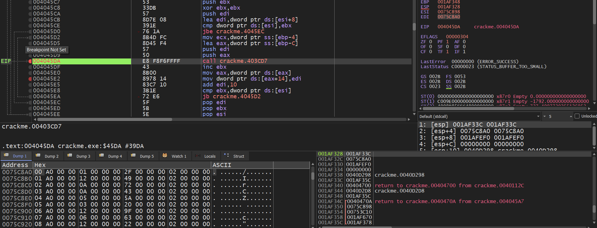

## Discussion Crackme9

__Prologue:__ This is just my short discussion about this challenge. I was not able to solve this challenge during the contest (I upsolved it later after searching and reading other player writeup) so I would not confirm this blog is a complete writeup for the whole challenge, just my raw note about this fantasting obfuscator used in this program.

Basically the challenge was about to analyze the logic of the serial checker, the binary is obfuscated by the technique called [Nanomites](https://github.com/Fatmike-GH/Nanomites), Dynamic API Resolution, API Hashing with many small anti-debugging and anti-disassembly techniques. I would not dive deeply into how to reverse this binary, my main focus is the obfuscator itself and other interesting anti-reversing technique

Before dive deeply into this challenge, I really appreciate Fatmike for creating such an amazing challenge

### Summary
1. The binary is a serial checker program which validate our serial and feed the correct flag whether our input is correct or not
2. The secret validating logic is located in the `.pc` section which is encrypted and obfuscated
3. The checker is using simple and weak hash so we can attempt a brute force measure to get the correct serial

### Analyze 
First of all the binary is stripped so it is hard to find any valid program logic's entry point, a suspicious pivot in order to start triaging the challenge function.

However, this program implemented a minimalist GUI with the `OK` confirm button. Moreover, there is also a dialog for typing input. So we can use breakpoint at `GetDlgItemTextA` or `GetDlgItemTextW`, and by inspecting the call stack we can find the serial authentication function

We can find the validation function which is at `405399h`


int __thiscall sub_405399(int this)
{
  // truncated
  memset(String, 0, sizeof(String));
  GetDlgItemTextA(*(HWND *)(this + 8), 1006, String, 255);
  if ( (unsigned __int8)sub_4030A5(String) )
  {
    sub_4025EC(v14, String);
    sub_40268B(v14);
    sub_405724(v14);
    sub_402876(Src, (int)v16);
    hInstance = *(HINSTANCE *)(this + 4);
    sub_40515A(&v5, Src);
    sub_40574D(hInstance, 134, v5, v6, v7, v8, v9, v10);
    sub_404E89((LPARAM)dwInitParam, *(HWND *)(this + 8));
    sub_4057DA(dwInitParam);
    sub_405724(Src);
    return sub_402781(v15);
  }
  else
  {
    hInstance_1 = *(HINSTANCE *)(this + 4);
    sub_4025EC(&v5, &unk_40B3CE);
    sub_40574D(hInstance_1, 136, v5, v6, v7, v8, v9, v10);
    sub_404E89((LPARAM)dwInitParam, *(HWND *)(this + 8));
    return sub_4057DA(dwInitParam);
  }
}


`sub_4030A5` is used to authenticate the serial. It calls the some init function and check the serial in the `.pc` section at `loc_40A000` and `sub_40A025` respectively

The function at 40112Ch is one of the Dynamic API Resolution/Hashing

int __thiscall sub_40112C(void *this, int a2, int a3, int n64, int a5)
{
  int v5; // eax
  int (__stdcall *v6)(int, int, int, int); // eax

  v5 = sub_401367(this);
  v6 = (int (__stdcall *)(int, int, int, int))sub_401AD3(v5);
  return v6(a2, a3, n64, a5);
}



int __thiscall sub_401AD3(int *this)
{
  int v2; // eax
  int v3; // eax
  _BYTE v4[4]; // [esp+Ch] [ebp-10h] BYREF
  int v5; // [esp+10h] [ebp-Ch]
  int n268857135; // [esp+14h] [ebp-8h]
  int *this_1; // [esp+18h] [ebp-4h]

  this_1 = this;
  if ( !*(this + 5) )
  {
    n268857135 = 0x10066F2F;
    v5 = *this_1;
    v2 = sub_401CA2(v4, 0x10066F2F);
    v3 = sub_401175(v2);
    this_1[5] = v3;
  }
  return this_1[5];
}

By using Hashdb with unmodified CRC32 algorithm we can find this stands for VirtualProtect
So the function at `04046C8h` is changing the memory of the PC segment to `PAGE_EXECUTE_READWRITE`

All of important API are dynamically resolved but luckily the list is pretty short so we can manually patch it.

There is a struct object that is used during the whole program which is initialized at `403DD2h`

Alright come back to the `4046C8h` function there is a small stub thats cause a breakpoint interruption

void __thiscall mw_do_breakpoint(_BYTE *this)
{
  *(this + 1) = 1;
  __debugbreak();
}


Alright all is what we get while trying to travel follow the program flow, nothing special to inspect anymore. 

So if you're trying to manual patch and fix the dynamic api hasing by yourself you would find something really interesting. The challenge implemented the `KiUserExceptionDispatcher` which is a NTDLL native API used for dispatching exception.

Talk more about this a little bit. What I have known so far is this function will resolve and dispatch the exception base on the priority from Windows VEH(Vector Exception Handler through `AddVectoredExceptionHandler`) to SEH(Structured Exception Handler through `__try __catch` stuff), if none of them are implemented the program will crash as a normal behavior. 

So back to the binary. The KiUserExceptionDispatcher will lie in `040187A`, by examining all its cross reference function you could find this interesting function


int __stdcall sub_402E5A(int a1, int a2, int a3, int a4, int a5)
{
  int *v5; // eax
  char *debugger_detected; // eax
  int *kernel_imgbase; // eax
  int (__stdcall *v9)(int, int, int, int, int); // [esp+Ch] [ebp-8h]
  char *v10; // [esp+10h] [ebp-4h]
  int savedregs; // [esp+14h] [ebp+0h] BYREF

  v5 = sub_402BF1();
  if ( overwrite_NtQueryInformationProcess(v5, (int)&savedregs) )
  {
    debugger_detected = sub_402CAC();           // debugger detected
    overwrite_KiUserExceptionDispatcher(debugger_detected);// trigger the real KiUserExceptionDispatcher
  }
  else
  {
    v10 = sub_402CAC();
    overwrite_the_API(v10, (int)custom_seh_handler, (int)&unk_40D24C);
  }
  kernel_imgbase = mw_get_kernel_imgbase();
  v9 = (int (__stdcall *)(int, int, int, int, int))mw_api_CallWindowProcA(kernel_imgbase);
  return v9(a1, a2, a3, a4, a5);
}


There is an Anti-debugging technique in the `overwrite_NtQueryInformationProcess` function, by checking the ProcessDebugPort we can just manually patch this to bypass this simple hindering stuff.


So if no debugger is debugging the program it will trigger the `overwrite_the_API` which is a really interesting function.


void __thiscall overwrite_the_API(_BYTE *this, int custom_seh_handler, int a3)
{
  int *kernel_imgbase; // eax
  void *base; // edi
  void *v6; // eax
  _BYTE trampoline[6]; // [esp+4h] [ebp-Ch] BYREF
  int three; // [esp+Ch] [ebp-4h] BYREF

  if ( !*this )
  {
    kernel_imgbase = mw_get_kernel_imgbase();
    base = (void *)mw_api_KiUserExceptionDispatcher(kernel_imgbase);
    three = 0;
    v6 = such_a_decoy();
    mw_VirtualProtect(v6, (int)base, 6, 0x40, (int)&three);
    mw_memcpy(this + 1, 6u, base, 6u);
    trampoline[0] = 0x68;
    trampoline[5] = 0xC3;
    *(_DWORD *)&trampoline[1] = custom_seh_handler;
    if ( base )
    {
      memcpy(base, trampoline, 6u);
    }
    else
    {
      *errno() = 22;
      invalid_parameter_noinfo();
    }
    *this = 1;
  }
}

First of all this function used VirtualProtect to change the memory protection of ntdll's text section to PAGE_EXECUTE_READWRITE which is often only READ and WRITE are allowed. After that it used a technique call inline hooking, create a indirect trampoline lead to the custom structured exception handler. 
It used an assembly PUSH-RET trick to craft the trampoline. The byte 0x68 and 0x3C is translated to PUSH and RET respectively so the very first 6 bytes of this looks like
```asm
PUSH custom_seh_handler
RET
```

This is challenge's custom exception handler

void __thiscall mw_exception_handler(obj *this, _EXCEPTION_RECORD *record, _CONTEXT *context)
{
  if ( !this->two )
  {
    switch ( record->ExceptionCode )
    {
      case 0x80000003:
        exception_breakpoint_handler(this, context);
        break;
      case 0x80000004:
        exception_singlestep_handler(this, context);
        break;
      case 0x80000001:
        exception_guardpage_handler(this, record, context);
        break;
    }
  }
}


Sorry for the inconvenience but I would not dive deep into how am I able to reverse this binary but in general, I was using x32dbg to debug, watching memmory at runtime and guessing the variable function properties and rename it. However there is still some part that I don't understand but the challenge is totally solvable without the comprehensive understanding about the binary

I would anlyze this first, those other exception handler is not much different

int __thiscall exception_breakpoint_handler(obj *this, _CONTEXT *context)
{
  _CONTEXT *context_1; // edi
  _CONTEXT *context_2; // [esp-Ch] [ebp-10h]
  char *Eip; // [esp-8h] [ebp-Ch]

  if ( check_something((_BYTE *)this->sixth) )
  {
    inc_rip_n_flush((_CONTEXT *)&context);
    set_ctxflag((_CONTEXT *)&context);
  }
  else
  {
    context_1 = context;
    if ( check_eip_in_pc(this, context->Eip) )
    {
      calc_next_eip(this, context_1);
      Eip = (char *)context->Eip;
      context_2 = context;
      this->EIP = (int)Eip;
      decrypt_next_eip(this, context_2, Eip);
    }
  }
  return -1;
}


So in the `set_ctxflag` it resets some register variable and activate the Trap Flag for the single step exception handler. 

The `calc_next_eip` lookups the hardcoded map table to know which`int 3` should be translated to which jcc instruction (you could read the nanomites github for a better explaination)

The `decrypt_next_eip` decrypts the next 0x10 bytes from the next EIP in the `.pc` section. It used custom constant ChaCha20 algorithm. The key is located at `0x0040D264 + 4`. The key is SHA256 hashed value of the whole `.text` section. So any breakpoint or patching modification will break the value of the key. So my solution to find the key was first open the exe file then using x32dbg to attach and jump to that address, retrieve the key

```asm
key = "f630aa38d57297375d645559c334fd50d55ca1d177d2655a042351cf69244bf2"
nonce = "0a0b0c0d0e0f1011"
constant = "9e3779b97f4a7c15f39cc0605cedc834"
```

Alright then just manually patch all the pc section by the decrypted value.

Now back to the branch dispatcher function at `404166h`


bool __stdcall check(int a1, _CONTEXT *context)
{
  DWORD EFlags; // ecx
  bool result; // al
  char v4; // dl
  DWORD v5; // eax

  EFlags = context->EFlags;
  switch ( *(_DWORD *)(a1 + 4) )
  {
    case 1:
      EFlags >>= 6;
      goto LABEL_12;
    case 2:
      return 1;
    case 3:
      EFlags >>= 7;
      goto LABEL_3;
    case 4:
      goto LABEL_12;
    case 5:
      v4 = 1;
      if ( (EFlags & 0x40) == 0
        && (((unsigned __int8)(EFlags >> 7) ^ (unsigned __int8)(context->EFlags >> 11)) & 1) == 0 )
      {
        return 0;
      }
      return v4;
    case 6:
      return (EFlags & 0x41) == 0;
    case 7:
      LOBYTE(v5) = ~(unsigned __int8)(EFlags >> 11);
      return ((EFlags >> 7) ^ v5) & 1;
    case 8:
      EFlags >>= 2;
      goto LABEL_3;
    case 9:
      EFlags >>= 11;
      goto LABEL_3;
    case 0xA:
      return (EFlags & 0x41) != 0;
    case 0xB:
      return context->Ecx == 0;
    case 0xC:
      EFlags >>= 2;
      goto LABEL_12;
    case 0xD:
      EFlags >>= 6;
      goto LABEL_3;
    case 0xE:
      v5 = EFlags >> 11;
      return ((EFlags >> 7) ^ v5) & 1;
    case 0xF:
      EFlags >>= 7;
      goto LABEL_12;
    case 0x10:
      EFlags >>= 11;
LABEL_12:
      LOBYTE(EFlags) = ~(_BYTE)EFlags;
      goto LABEL_3;
    case 0x11:
      v4 = 1;
      if ( (EFlags & 0x40) != 0
        || (((unsigned __int8)(EFlags >> 7) ^ (unsigned __int8)(context->EFlags >> 11)) & 1) != 0 )
      {
        return 0;
      }
      return v4;
    case 0x12:
LABEL_3:
      result = EFlags & 1;
      break;
    default:
      result = 0;
      break;
  }
  return result;
}

The logic is not that hard, it is a little bit lengthy. For example the first one is simulate the `JNE/JNZ` instruction
You would not have to remember these signature, just googling them
This is what you get after reversing the function given in the format `(name, short jump, near jump)`

```python
jcc = {
    1: ('JNE', b'\x75', b'\x0F\x85'),
    2: ('JMP', b'\xEB', b'\xE9'),
    3: ('JS', b'\x78', b'\x0F\x88'),
    4: ('JNC', b'\x73', b'\x0F\x83'),
    5: ('JLE', b'\x7E', b'\x0F\x8E'),
    6: ('JA', b'\x77', b'\x0F\x87'),
    7: ('JGE', b'\x7D', b'\x0F\x8D'),
    8: ('JP', b'\x7A', b'\x0F\x8A'),
    9: ('JO', b'\x70', b'\x0F\x80'),
    10: ('JBE', b'\x76', b'\x0F\x86'),
    11: ('JECXZ', b'\xE3', None),
    12: ('JNP', b'\x7B', b'\x0F\x8B'),
    13: ('JE', b'\x74', b'\x0F\x84'),
    14: ('JL', b'\x7C', b'\x0F\x8C'),
    15: ('JNS', b'\x79', b'\x0F\x89'),
    16: ('JNO', b'\x71', b'\x0F\x81'),
    17: ('JG', b'\x7F', b'\x0F\x8F'),
    18: ('JC', b'\x72', b'\x0F\x82')
}
```
So the breakpoint interruption will be replaced by one of these jcc instruction. So how does it change? Well remember the 
hardcoded map table I said above? You can dump this value by looking at the map table initialization at the function lies in `4045A7h`. 


void __thiscall sub_4045A7(char *this, unsigned int *a2)
{
  unsigned int v2; // ebx
  unsigned int *v3; // edi
  char v4[8]; // [esp+4h] [ebp-Ch] BYREF
  int *v5; // [esp+Ch] [ebp-4h]

  v5 = (int *)(this + 64);
  sub_404CD0((_DWORD *)this + 16);
  if ( a2 && *a2 )
  {
    v2 = 0;
    v3 = a2 + 2;
    do
    {
      ++v2;
      *(_DWORD *)(*(_DWORD *)sub_403CD7(v5, (int)v4, v3) + 20) = v3;
      v3 += 4;
    }
    while ( v2 < *a2 );
  }
}


The call instruction at `4045DAh` is stl map insert function, 16 bytes from the second argument of the `4045A7h` stub. So the solution was first place a breakpoint at `4045DAh` and follow in dump the value stored in `EDI`



So the data is given in the (address offset, type, jump offset, instruction size) format which is 
```yml
00 A0 00 00 01 00 00 00 2F 00 00 00 02 00 00 00 
01 A0 00 00 12 00 00 00 49 00 00 00 02 00 00 00 
02 A0 00 00 0A 00 00 00 72 00 00 00 02 00 00 00 
// truncated 
```

Another small technique used in this binary was anti-disassembly. So basically, it looks like
```asm
jmp loc+1
loc:
// some really meaningless instruction go here
```

The jmp instruction directly point to the address of loc+1 which mean the byte at loc is actually junk/garbage byte. But IDA in this situation is disassembling the instruction statically so it does not know this and start translating this useless byte. To fix this, we can nop the junk byte and everything will go fine

So basically challenge's execution flow is:
> 1. The execution flow initiates with the dynamic generation of ChaCha20 Key, alongside the registeration of a custom SEH
> 2. The ChaCha20 decryption process of the `.pc` section comes right after our serial key is submitted 
> 3. The follow execution flow will contain a lot of breakpoint interruption, which will be replaced by the jcc instruction based on the fixed map table
> 4. The serial has a size of 19 which is hashed into 5 different chunks and compared with fixed values that is initialized at the very first function of the `.pc` section
> 5. The hash algorithm is pretty simple to crack by just a normal brute-forcing attack because each chunk is isolated with a small size

By chaining all the aforementioned pieces, you can deobfuscate this amazing challenge, now is the play of hashing algorithm

This is where the 5 different chunk's result hash value be initialized


serial_obj14 *__thiscall encrypted_stuff(serial_obj14 *this)
{
  this->first = 0x865DBB47;
  this->second = 0xA6EB190;
  this->third = 0x20476C33;
  this->four = 0x1C8A7693;
  this->five = 0x59FEBDFB;
  return this;
}


And the authentication algorithm is 

bool __thiscall validate_hash_value(serial_obj14 *obj, char *serial)
{
  HCRYPTPROV *inited; // eax
  int hash_mask; // [esp+1Ch] [ebp-10h]
  int hash_value; // [esp+20h] [ebp-Ch]
  int counter; // [esp+24h] [ebp-8h]
  int program_flag; // [esp+28h] [ebp-4h]

  if ( !serial || strlen(serial) != 19 )
    return 0;
  program_flag = 0;
  counter = 0;
  hash_mask = 0;
  hash_value = 0xCAFEBABE;
  while ( 1 )
  {
    while ( 1 )
    {
      while ( 1 )
      {
        while ( 1 )
        {
          inited = init_crypto_context();
          handler_crypto_context((int)inited);
          if ( program_flag )
            break;
          program_flag = 1;
        }
        if ( program_flag != 1 )
          break;
        hash_value = calc_next_hash(hash_value, serial[counter++]);
        if ( counter % 4 )
        {
          if ( counter == 19 )
            program_flag = 3;
          else
            program_flag = 1;
        }
        else
        {
          program_flag = 2;
        }
      }
      if ( program_flag != 2 )
        break;
      hash_mask |= *((_DWORD *)obj + counter / 4 - 1) ^ hash_value;
      hash_value = 0x112233 * counter - 0x35014542;
      program_flag = 1;
    }
    if ( program_flag != 3 )
      break;
    hash_mask |= obj->five ^ hash_value;
    if ( hash_mask )
      program_flag = 5;
    else
      program_flag = 4;
  }
  return program_flag == 4;
}


This is basically divide the 19 bytes of the serial into 5 different chunks, each chunk is 4-bytes length then calculate hash of each character consecutively base on the `calc_next_hash` function. Then if all is matched, the serial checker is valid, our flag will appear
We don't have to understand what the `calc_next_hash` does, we can just manually simulate it in the script by looking really quick through the pseudocode. Then start cracking the hash, this is my solve script



#!/home/ryou/.venvs/rev/bin/python

import struct
import string

def calc_next_hash(hash_val, character):
    if not isinstance(character, int):
        raise ValueError("Character is not an integer value")
    hash_val &= 0xFFFFFFFF
    character &= 0xFF

    if hash_val & 1:
        if (character ^ hash_val) <= 0x80000000:
            if not (97 <= character <= 122):
                if not (65 <= character <= 90):
                    value = (9 * hash_val) & 0xFFFFFFFF
                else:
                    value = (character + hash_val) & 0xFFFFFFFF
                    if value & 0x100:
                        value ^= 0x13371337
            else:
                value = (hash_val - character) & 0xFFFFFFFF
        else:
            value = (hash_val - 0x21524111) & 0xFFFFFFFF
            if character > 0x60:
                value ^= (33 * character) & 0xFFFFFFFF
    elif character >= 64:
        if character % 2:
            value = (((hash_val << 27) & 0xFFFFFFFF) | (hash_val >> 5)) ^ 2271560481
        else:
            value = ((hash_val >> 29) | ((hash_val << 3) & 0xFFFFFFFF)) + 0x12345678
            value &= 0xFFFFFFFF
    elif character & 2:
        value = (character + (hash_val ^ 0x55AA55AA)) & 0xFFFFFFFF
    else:
        value = (hash_val - 16 * character) & 0xFFFFFFFF
        if character == 48:
            value |= 0xF0F0F0F0

    for i in range((character % 5) + 2):
        if not (value & 0x80000000):
            hash_valueb = (value << 1) & 0xFFFFFFFF
        else:
            hash_valueb = ((value << 1) & 0xFFFFFFFF) ^ 0x04C11DB7

        if i % 2:
            value = (hash_valueb + 10 * i) & 0xFFFFFFFF
        else:
            value = character ^ hash_valueb

    if ((value ^ (value >> 8) ^ (value >> 16) ^ (value >> 24)) & 0xF) > 7:
        return (~value) & 0xFFFFFFFF

    if value == 0:
        return 0xBADF00D

    return value
charset = b'0123456789ABCDEFGHIJKLMNOPQRSTUVWXYZabcdefghijklmnopqrstuvwxyz-_'

def hash_crack(hash_init, target, serial_length):

    for a in charset:
        for b in charset:
            for c in charset:
                
                hash = hash_init
                
                hash = calc_next_hash(hash, a)
                hash = calc_next_hash(hash, b)
                hash = calc_next_hash(hash, c)

                if serial_length == 3:
                    if hash == target:
                        return chr(a) + chr(b) + chr(c)
                else:
                    for d in charset:
                        if calc_next_hash(hash, d) == target:
                            return chr(a) + chr(b) + chr(c) + chr(d)

    return "Error"
result_set = [
    0x865DBB47,
    0xA6EB190,
    0x20476C33, 
    0x1C8A7693,
    0x59FEBDFB
]
hash = 0xCAFEBABE
final_serial = ""
for chunk in range(5):
    serial = hash_crack(hash, result_set[chunk], 3 if chunk == 4 else 4)
    print(f"Founded {chunk}'th serial part {serial}!")
    final_serial += serial

    hash = (0x112233 * (chunk + 1) * 4 - 0x35014542) & 0xFFFFFFFF
print(final_serial)





#!/home/ryou/.venvs/rev/bin/python

# key = bytearray(open("keydump.bin", "rb").read())
# print(len(key))
# print(' '.join(hex(i) for i in key))

import struct

jcc = {
    1: ('JNE', b'\x75', b'\x0F\x85'),
    2: ('JMP', b'\xEB', b'\xE9'),
    3: ('JS', b'\x78', b'\x0F\x88'),
    4: ('JNC', b'\x73', b'\x0F\x83'),
    5: ('JLE', b'\x7E', b'\x0F\x8E'),
    6: ('JA', b'\x77', b'\x0F\x87'),
    7: ('JGE', b'\x7D', b'\x0F\x8D'),
    8: ('JP', b'\x7A', b'\x0F\x8A'),
    9: ('JO', b'\x70', b'\x0F\x80'),
    10: ('JBE', b'\x76', b'\x0F\x86'),
    11: ('JECXZ', b'\xE3', None),
    12: ('JNP', b'\x7B', b'\x0F\x8B'),
    13: ('JE', b'\x74', b'\x0F\x84'),
    14: ('JL', b'\x7C', b'\x0F\x8C'),
    15: ('JNS', b'\x79', b'\x0F\x89'),
    16: ('JNO', b'\x71', b'\x0F\x81'),
    17: ('JG', b'\x7F', b'\x0F\x8F'),
    18: ('JC', b'\x72', b'\x0F\x82')
}
raw_map_data = bytearray(open("mapdump.bin", "rb").read())
map_data = [
    struct.unpack("<IIII", raw_map_data[i:i+16])
    for i in range(0, len(raw_map_data), 16)
]

eip = 0
decrypted_pc = bytearray.fromhex(open("decrypted_pc", 'r').read())
size = len(decrypted_pc)

patched_byte = []

for i, opcode in enumerate(decrypted_pc):
    if i < eip:
        continue

    if opcode != 0xCC:
        patched_byte.append(opcode)
        continue
    
    base, cond, off, sz = map_data[i]
    mnem, short, near = jcc[cond]

    if sz == 0x2:   
        insn = short + struct.pack("<B", off & 0xFF)
    else:
        insn = near + struct.pack("<L", off & 0xFFFFFFFF)
    
    patched_byte += list(insn)
    eip = i + sz

There is a problem in this nanomites deobfuscator. There is an special case that cause incorrect translation, for example
```asm
0000 .byte 0xCC
0001 .byte 0x77
0002 .byte 0xCC
0003 .byte 0x77
```
If translated instruction at the 0x0 address is a `jump to 0x3`, and if we decrypt the breakpoint at 0x2, it will break the byte at 0x3 led to the wrong disassembled instruction. So I was decided to fix this manully by myself because it doesn't have much case like this but it should have had a better solution like the auto-rev script? I don't know


### End
I really appreciate the contribution of [Fatmike](https://github.com/Fatmike-GH) in making this such an amazing challenge, it has a very educational knowledge for reverse engineer in particular and all binary analyst in general
I'm also give a enormous respect to the community as well as some individuals in providing a great explanation and writeup about this challenge, I also learn a lots while reading your guys' blog. Thanks again!

If you have any problems with my discussion you could have a contact with me! Have a good day while reversing ^_^