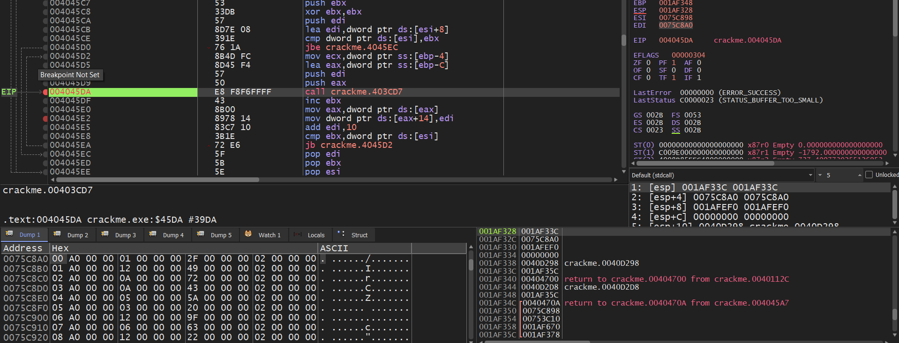

## Discussion Crackme9

__Prologue:__ This is just my brief discussion about this challenge. I was not able to solve this challenge during the contest (I upsolved it later after doing some research and reading other player writeups)

Basically the solution was about to analyze the logic of the serial checker. There are several techniques implemented in the binary such as [Nanomites](https://github.com/Fatmike-GH/Nanomites), Dynamic API Resolution, API Hashing, and many other small anti-debugging and anti-disassembly tricks. I will not dive into how to reverse this binary. My main focus is the obfuscation itself and other interesting anti reverse engineering techniques

Before dive into this challenge, I really appreciate Fatmike for creating such an amazing challenge

### Summary
1. The binary is a serial checker that validates entered key and if it is correct, the flag will be displayed
2. The secret validation algorithm is located in the `.pc` section which is encrypted and obfuscated
3. The checker uses a weak hash algorithm, so we can attempt a brute-force attack to get the correct serial

### Analyze 
First of all the binary is stripped, so it is hard to spot the correct entry of the encryption routine

This program implements a minimalist GUI with an `OK` button. Moreover, there is a dialog for typing input. So we can place a breakpoint at `GetDlgItemTextA` or `GetDlgItemTextW`, and by inspecting the call stack we can find the checker function

We can find the validation function at `405399h`

```c
int __thiscall sub_405399(int this)
{
  // truncated
  memset(String, 0, sizeof(String));
  GetDlgItemTextA(*(HWND *)(this + 8), 1006, String, 255);
  if ( (unsigned __int8)sub_4030A5(String) )
  {
    sub_4025EC(v14, String);
    sub_40268B(v14);
    sub_405724(v14);
    sub_402876(Src, (int)v16);
    hInstance = *(HINSTANCE *)(this + 4);
    sub_40515A(&v5, Src);
    sub_40574D(hInstance, 134, v5, v6, v7, v8, v9, v10);
    sub_404E89((LPARAM)dwInitParam, *(HWND *)(this + 8));
    sub_4057DA(dwInitParam);
    sub_405724(Src);
    return sub_402781(v15);
  }
  else
  {
    hInstance_1 = *(HINSTANCE *)(this + 4);
    sub_4025EC(&v5, &unk_40B3CE);
    sub_40574D(hInstance_1, 136, v5, v6, v7, v8, v9, v10);
    sub_404E89((LPARAM)dwInitParam, *(HWND *)(this + 8));
    return sub_4057DA(dwInitParam);
  }
}
```

`sub_4030A5` is used to verify the serial. It calls the some init functions in the `.pc` section which are `loc_40A000` and `sub_40A025` respectively

The function at `40112Ch` uses Dynamic API Resolution/Hashing
```c
int __thiscall sub_40112C(void *this, int a2, int a3, int n64, int a5)
{
  int v5; // eax
  int (__stdcall *v6)(int, int, int, int); // eax

  v5 = sub_401367(this);
  v6 = (int (__stdcall *)(int, int, int, int))sub_401AD3(v5);
  return v6(a2, a3, n64, a5);
}
```

```c
int __thiscall sub_401AD3(int *this)
{
  int v2; // eax
  int v3; // eax
  _BYTE v4[4]; // [esp+Ch] [ebp-10h] BYREF
  int v5; // [esp+10h] [ebp-Ch]
  int n268857135; // [esp+14h] [ebp-8h]
  int *this_1; // [esp+18h] [ebp-4h]

  this_1 = this;
  if ( !*(this + 5) )
  {
    n268857135 = 0x10066F2F;
    v5 = *this_1;
    v2 = sub_401CA2(v4, 0x10066F2F);
    v3 = sub_401175(v2);
    this_1[5] = v3;
  }
  return this_1[5];
}
```
By using HashDB to look up the CRC32 hash value, we can determine that it is `VirtualProtect`
So the function at `04046C8h` changes the memory protection attribute of the `pc` section to `PAGE_EXECUTE_READWRITE`

All of the important APIs are dynamically resolved. Fortunately the list is tiny, so we can manually patch it.

There is a struct used throughout execution which is initialized at `403DD2h`

The function at `4046C8h` is used to raise a breakpoint exception
```c
void __thiscall mw_do_breakpoint(_BYTE *this)
{
  *(this + 1) = 1;
  __debugbreak();
}
```

Alright, that is all we can explore while navigating around the binary. Nothing is special to inspect anymore

But if you try to recover the hashed API, you will find something really interesting. The challenge uses `KiUserExceptionDispatcher` which is an NTDLL native API, to implement some stuff

Let's talk more about this API. What I have known is that this function will resolve and dispatch the exception based on the priority, for example from Windows VEH (Vector Exception Handler through `AddVectoredExceptionHandler`) to SEH (Structured Exception Handler through `__try __catch` stuff). If none of them are registered, the program will crash. 

So back to the binary, by examining all the cross-reference assosiated with the `KiUserExceptionDispatcher` function located at `040187A`, you can find this interesting function

```c
int __stdcall sub_402E5A(int a1, int a2, int a3, int a4, int a5)
{
  int *v5; // eax
  char *debugger_detected; // eax
  int *kernel_imgbase; // eax
  int (__stdcall *v9)(int, int, int, int, int); // [esp+Ch] [ebp-8h]
  char *v10; // [esp+10h] [ebp-4h]
  int savedregs; // [esp+14h] [ebp+0h] BYREF

  v5 = sub_402BF1();
  if ( overwrite_NtQueryInformationProcess(v5, (int)&savedregs) )
  {
    debugger_detected = sub_402CAC();           // debugger detected
    overwrite_KiUserExceptionDispatcher(debugger_detected);// trigger the real KiUserExceptionDispatcher
  }
  else
  {
    v10 = sub_402CAC();
    overwrite_the_API(v10, (int)custom_seh_handler, (int)&unk_40D24C);
  }
  kernel_imgbase = mw_get_kernel_imgbase();
  v9 = (int (__stdcall *)(int, int, int, int, int))mw_api_CallWindowProcA(kernel_imgbase);
  return v9(a1, a2, a3, a4, a5);
}
```

There is an anti-debugging technique in the `overwrite_NtQueryInformationProcess` function using the `ProcessDebugPort` option. We can manually patch this to bypass.

So if no debugger exists, the program will trigger the `overwrite_the_API` function which is also a really interesting one

```c
void __thiscall overwrite_the_API(_BYTE *this, int custom_seh_handler, int a3)
{
  int *kernel_imgbase; // eax
  void *base; // edi
  void *v6; // eax
  _BYTE trampoline[6]; // [esp+4h] [ebp-Ch] BYREF
  int three; // [esp+Ch] [ebp-4h] BYREF

  if ( !*this )
  {
    kernel_imgbase = mw_get_kernel_imgbase();
    base = (void *)mw_api_KiUserExceptionDispatcher(kernel_imgbase);
    three = 0;
    v6 = such_a_decoy();
    mw_VirtualProtect(v6, (int)base, 6, 0x40, (int)&three);
    mw_memcpy(this + 1, 6u, base, 6u);
    trampoline[0] = 0x68;
    trampoline[5] = 0xC3;
    *(_DWORD *)&trampoline[1] = custom_seh_handler;
    if ( base )
    {
      memcpy(base, trampoline, 6u);
    }
    else
    {
      *errno() = 22;
      invalid_parameter_noinfo();
    }
    *this = 1;
  }
}
```
First of all, this function uses `VirtualProtect` to change the memory protection of ntdll text section to `PAGE_EXECUTE_READWRITE`. After that, the program uses a technique called inline hooking to create an indirect trampoline led to the custom structured exception handler. 
The author uses an assembly trick which is `PUSH-RET` to craft the trampoline. The byte 0x68 and 0x3C can be translated to `PUSH` and `RET` respectively, so the epilouge of the function looks like
```asm
PUSH custom_seh_handler
RET
```

This is challenge's custom exception handler
```c
void __thiscall mw_exception_handler(obj *this, _EXCEPTION_RECORD *record, _CONTEXT *context)
{
  if ( !this->two )
  {
    switch ( record->ExceptionCode )
    {
      case 0x80000003:
        exception_breakpoint_handler(this, context);
        break;
      case 0x80000004:
        exception_singlestep_handler(this, context);
        break;
      case 0x80000001:
        exception_guardpage_handler(this, record, context);
        break;
    }
  }
}
```

Sorry for the inconvenience that I would not dive into how I'm able to reverse this part, but in general, I was using x32dbg to debug, watching the memmory at runtime and guessing the function variables properties and rename them. Although, there is still some part that I didn't understand, the challenge is totally solvable

I would analyze this first, those other exception handlers are not much different
```c
int __thiscall exception_breakpoint_handler(obj *this, _CONTEXT *context)
{
  _CONTEXT *context_1; // edi
  _CONTEXT *context_2; // [esp-Ch] [ebp-10h]
  char *Eip; // [esp-8h] [ebp-Ch]

  if ( check_something((_BYTE *)this->sixth) )
  {
    inc_rip_n_flush((_CONTEXT *)&context);
    set_ctxflag((_CONTEXT *)&context);
  }
  else
  {
    context_1 = context;
    if ( check_eip_in_pc(this, context->Eip) )
    {
      calc_next_eip(this, context_1);
      Eip = (char *)context->Eip;
      context_2 = context;
      this->EIP = (int)Eip;
      decrypt_next_eip(this, context_2, Eip);
    }
  }
  return -1;
}
```

So in the `set_ctxflag` function, it resets some register and activates the `Trap Flag` for the single step exception.

`calc_next_eip` looks up the hard-coded mapping table to determine which jcc instruction each `int 3` instruction should be translated to (the nanomites github has a deeper explaination)

The `decrypt_next_eip` function decrypts the next 0x10 bytes from the next EIP in the `.pc` section. It uses a custom ChaCha20 constant. The key is located at `0x0040D264 + 4`, it is a SHA256 hash value of the whole `.text` section. This can be called an anti-tampering technique so that any software breakpoints or modifications like patching to the binary will break the accuracy of the key. Therefore, we can attach the program to the debugger later to extract the key safely 

```asm
key = "f630aa38d57297375d645559c334fd50d55ca1d177d2655a042351cf69244bf2"
nonce = "0a0b0c0d0e0f1011"
constant = "9e3779b97f4a7c15f39cc0605cedc834"
```
Then we have enough information to decrypt the `pc` section. We can manually patch the section to analyze it statically now

Now back to the dispatcher function at `404166h`
```c
bool __stdcall check(int a1, _CONTEXT *context)
{
  DWORD EFlags; // ecx
  bool result; // al
  char v4; // dl
  DWORD v5; // eax

  EFlags = context->EFlags;
  switch ( *(_DWORD *)(a1 + 4) )
  {
    case 1:
      EFlags >>= 6;
      goto LABEL_12;
    case 2:
      return 1;
    case 3:
      EFlags >>= 7;
      goto LABEL_3;
    case 4:
      goto LABEL_12;
    case 5:
      v4 = 1;
      if ( (EFlags & 0x40) == 0
        && (((unsigned __int8)(EFlags >> 7) ^ (unsigned __int8)(context->EFlags >> 11)) & 1) == 0 )
      {
        return 0;
      }
      return v4;
    case 6:
      return (EFlags & 0x41) == 0;
    case 7:
      LOBYTE(v5) = ~(unsigned __int8)(EFlags >> 11);
      return ((EFlags >> 7) ^ v5) & 1;
    case 8:
      EFlags >>= 2;
      goto LABEL_3;
    case 9:
      EFlags >>= 11;
      goto LABEL_3;
    case 0xA:
      return (EFlags & 0x41) != 0;
    case 0xB:
      return context->Ecx == 0;
    case 0xC:
      EFlags >>= 2;
      goto LABEL_12;
    case 0xD:
      EFlags >>= 6;
      goto LABEL_3;
    case 0xE:
      v5 = EFlags >> 11;
      return ((EFlags >> 7) ^ v5) & 1;
    case 0xF:
      EFlags >>= 7;
      goto LABEL_12;
    case 0x10:
      EFlags >>= 11;
LABEL_12:
      LOBYTE(EFlags) = ~(_BYTE)EFlags;
      goto LABEL_3;
    case 0x11:
      v4 = 1;
      if ( (EFlags & 0x40) != 0
        || (((unsigned __int8)(EFlags >> 7) ^ (unsigned __int8)(context->EFlags >> 11)) & 1) != 0 )
      {
        return 0;
      }
      return v4;
    case 0x12:
LABEL_3:
      result = EFlags & 1;
      break;
    default:
      result = 0;
      break;
  }
  return result;
}
```
The logic is not that hard, it is a little bit lengthy. For example, the first one simulates the `JNE/JNZ` instruction
You do not have to remember these signatures, just googling them
This is what you get after reversing the function, given in the format `(name, short jump, near jump)`

```python
jcc = {
    1: ('JNE', b'\x75', b'\x0F\x85'),
    2: ('JMP', b'\xEB', b'\xE9'),
    3: ('JS', b'\x78', b'\x0F\x88'),
    4: ('JNC', b'\x73', b'\x0F\x83'),
    5: ('JLE', b'\x7E', b'\x0F\x8E'),
    6: ('JA', b'\x77', b'\x0F\x87'),
    7: ('JGE', b'\x7D', b'\x0F\x8D'),
    8: ('JP', b'\x7A', b'\x0F\x8A'),
    9: ('JO', b'\x70', b'\x0F\x80'),
    10: ('JBE', b'\x76', b'\x0F\x86'),
    11: ('JECXZ', b'\xE3', None),
    12: ('JNP', b'\x7B', b'\x0F\x8B'),
    13: ('JE', b'\x74', b'\x0F\x84'),
    14: ('JL', b'\x7C', b'\x0F\x8C'),
    15: ('JNS', b'\x79', b'\x0F\x89'),
    16: ('JNO', b'\x71', b'\x0F\x81'),
    17: ('JG', b'\x7F', b'\x0F\x8F'),
    18: ('JC', b'\x72', b'\x0F\x82')
}
```
So `int 3` will be replaced by one of these jcc instructions. So how does it change? Well remember the 
hard-coded mapping table that I mentioned? You can dump these values by looking into the mapping table initialization located at `4045A7h`. 

```c
void __thiscall sub_4045A7(char *this, unsigned int *a2)
{
  unsigned int v2; // ebx
  unsigned int *v3; // edi
  char v4[8]; // [esp+4h] [ebp-Ch] BYREF
  int *v5; // [esp+Ch] [ebp-4h]

  v5 = (int *)(this + 64);
  sub_404CD0((_DWORD *)this + 16);
  if ( a2 && *a2 )
  {
    v2 = 0;
    v3 = a2 + 2;
    do
    {
      ++v2;
      *(_DWORD *)(*(_DWORD *)sub_403CD7(v5, (int)v4, v3) + 20) = v3;
      v3 += 4;
    }
    while ( v2 < *a2 );
  }
}
```
The call instruction at `4045DAh` is the STL map insert function. Basically, it uses the STL map to store and query data, but we just need data. So the solution was first set up a breakpoint at `4045DAh` and then follow in dump the value stored in `EDI`



So the data is given in the `(address offset, type, jump offset, instruction size)` format which is 
```yml
00 A0 00 00 01 00 00 00 2F 00 00 00 02 00 00 00 
01 A0 00 00 12 00 00 00 49 00 00 00 02 00 00 00 
02 A0 00 00 0A 00 00 00 72 00 00 00 02 00 00 00 
// truncated 
```

Another small technique used in this binary is anti-disassembly, it looks like this
```asm
jmp loc+1
loc:
// some really meaningless instruction go here
```

The idea is simple, disassemblers often translate bytecode into assembly in order. So if we insert a junk byte between two instructions and somehow make the runtime skip it (or else we can get crashed). The disassemblers like IDA still translate and get confused. And the solution to make CPU skip that junk byte is the jump instruction. In order to fix dodge this, we can modify all junk bytes into `nop` opcode

So basically challenge's execution flow is:
>[!NOTE]
> 1. The execution initiates with the dynamic initialization of the ChaCha20 Key, alongside the registeration of a custom SEH
> 2. The ChaCha20 decryption process for the `.pc` section comes right after our serial key is submitted 
> 3. The following execution contains a lot of breakpoint exception, which will be replaced by the jcc instruction
> 4. The serial has a length of 19 which is hashed into 5 different chunks and compared with fixed values initialized in the first function in the `.pc` section
> 5. The hash algorithm is pretty simple to crack by just a normal brute-forcing attack

By chaining all the pieces, you can deobfuscate this amazing challenge. Now is the play of hashing algorithm

This is where the 5 hard-coded constant be initialized

```c
serial_obj14 *__thiscall encrypted_stuff(serial_obj14 *this)
{
  this->first = 0x865DBB47;
  this->second = 0xA6EB190;
  this->third = 0x20476C33;
  this->four = 0x1C8A7693;
  this->five = 0x59FEBDFB;
  return this;
}
```

And the validatioj algorithm is 
```c
bool __thiscall validate_hash_value(serial_obj14 *obj, char *serial)
{
  HCRYPTPROV *inited; // eax
  int hash_mask; // [esp+1Ch] [ebp-10h]
  int hash_value; // [esp+20h] [ebp-Ch]
  int counter; // [esp+24h] [ebp-8h]
  int program_flag; // [esp+28h] [ebp-4h]

  if ( !serial || strlen(serial) != 19 )
    return 0;
  program_flag = 0;
  counter = 0;
  hash_mask = 0;
  hash_value = 0xCAFEBABE;
  while ( 1 )
  {
    while ( 1 )
    {
      while ( 1 )
      {
        while ( 1 )
        {
          inited = init_crypto_context();
          handler_crypto_context((int)inited);
          if ( program_flag )
            break;
          program_flag = 1;
        }
        if ( program_flag != 1 )
          break;
        hash_value = calc_next_hash(hash_value, serial[counter++]);
        if ( counter % 4 )
        {
          if ( counter == 19 )
            program_flag = 3;
          else
            program_flag = 1;
        }
        else
        {
          program_flag = 2;
        }
      }
      if ( program_flag != 2 )
        break;
      hash_mask |= *((_DWORD *)obj + counter / 4 - 1) ^ hash_value;
      hash_value = 0x112233 * counter - 0x35014542;
      program_flag = 1;
    }
    if ( program_flag != 3 )
      break;
    hash_mask |= obj->five ^ hash_value;
    if ( hash_mask )
      program_flag = 5;
    else
      program_flag = 4;
  }
  return program_flag == 4;
}
```

This function divides the 19 bytes of the serial into 5 different chunks, each chunk has length of 4 bytes. Then it calculates the hash of each character consecutively based on the `calc_next_hash` function. Then if all chunks are matched, the serial checker is valid, our flag will be displayed
We don't have to understand what the `calc_next_hash` does, we can just manually simulate it in the script by looking real quick through the implementation. Then start attacking the hash, this is my solve script

```python

#!/home/ryou/.venvs/rev/bin/python

import struct
import string

def calc_next_hash(hash_val, character):
    if not isinstance(character, int):
        raise ValueError("Character is not an integer value")
    hash_val &= 0xFFFFFFFF
    character &= 0xFF

    if hash_val & 1:
        if (character ^ hash_val) <= 0x80000000:
            if not (97 <= character <= 122):
                if not (65 <= character <= 90):
                    value = (9 * hash_val) & 0xFFFFFFFF
                else:
                    value = (character + hash_val) & 0xFFFFFFFF
                    if value & 0x100:
                        value ^= 0x13371337
            else:
                value = (hash_val - character) & 0xFFFFFFFF
        else:
            value = (hash_val - 0x21524111) & 0xFFFFFFFF
            if character > 0x60:
                value ^= (33 * character) & 0xFFFFFFFF
    elif character >= 64:
        if character % 2:
            value = (((hash_val << 27) & 0xFFFFFFFF) | (hash_val >> 5)) ^ 2271560481
        else:
            value = ((hash_val >> 29) | ((hash_val << 3) & 0xFFFFFFFF)) + 0x12345678
            value &= 0xFFFFFFFF
    elif character & 2:
        value = (character + (hash_val ^ 0x55AA55AA)) & 0xFFFFFFFF
    else:
        value = (hash_val - 16 * character) & 0xFFFFFFFF
        if character == 48:
            value |= 0xF0F0F0F0

    for i in range((character % 5) + 2):
        if not (value & 0x80000000):
            hash_valueb = (value << 1) & 0xFFFFFFFF
        else:
            hash_valueb = ((value << 1) & 0xFFFFFFFF) ^ 0x04C11DB7

        if i % 2:
            value = (hash_valueb + 10 * i) & 0xFFFFFFFF
        else:
            value = character ^ hash_valueb

    if ((value ^ (value >> 8) ^ (value >> 16) ^ (value >> 24)) & 0xF) > 7:
        return (~value) & 0xFFFFFFFF

    if value == 0:
        return 0xBADF00D

    return value
charset = b'0123456789ABCDEFGHIJKLMNOPQRSTUVWXYZabcdefghijklmnopqrstuvwxyz-_'

def hash_crack(hash_init, target, serial_length):

    for a in charset:
        for b in charset:
            for c in charset:
                
                hash = hash_init
                
                hash = calc_next_hash(hash, a)
                hash = calc_next_hash(hash, b)
                hash = calc_next_hash(hash, c)

                if serial_length == 3:
                    if hash == target:
                        return chr(a) + chr(b) + chr(c)
                else:
                    for d in charset:
                        if calc_next_hash(hash, d) == target:
                            return chr(a) + chr(b) + chr(c) + chr(d)

    return "Error"
result_set = [
    0x865DBB47,
    0xA6EB190,
    0x20476C33, 
    0x1C8A7693,
    0x59FEBDFB
]
hash = 0xCAFEBABE
final_serial = ""
for chunk in range(5):
    serial = hash_crack(hash, result_set[chunk], 3 if chunk == 4 else 4)
    print(f"Founded {chunk}'th serial part {serial}!")
    final_serial += serial

    hash = (0x112233 * (chunk + 1) * 4 - 0x35014542) & 0xFFFFFFFF
print(final_serial)

```


```python
#!/home/ryou/.venvs/rev/bin/python

# key = bytearray(open("keydump.bin", "rb").read())
# print(len(key))
# print(' '.join(hex(i) for i in key))

import struct

jcc = {
    1: ('JNE', b'\x75', b'\x0F\x85'),
    2: ('JMP', b'\xEB', b'\xE9'),
    3: ('JS', b'\x78', b'\x0F\x88'),
    4: ('JNC', b'\x73', b'\x0F\x83'),
    5: ('JLE', b'\x7E', b'\x0F\x8E'),
    6: ('JA', b'\x77', b'\x0F\x87'),
    7: ('JGE', b'\x7D', b'\x0F\x8D'),
    8: ('JP', b'\x7A', b'\x0F\x8A'),
    9: ('JO', b'\x70', b'\x0F\x80'),
    10: ('JBE', b'\x76', b'\x0F\x86'),
    11: ('JECXZ', b'\xE3', None),
    12: ('JNP', b'\x7B', b'\x0F\x8B'),
    13: ('JE', b'\x74', b'\x0F\x84'),
    14: ('JL', b'\x7C', b'\x0F\x8C'),
    15: ('JNS', b'\x79', b'\x0F\x89'),
    16: ('JNO', b'\x71', b'\x0F\x81'),
    17: ('JG', b'\x7F', b'\x0F\x8F'),
    18: ('JC', b'\x72', b'\x0F\x82')
}
raw_map_data = bytearray(open("mapdump.bin", "rb").read())
map_data = [
    struct.unpack("<IIII", raw_map_data[i:i+16])
    for i in range(0, len(raw_map_data), 16)
]

eip = 0
decrypted_pc = bytearray.fromhex(open("decrypted_pc", 'r').read())
size = len(decrypted_pc)

patched_byte = []

for i, opcode in enumerate(decrypted_pc):
    if i < eip:
        continue

    if opcode != 0xCC:
        patched_byte.append(opcode)
        continue
    
    base, cond, off, sz = map_data[i]
    mnem, short, near = jcc[cond]

    if sz == 0x2:   
        insn = short + struct.pack("<B", off & 0xFF)
    else:
        insn = near + struct.pack("<L", off & 0xFFFFFFFF)
    
    patched_byte += list(insn)
    eip = i + sz
```
There is a problem in this nanomites deobfuscator. There is a special case that cause an incorrect translation, for example
```asm
0000 .byte 0xCC
0001 .byte 0x77
0002 .byte 0xCC
0003 .byte 0x77
```
So basically the issue is exactly similar to the anti-assembly I mentioned above. It is not always a good choice to decrypt a `0xcc` because it could not even be executed during the actual runtime. So if we decrypt every `0xcc` it can affect the nearby bytecode and mess up so many things. For example, if the `0xcc` located at `0000` is decoded into `jmp 0x3`, continuing to decode the following `0xcc` could break the byte at `0003` and ruin the program.

### End
I really appreciate the contribution of [Fatmike](https://github.com/Fatmike-GH) in making this such an amazing challenge, it has a very educational meaning for reverse engineer in particular and all binary analyst in general
I'm also give an enormous respect to the community as well as some individuals because they have provided a great explanation and writeup about this challenge. I learnt a lots while reading your guys' blog. Thanks again!

If you notice any misleading informations in my blog, you could contact me! Have a good day while reversing ^_^