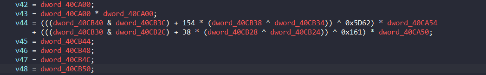

# Findkey

Ở đoạn mã assembly của bài này nó đã bị làm rối luồng thực thi, sử dụng nhiều junk codes cũng như switch case, tuy nhiên ở pseudocode IDA đã làm khá tốt khi đã làm phẳng code flow

Bài này còn bị làm rối bởi những công thức toán học phức tạp và vô nghĩa ví dụ như



Tuy nhiên em nhận ra là những con số này chắc chắn là hằng số vì vậy em có thể đặt breakpoint ngay tại những ví trí quan trọng như index của mảng. Khi đọc mã assembly thì đoạn công thức toán rối đó sẽ được lưu vào thanh ghi nào đó sau đó sẽ được sử dụng dưới mục đích index của mảng hay của vòng lập. Vì vậy em có thể tìm ra xu hướng thay đổi của nó

Script để xem xét của em:
```python 
#!/home/ryou/.venvs/re/bin/python
from pwn import *
elf = './findkey'
p = process(['gdb', '-q', '--nx', elf])

def prompt(prm: bytes):
    p.sendlineafter(b'(gdb)', prm)
    return

def receive(prm: bytes):
    prompt(prm)
    return p.recvline().decode().strip()    

def dump(prm: bytes, endl = ' '):
    out = receive(prm)
    print(out, end=endl)
    return

bp = '40684B'
trace = 'rax'
prompt(f'b * 0x{bp}'.encode())

shouldInFunc = False
sta_func_debug = 0x405BC0
end_func_debug = 0x406DB4

if shouldInFunc:
    prompt(f'b * {end_func_debug:#x}'.encode())

prompt(b'run')

pattern = b'aaa63aaaadaaaaea'
p.sendline(pattern)

print(f'Input: {pattern}\n')

counter = 1
while (counter := counter - 1) >= 0:
    if shouldInFunc:
        if int(receive(f'printf "%u\\n", $rip'.encode()), 10) == end_func_debug:
            break
    dump(f'printf "%u\\n", ${trace}'.encode(), ' ')
    prompt(b'c')
    
print()
p.close()
```
Khi em muốn xem giá trị của 1 cái gì đấy thì chỉ cần chỉnh lại breakpoint và thêm số lần muốn xem lại giá trị đấy là được

```C
// The function seems has been flattened
int __fastcall main(int argc, const char **argv, const char **envp)
{
..............

  n1809819584 = 1809819584;
  noise = 192906851;
  v18 = (int *)(&v6 - 2);
  v17 = 0;
  qmemcpy(plaintext, "278-362-75136019", sizeof(plaintext));
  expected_value[0] = 0x7780842C4DDC52D4LL;
  expected_value[1] = 0x710DCABA4E7D18D6LL;
  memset(s, 0, 0x10uLL);
  printf(pleaseinputyourflag);                  // "[GNJXN\vBE[^_\vRD^Y\vMGJL"
  v3 = fgets(src, 256, stdin);
  if ( v3 )
  {
    len_inp = strlen(src);
    ++noise;
    noise += 5;
    len_inp_temp = len_inp;
    if ( len_inp )
    {
      v20 = &src[len_inp_temp - 1];
      noise += 7;
      noise += 6;
      if ( *v20 == 10 )
      {
        v21 = &src[len_inp_temp - 1];
        noise += 7;
        *v21 = 0;
        --len_inp_temp;
        noise += 4;
      }
    }
    n16_4 = len_inp_temp;
    noise += 5;
    if ( len_inp_temp >= 16 )
    {
      n16 = 16LL;
    }
    else
    {
      n16_5 = len_inp_temp;
      noise += 7;
      noise += 3;
      noise += 5;
      n16 = len_inp_temp;
    }
    n = n16;
    memcpy(s, src, n16);
    sus_func((__int64)plaintext_, (__int64)plaintext, 16);
    sus_func((__int64)&encryptionkey_, (__int64)s, 16);
    is_this_enc(plaintext, dest, (__int64)s);
    sus_func((__int64)encrypteddata_, (__int64)dest, 16);
    rsi_reg = expected_value;
    sus_func((__int64)&expecteddata_, (__int64)expected_value, 16);
    *v18 = 0;
    noise += 8;
    while ( 1 )
    {
      n16_2 = *v18;
      noise += 6;
      if ( n16_2 >= 16 )
        break;
      cur_value = *((_BYTE *)dest + *v18);
      noise += 8;
      noise += 8;
      rsi_reg = (_QWORD *)*((unsigned __int8 *)expected_value + *v18);
      if ( cur_value != (_DWORD)rsi_reg )
      {
        ::match = 0;
        noise += 4;
        noise += 6;
        noise += 2;
        break;
      }
      noise += 8;
      v26 = *v18;
      v27 = dword_40CC84;
      v28 = dword_40CC88;
      v29 = (53 * dword_40CF24 + 7 * dword_40CF24 * dword_40CF24 + 44) * dword_40CC8C
          + (((dword_40CCA8 & dword_40CCA4) + 163 * (dword_40CCA0 ^ dword_40CC9C)) ^ 0x3B2C)
          * dword_40CC8C
          * dword_40CC8C;
      v30 = (((unsigned int)dword_40CCB0 >> 3) | (32 * dword_40CCAC)) ^ 0xFFFFF76D;
      noise += 2;
      noise += 6;
      rsi_reg = (_QWORD *)(dword_40CCE4 & (unsigned int)dword_40CCE0);
      *v18 = (((_DWORD)rsi_reg + 100 * (dword_40CCDC ^ dword_40CCD8)) ^ 0xA1C8F311)
           + (((14 * (dword_40CCD4 + 48)) ^ 0x3A) + 1045) * dword_40CC98
           + (31642 * dword_40CCD0 + 24991 * dword_40CCCC - 252842937) * dword_40CC94
           + (((((unsigned int)dword_40CCC8 >> 3) | (32 * dword_40CCC4)) ^ 0xFFF8B795)
            + ((((unsigned int)dword_40CCC0 >> 3) | (32 * dword_40CCBC)) ^ 0xFE773) * dword_40CC90
            + ((((unsigned int)dword_40CCB8 >> 3) | (32 * dword_40CCB4)) ^ 0x18B65) * dword_40CC90 * dword_40CC90)
           * dword_40CC88
           + (v30 + v29) * dword_40CC84
           + v26;
    }
    match = ::match;
    noise += 9;
    noise += 3;
    if ( ::match )
    {
      printf(&sucess, rsi_reg, (unsigned int)::match);
      noise += 2;
      noise += 7;
      noise += 5;
    }
............
}
```
Ở đây thì em thấy đã có plaintext và expected data rồi, việc của em là đi reverse hàm `is_this_enc` để coi thử logic của nó là gì

```C
// The function seems has been flattened
_QWORD *__fastcall is_this_enc(_QWORD *p_plaintext, _QWORD *p_arg_dest, __int64 program_inp)
{
  __int64 *dest_10; // rax
  _QWORD *dest_3; // rax
  __int64 v5; // [rsp+0h] [rbp-2E0h] BYREF
  unsigned int v6; // [rsp+8h] [rbp-2D8h]
  int v7; // [rsp+Ch] [rbp-2D4h]
  int v8; // [rsp+10h] [rbp-2D0h]
  _QWORD *plaintext_1; // [rsp+18h] [rbp-2C8h]
  _QWORD *dest_1; // [rsp+20h] [rbp-2C0h]
  __int64 s_1; // [rsp+28h] [rbp-2B8h]
  int _; // [rsp+30h] [rbp-2B0h]
  int n115814123; // [rsp+34h] [rbp-2ACh]
  int n16; // [rsp+3Ch] [rbp-2A4h]
  __m128i desta[16]; // [rsp+40h] [rbp-2A0h] BYREF
  int n9_3; // [rsp+148h] [rbp-198h]
  int counter; // [rsp+14Ch] [rbp-194h]
  _BYTE destination[160]; // [rsp+150h] [rbp-190h] BYREF
  _BYTE source[16]; // [rsp+1F0h] [rbp-F0h] BYREF
  __int64 dest; // [rsp+200h] [rbp-E0h] BYREF
  __int64 v21; // [rsp+208h] [rbp-D8h]
  __int64 s_2; // [rsp+210h] [rbp-D0h]
  _QWORD *dest_2; // [rsp+218h] [rbp-C8h]
  __int64 *p_plaintext2; // [rsp+220h] [rbp-C0h]
  __int64 *dest_6; // [rsp+228h] [rbp-B8h]
  int n9_6; // [rsp+234h] [rbp-ACh]
  __int64 *p_dest; // [rsp+238h] [rbp-A8h]
  _BYTE *dest_5; // [rsp+240h] [rbp-A0h]
  int n9_1; // [rsp+248h] [rbp-98h]
  unsigned int v30; // [rsp+24Ch] [rbp-94h]
  int v31; // [rsp+250h] [rbp-90h]
  int v32; // [rsp+254h] [rbp-8Ch]
  int v33; // [rsp+258h] [rbp-88h]
  int v34; // [rsp+25Ch] [rbp-84h]
  int n9_2; // [rsp+260h] [rbp-80h]
  int v36; // [rsp+264h] [rbp-7Ch]
  unsigned int v37; // [rsp+268h] [rbp-78h]
  int n16_2; // [rsp+26Ch] [rbp-74h]
  __int64 *dest_7; // [rsp+270h] [rbp-70h]
  _BYTE *dest_8; // [rsp+278h] [rbp-68h]
  int n9_4; // [rsp+284h] [rbp-5Ch]
  int v42; // [rsp+288h] [rbp-58h]
  int v43; // [rsp+28Ch] [rbp-54h]
  int v44; // [rsp+290h] [rbp-50h]
  int v45; // [rsp+294h] [rbp-4Ch]
  int v46; // [rsp+298h] [rbp-48h]
  int v47; // [rsp+29Ch] [rbp-44h]
  int v48; // [rsp+2A0h] [rbp-40h]
  int n16_1; // [rsp+2A4h] [rbp-3Ch]
  int v50; // [rsp+2A8h] [rbp-38h]
  int v51; // [rsp+2ACh] [rbp-34h]
  unsigned int v52; // [rsp+2B0h] [rbp-30h]
  int v53; // [rsp+2B4h] [rbp-2Ch]
  __int64 *v54; // [rsp+2B8h] [rbp-28h]
  _BYTE *dest_9; // [rsp+2C0h] [rbp-20h]
  int n9_5; // [rsp+2CCh] [rbp-14h]
  int v57; // [rsp+2D0h] [rbp-10h]
  int v58; // [rsp+2D4h] [rbp-Ch]
  int v59; // [rsp+2D8h] [rbp-8h]
  int v60; // [rsp+2DCh] [rbp-4h]

  plaintext_1 = p_plaintext;
  dest_1 = p_arg_dest;
  s_1 = program_inp;
  n115814123 = 115814123;
  _ = 2008905965;
  dest_6 = &v5 - 2;
  p_plaintext2 = p_plaintext;
  dest_2 = p_arg_dest;
  s_2 = program_inp;
  initialize_whitesbox();
  kinda_sus(s_2, (__int64)destination);
  dest = *p_plaintext2;
  v21 = p_plaintext2[1];
  xor16Bytes((__int64)&dest, (__int64)destination);
  counter = 1;
  for ( _ += 7; ; _ += 7 )
  {
    n9_6 = counter;
    _ += 4;
    if ( counter >= 9 )
      break;
    transferFirst16WhiteBox((__int64)&dest);
    cook_some_swap(&dest);
    what_da_hell((__int64)&dest);
    p_dest = &dest;
    dest_5 = destination;
    n9_1 = counter;
    v8 = dword_40CA14 << (((48 * (dword_40CA90 + 86)) ^ 0x2C) + 9);
    v30 = ((((38 * (dword_40CA94 + 69)) ^ 0x2E) + 730372) ^ (((unsigned int)dword_40CA18 >> (6 * dword_40CF20
                                                                                           + 27
                                                                                           * dword_40CF20
                                                                                           * dword_40CF20
                                                                                           + 3)) | v8))
        + dword_40C9F8;
    v31 = dword_40CA1C;
    v32 = dword_40CA20;
    v33 = dword_40CA98;
    v34 = dword_40CA9C;
    _ += 6;
    xor16Bytes(
      (__int64)&dest,
      (__int64)&destination[(((12 * (dword_40CACC + 73)) ^ 0xEC)
                           - 654606840
                           + (11524 * dword_40CAC8 + 9446 * dword_40CAC4 - 306348074) * dword_40CA38
                           + (((dword_40CAC0 & dword_40CABC) + 26 * (dword_40CAB8 ^ dword_40CAB4)) ^ 0x4B02)
                           * dword_40CA34
                           + ((((6 * (dword_40CAB0 + 3)) ^ 0x82) + 9930) ^ ((dword_40CA30 & dword_40CA2C)
                                                                          + (28 * dword_40CAAC
                                                                           + 23 * dword_40CAAC * dword_40CAAC
                                                                           - 131269)
                                                                          * (dword_40CA28 ^ dword_40CA24)) ^ (((dword_40CAA8 << 6) + 19 * dword_40CAA8 * dword_40CAA8 - 343928242 + (20341 * dword_40CAA4 + 13717 * dword_40CAA0 - 762217776) * dword_40CA20 + ((((unsigned int)dword_40CA9C >> 3) | (32 * dword_40CA98)) ^ 0xD1A4F) * dword_40CA1C) * v30)))
                          * counter]);
    _ += 4;
    n9_2 = counter;
    v36 = dword_40C9FC;
    v7 = dword_40CA3C << (116 * dword_40CAD4 - 68 * dword_40CAD0 + 89);
    v37 = (((dword_40CAEC & dword_40CAE8) + 208 * (dword_40CAE4 ^ dword_40CAE0)) ^ 0xC46AA ^ (((unsigned int)dword_40CA40 >> (78 * dword_40CADC + 126 * dword_40CAD8 + 63)) | v7))
        * dword_40C9FC
        * dword_40C9FC;
    _ += 9;
    v6 = ((((dword_40CB10 & dword_40CB0C) + 48 * (dword_40CB08 ^ dword_40CB04)) ^ 0xFFFFFB1D)
        + ((58 * dword_40CB00 + 32 * dword_40CB00 * dword_40CB00 - 43342) ^ (((((unsigned int)dword_40CAFC >> 3) | (32 * dword_40CAF8)) ^ 0xCFF02)
                                                                           * (18965 * dword_40CAF4
                                                                            + 31409 * dword_40CAF0
                                                                            - 853506882
                                                                            + dword_40CA44))))
       * dword_40C9FC
       + v37;
    counter += ((10485 * dword_40CB20 + 10263 * dword_40CB1C - 185256078) ^ (((unsigned int)dword_40CA4C >> (75 * dword_40CB18 + 31 * dword_40CB18 * dword_40CB18 + 57)) | (dword_40CA48 << (71 * dword_40CB14 + 18 * dword_40CB14 * dword_40CB14 - 13))))
             + v6;
  }
  n9_3 = 9;
  transferFirst16WhiteBox((__int64)&dest);
  _ += 3;
  ++_;
  cook_some_swap(&dest);
  memcpy(desta, &src_, sizeof(desta));
  n16 = 0;
  for ( _ += 8; ; _ += 9 )
  {
    n16_2 = n16;
    _ += 6;
    _ += 6;
    if ( n16 >= 16 )
      break;
    dest_10 = dest_6;
    *dest_6 = 0xFC2C4EB7D23BA45LL;
    dest_10[1] = 0xB464F693616239DALL;
    *((_BYTE *)dest_6 + n16) = 0;
    what_da_hell((__int64)dest_6);
    dest_7 = dest_6;
    dest_8 = destination;
    n9_4 = n9_3;
    v42 = dword_40CA00;
    v43 = dword_40CA00 * dword_40CA00;
    v44 = (((dword_40CB40 & dword_40CB3C) + 154 * (dword_40CB38 ^ dword_40CB34)) ^ 0x5D62) * dword_40CA54
        + (((dword_40CB30 & dword_40CB2C) + 38 * (dword_40CB28 ^ dword_40CB24)) ^ 0x161) * dword_40CA50;
    v45 = dword_40CB44;
    v46 = dword_40CB48;
    v47 = dword_40CB4C;
    v48 = dword_40CB50;
    _ += 4;
    xor16Bytes(
      (__int64)dest_7,
      (__int64)&dest_8[(((((unsigned int)dword_40CB78 >> 3) | (32 * dword_40CB74)) ^ 0xA210E9BA)
                      + (30 * dword_40CB70 + 21 * dword_40CB70 * dword_40CB70 - 5592) * dword_40CA6C
                      + (57 * dword_40CB6C + 42 * dword_40CB6C * dword_40CB6C - 71897) * dword_40CA68
                      + ((((unsigned int)dword_40CB68 >> 3) | (32 * dword_40CB64)) ^ 0xE61F1 ^ ((dword_40CA64 & dword_40CA60)
                                                                                              + (((dword_40CB60 & dword_40CB5C)
                                                                                                + 114
                                                                                                * (dword_40CB58 ^ dword_40CB54)) ^ 0x218A)
                                                                                              * (dword_40CA5C ^ dword_40CA58)))
                      * v42
                      + ((((v48 & v47) + 3 * (v46 ^ v45)) ^ 0xF732260E) + v44) * v43)
                     * n9_4]);
    transferFirst16WhiteBox((__int64)dest_6);
    cook_some_swap(dest_6);
    xor16Bytes((__int64)dest_6, (__int64)source);
    if ( _mm_movemask_epi8(_mm_cmpeq_epi8(*(__m128i *)dest_6, desta[n16])) != 0xFFFF )
    {
      match = 0;
      ++_;
      _ += 4;
      _ += 5;
    }
    ++_;
    n16_1 = n16;
    v50 = dword_40CA04;
    v51 = dword_40CA08;
    v52 = ((((unsigned int)dword_40CB90 >> 3) | (32 * dword_40CB8C)) ^ 0x63FD7) * dword_40CA70
        + (((dword_40CB88 & dword_40CB84) + 80 * (dword_40CB80 ^ dword_40CB7C)) ^ 0x261) * dword_40CA70 * dword_40CA70;
    v53 = 2143 * dword_40CB98 + 26072 * dword_40CB94 - 759796583;
    ++_;
    _ += 6;
    n16 += 44 * dword_40CBC0
         + 33 * dword_40CBC0 * dword_40CBC0
         - 251846935
         + ((((unsigned int)dword_40CBBC >> 3) | (32 * dword_40CBB8)) ^ 0xFD2EA) * dword_40CA78
         + ((((unsigned int)dword_40CBB4 >> 3) | (32 * dword_40CBB0)) ^ 0xDBFEA) * dword_40CA78 * dword_40CA78
         + (((((unsigned int)dword_40CBAC >> 3) | (32 * dword_40CBA8)) ^ 0xFFFD908F)
          + (13 * dword_40CBA4 + 43 * dword_40CBA4 * dword_40CBA4 - 29310) * dword_40CA74
          + (2641 * dword_40CBA0 + 6017 * dword_40CB9C - 37439678) * dword_40CA74 * dword_40CA74)
         * dword_40CA08
         + (v53 + v52) * dword_40CA04;
  }
  what_da_hell((__int64)&dest);
  v54 = &dest;
  dest_9 = destination;
  n9_5 = n9_3;
  v57 = dword_40CA0C;
  v58 = dword_40CA10;
  v59 = (((dword_40CBE0 & dword_40CBDC) + 88 * (dword_40CBD8 ^ dword_40CBD4)) ^ 0x3972) * dword_40CA7C
      + (((dword_40CBD0 & dword_40CBCC) + 61 * (dword_40CBC8 ^ dword_40CBC4)) ^ 0x17CC) * dword_40CA7C * dword_40CA7C;
  v60 = (42 * (dword_40CBE4 + 21)) ^ 0x14;
  _ += 7;
  _ += 6;
  HIDWORD(v5) = ((((22 * (dword_40CBF8 + 100)) ^ 0xE7) + 436994) ^ (((unsigned int)dword_40CA84 >> ((((unsigned int)dword_40CBF4 >> 3) | (32 * dword_40CBF0)) ^ 0xD5)) | (dword_40CA80 << ((((unsigned int)dword_40CBEC >> 3) | (32 * dword_40CBE8)) ^ 0x52))))
              * dword_40CA10
              + (v60 - 107184 + v59) * dword_40CA0C;
  xor16Bytes(
    (__int64)&dest,
    (__int64)&destination[(((32583 * dword_40CC0C + 29531 * dword_40CC08 - 2072954027) ^ (((unsigned int)dword_40CA8C >> ((((unsigned int)dword_40CC04 >> 3) | (32 * dword_40CC00)) ^ 0x97)) | (dword_40CA88 << (((38 * (dword_40CBFC + 3)) ^ 0x48) - 11))))
                         + HIDWORD(v5))
                        * n9_3]);
  transferFirst16WhiteBox((__int64)&dest);
  cook_some_swap(&dest);
  xor16Bytes((__int64)&dest, (__int64)source);
  dest_3 = dest_2;
  *dest_2 = dest;
  dest_3[1] = v21;
  return dest_3;
}
```
Sau khi dùng script để tìm index thì em nhận thấy những vòng lặp nó chỉ đơn giản là tăng dần tới 1 lúc nào đó thì sẽ break như for bình thường nó chỉ làm rối code hơn thôi. Và còn vài chổ khác nữa như nói chung là giá trị của nó khá là cố định và đơn giản chỉ có phép toán phức tạp

Sau khi áp dụng script trace giá trị thì em đã thấy nó khá giống AES-128bits key nhưng vì sợ nó có modify hay gì đó nên em đã quyết định reverse lại toàn bộ

Đây là script mô phỏng lại toàn bộ hành vi của chương trình của em

```python 
#!/home/ryou/.venvs/re/bin/python
import sys

sbox = [
    0x63, 0x7c, 0x77, 0x7b, 0xf2, 0x6b, 0x6f, 0xc5, 0x30, 0x01, 0x67, 0x2b, 0xfe, 0xd7, 0xab, 0x76,
    0xca, 0x82, 0xc9, 0x7d, 0xfa, 0x59, 0x47, 0xf0, 0xad, 0xd4, 0xa2, 0xaf, 0x9c, 0xa4, 0x72, 0xc0,
    0xb7, 0xfd, 0x93, 0x26, 0x36, 0x3f, 0xf7, 0xcc, 0x34, 0xa5, 0xe5, 0xf1, 0x71, 0xd8, 0x31, 0x15,
    0x04, 0xc7, 0x23, 0xc3, 0x18, 0x96, 0x05, 0x9a, 0x07, 0x12, 0x80, 0xe2, 0xeb, 0x27, 0xb2, 0x75,
    0x09, 0x83, 0x2c, 0x1a, 0x1b, 0x6e, 0x5a, 0xa0, 0x52, 0x3b, 0xd6, 0xb3, 0x29, 0xe3, 0x2f, 0x84,
    0x53, 0xd1, 0x00, 0xed, 0x20, 0xfc, 0xb1, 0x5b, 0x6a, 0xcb, 0xbe, 0x39, 0x4a, 0x4c, 0x58, 0xcf,
    0xd0, 0xef, 0xaa, 0xfb, 0x43, 0x4d, 0x33, 0x85, 0x45, 0xf9, 0x02, 0x7f, 0x50, 0x3c, 0x9f, 0xa8,
    0x51, 0xa3, 0x40, 0x8f, 0x92, 0x9d, 0x38, 0xf5, 0xbc, 0xb6, 0xda, 0x21, 0x10, 0xff, 0xf3, 0xd2,
    0xcd, 0x0c, 0x13, 0xec, 0x5f, 0x97, 0x44, 0x17, 0xc4, 0xa7, 0x7e, 0x3d, 0x64, 0x5d, 0x19, 0x73,
    0x60, 0x81, 0x4f, 0xdc, 0x22, 0x2a, 0x90, 0x88, 0x46, 0xee, 0xb8, 0x14, 0xde, 0x5e, 0x0b, 0xdb,
    0xe0, 0x32, 0x3a, 0x0a, 0x49, 0x06, 0x24, 0x5c, 0xc2, 0xd3, 0xac, 0x62, 0x91, 0x95, 0xe4, 0x79,
    0xe7, 0xc8, 0x37, 0x6d, 0x8d, 0xd5, 0x4e, 0xa9, 0x6c, 0x56, 0xf4, 0xea, 0x65, 0x7a, 0xae, 0x08,
    0xba, 0x78, 0x25, 0x2e, 0x1c, 0xa6, 0xb4, 0xc6, 0xe8, 0xdd, 0x74, 0x1f, 0x4b, 0xbd, 0x8b, 0x8a,
    0x70, 0x3e, 0xb5, 0x66, 0x48, 0x03, 0xf6, 0x0e, 0x61, 0x35, 0x57, 0xb9, 0x86, 0xc1, 0x1d, 0x9e,
    0xe1, 0xf8, 0x98, 0x11, 0x69, 0xd9, 0x8e, 0x94, 0x9b, 0x1e, 0x87, 0xe9, 0xce, 0x55, 0x28, 0xdf,
    0x8c, 0xa1, 0x89, 0x0d, 0xbf, 0xe6, 0x42, 0x68, 0x41, 0x99, 0x2d, 0x0f, 0xb0, 0x54, 0xbb, 0x16
]

src_data = [
    0x1F, 0x52, 0xDC, 0x4D, 0x2C, 0x84, 0x80, 0x91, 0xD6, 0x18, 0x5B, 0x4E, 0xBA, 0xC3, 0x0D, 0x71,
    0x56, 0x52, 0xDC, 0x4D, 0x2C, 0x84, 0x80, 0xD8, 0xD6, 0x18, 0x72, 0x4E, 0xBA, 0x61, 0x0D, 0x71,
    0x34, 0x52, 0xDC, 0x4D, 0x2C, 0x84, 0x80, 0x5C, 0xD6, 0x18, 0x43, 0x4E, 0xBA, 0x65, 0x0D, 0x71,
    0xC9, 0x52, 0xDC, 0x4D, 0x2C, 0x84, 0x80, 0x28, 0xD6, 0x18, 0x61, 0x4E, 0xBA, 0x50, 0x0D, 0x71,
    0xD4, 0x0B, 0xDC, 0x4D, 0x9B, 0x84, 0x80, 0x77, 0xD6, 0x18, 0x7D, 0x34, 0xBA, 0xCA, 0x47, 0x71,
    0xD4, 0x41, 0xDC, 0x4D, 0x94, 0x84, 0x80, 0x77, 0xD6, 0x18, 0x7D, 0xDA, 0xBA, 0xCA, 0x62, 0x71,
    0xD4, 0x36, 0xDC, 0x4D, 0x06, 0x84, 0x80, 0x77, 0xD6, 0x18, 0x7D, 0xE1, 0xBA, 0xCA, 0xAC, 0x71,
    0xD4, 0xC2, 0xDC, 0x4D, 0xE7, 0x84, 0x80, 0x77, 0xD6, 0x18, 0x7D, 0xEA, 0xBA, 0xCA, 0x60, 0x71,
    0xD4, 0x52, 0x6F, 0x4D, 0x2C, 0x37, 0x80, 0x77, 0x00, 0x18, 0x7D, 0x4E, 0xBA, 0xCA, 0x0D, 0x80,
    0xD4, 0x52, 0x09, 0x4D, 0x2C, 0x3A, 0x80, 0x77, 0x40, 0x18, 0x7D, 0x4E, 0xBA, 0xCA, 0x0D, 0x7B,
    0xD4, 0x52, 0x62, 0x4D, 0x2C, 0x93, 0x80, 0x77, 0x54, 0x18, 0x7D, 0x4E, 0xBA, 0xCA, 0x0D, 0x36,
    0xD4, 0x52, 0xF0, 0x4D, 0x2C, 0x54, 0x80, 0x77, 0x10, 0x18, 0x7D, 0x4E, 0xBA, 0xCA, 0x0D, 0x17,
    0xD4, 0x52, 0xDC, 0x1F, 0x2C, 0x84, 0xC8, 0x77, 0xD6, 0x4B, 0x7D, 0x4E, 0x17, 0xCA, 0x0D, 0x71,
    0xD4, 0x52, 0xDC, 0x75, 0x2C, 0x84, 0x76, 0x77, 0xD6, 0x25, 0x7D, 0x4E, 0xCF, 0xCA, 0x0D, 0x71,
    0xD4, 0x52, 0xDC, 0x2B, 0x2C, 0x84, 0x22, 0x77, 0xD6, 0x08, 0x7D, 0x4E, 0x16, 0xCA, 0x0D, 0x71,
    0xD4, 0x52, 0xDC, 0x3E, 0x2C, 0x84, 0x33, 0x77, 0xD6, 0x81, 0x7D, 0x4E, 0x2D, 0xCA, 0x0D, 0x71
]

rcon = [
    0x00, 0x01, 0x02, 0x04, 0x08, 0x10, 0x20, 0x40, 
    0x80, 0x1B, 0x36, 0x00, 0x00, 0x00, 0x00, 0x00
]

def kinda_sus(inp: list):
    dest = [0] * 176
    cache = [0] * 4

    for i in range(16):
        dest[i] = inp[i]

    i = 4
    while True:
        if i >= 44:
            break
        for n4 in range(4):
            cache[n4] = dest[n4 + (i - 1) * 4]
        if i % 4 == 0:
            cache[0], cache[1], cache[2], cache[3] = cache[1], cache[2], cache[3], cache[0]

            for n4 in range(4):
                cache[n4] = sbox[cache[n4]]
            cache[0] ^= rcon[i // 4] 

        for n4 in range(4):
            dest[n4 + 4 * i] = cache[n4] ^ dest[n4 + (i - 4) * 4]
            dest[n4 + 4 * i] &= 0xFF
        i += 1
    
    return dest

def whut_is_this(src: int, num: int):
    returnValue = 0
    for _ in range(8):
        if (num & 1) != 0:
            returnValue ^= src
        v14 = 128 & src
        src <<= 1
        if v14:
            src ^= 27
        num >>= 1
    return returnValue

def cook_some_swap(src: list):
    src[1], src[5], src[9], src[13] = src[5], src[9], src[13], src[1]
    src[2], src[10] = src[10], src[2]
    src[6], src[14] = src[14], src[6]
    src[15], src[11], src[7], src[3] = src[11], src[7], src[3], src[15]

    return

def xor16Bytes(dest: list, src: list):
    for i in range(16):
        # print(hex(src[i] ^ dest[i]))
        num = src[i] ^ dest[i]
        num &= 0xFF
        dest[i] = num

def transferFirst16WhiteBox(dest: list):
    for i in range(len(dest)):
        dest[i] = sbox[dest[i]]
    return

def what_da_hell(src: list):
    for n4 in range(4):
        pos = n4 * 4
        first = src[pos]
        second = src[pos + 1]
        third = src[pos + 2]
        fourth = src[pos + 3]

        src[pos] = fourth ^ third ^ whut_is_this(second, 3) ^ whut_is_this(first, 2)
        src[pos + 1] = fourth ^ whut_is_this(third, 3) ^ first ^ whut_is_this(second, 2)
        src[pos + 2] = whut_is_this(fourth, 3) ^ whut_is_this(third, 2) ^ second ^ first
        src[pos + 3] = third ^ second ^ whut_is_this(first, 3) ^ whut_is_this(fourth, 2)

        for _ in range(4): 
            src[pos + _] &= 0xFF

    return

match = 1

print_hex = lambda x: ' '.join(f'{i:02x}' for i in x)

def is_this_enc(inp: list):
    dest = [0x32, 0x37, 0x38, 0x2d, 0x33, 0x36, 0x32, 0x2d, 0x37, 0x35, 0x31, 0x33, 0x36, 0x30, 0x31, 0x39] 
    destination = kinda_sus(inp)
    xor16Bytes(dest, destination)
    for counter in range(1, 9):
        transferFirst16WhiteBox(dest)
        cook_some_swap(dest)
        what_da_hell(dest)

        xor16Bytes(dest, destination[counter * 16 : counter * 16 + 16])

    transferFirst16WhiteBox(dest)
    cook_some_swap(dest)

    for n16 in range(16):
        craftbyte = list(int(0xFC2C4EB7D23BA45).to_bytes(8, byteorder='little') \
            + int(0xB464F693616239DA).to_bytes(8, byteorder='little'))
        
        craftbyte[n16] = 0

        crafted = craftbyte 
        what_da_hell(crafted)

        xor16Bytes(
            crafted,
            destination[144 : 144 + 16]
        )

        transferFirst16WhiteBox(crafted)
        cook_some_swap(crafted)
        xor16Bytes(crafted, destination[160 : 160 + 16])

        if crafted[:16] != src_data[n16 * 16 : n16 * 16 + 16]:
            match = 0
    
    what_da_hell(dest)
    xor16Bytes(
        dest, 
        destination[144 : 144 + 16]
    )
    transferFirst16WhiteBox(dest)
    cook_some_swap(dest)
    xor16Bytes(dest, destination[160 : 160 + 16])

    # dest += [0x57,0xe4,0x9d,0xe2,0xcc,0x66,0xb4,0x34,0xa0, 0xdb, 0xff, 0xff, 0xff, 0x7f, 0x00, 0x00]

    return dest

def sus_print(fmt):
    for i in fmt:
        print(f'{i:02x}', end = '')
    print()

pattern =  list(b'skibiditoilethah')
print(sus_print(is_this_enc(pattern)))
print(match)
```

Đây chính xác là AES 128bit key rồi, tuy nhiên nếu chỉ để nguyên như này thì chắc chắn không giải quyết được gì bởi chỉ với plaintext và ciphertext thì khó mà tìm ra key

Em nhận thấy trong code có một lỗ hỏng khá nghiêm trọng 
```python 
    for n16 in range(16):
        craftbyte = list(int(0xFC2C4EB7D23BA45).to_bytes(8, byteorder='little') \
            + int(0xB464F693616239DA).to_bytes(8, byteorder='little'))
        
        craftbyte[n16] = 0

        crafted = craftbyte 
        what_da_hell(crafted)

        xor16Bytes(
            crafted,
            destination[144 : 144 + 16]
        )

        transferFirst16WhiteBox(crafted)
        cook_some_swap(crafted)
        xor16Bytes(crafted, destination[160 : 160 + 16])

        if crafted[:16] != src_data[n16 * 16: 16 * n16+16]:
            match = 0
```
Tại đoạn này, Key Round 9th có thể bị phục hồi từ đó nhẫn tới việc tìm được Key ban đầu của AES

Key 9 là `destination[144 : 144 + 16]` và key 10 là `destination[160 : 160 + 16]`
Gọi trạng thái của crafted trước khi xor với key 10 ở vòng lặp thứ k là P(k)
Ta có

```
Với k > 1
src_data[k*16: (k+1)*16] ^ src_data[(k-1)*16: k*16] === P(k) ^ Key10 ^ P(k+1) ^ Key10

Key 10 bị triệt tiêu
```

Pseudocode recover giá trị:
Chúng ta có `x và `y tương ứng với list crafted ở n16=0 và n16=1 sau khi chạy qua hàm `what_da_hell` 
`T` và `Q` là `src_data[k * 16: (k + 1) * 16]` tương ứng với k = 0 và k = 1 sau khi đưa vào hàm `inverse_cook_some_swap`
```

FOR i in 16
candidate
FOR k in 256:
    if sbox[k ^ x[i]] ^ sbox[k ^ y[i]] == T[i] ^ Q[i]
        candidate append k
all possible value is in candidate
```
Để mà candidate có duy nhật 1 giá trị thì chúng ta có thể thử 15 cập hệ phương trình
    
Script:
```python 
def script():
    def inverse_cook_some_swap(src: list):
        src[1], src[5], src[9], src[13] = src[13], src[1], src[5], src[9]
        src[2], src[10] = src[10], src[2]
        src[6], src[14] = src[14], src[6]
        src[15], src[11], src[7], src[3] = src[3], src[15], src[11], src[7]
        return src

    raw_bytes = list(int(0xFC2C4EB7D23BA45).to_bytes(8, 'little') + int(0xB464F693616239DA).to_bytes(8, 'little'))
    
    inputs = [] 
    outputs = []

    for n in range(16):
        inp = list(raw_bytes) 
        inp[n] = 0           

        what_da_hell(inp) 
        
        inputs.append(inp) 

        out = list(src_data[n*16 : (n+1)*16])
        inverse_cook_some_swap(out)    
        outputs.append(out)

    RoundKey9 = []

    for i in range(16):
        candidates = set(range(256))
        
        base_in = inputs[0][i]
        base_out = outputs[0][i]

        for other_run in range(1, 16):
            other_in = inputs[other_run][i]
            other_out = outputs[other_run][i]
            
            target_diff = base_out ^ other_out
            
            valid_for_this_pair = set()
            
            for k in candidates:
                s0 = sbox[base_in ^ k]
                s_other = sbox[other_in ^ k]
                
                if (s0 ^ s_other) == target_diff:
                    valid_for_this_pair.add(k)
            
            candidates = candidates.intersection(valid_for_this_pair)

            if len(candidates) == 1:
                break
        
        if len(candidates) == 1:
            RoundKey9.append(list(candidates)[0])

    def reverse_kinda_sus(rk9):
        exp_key = [0] * 176
        for i in range(16): exp_key[144 + i] = rk9[i]

        W = [0] * 44
        for i in range(44):
            if i >= 36: W[i] = (exp_key[4 * i] << 24) | (exp_key[4 * i + 1] << 16) | (exp_key[4 * i + 2] << 8) | exp_key[4 * i + 3]

        for i in range(35, -1, -1):
            temp = W[i+3]

            if (i + 4) % 4 == 0:
                temp = ((temp << 8) & 0xFFFFFFFF) | (temp >> 24)
                t0, t1, t2, t3 = sbox[(temp >> 24) & 0xFF], sbox[(temp >> 16) & 0xFF], sbox[(temp >> 8) & 0xFF], sbox[temp & 0xFF]
                temp = (t0 << 24) | (t1 << 16) | (t2 << 8) | t3

                temp ^= (rcon[(i + 4) // 4] << 24)

            W[i] = W[i+4] ^ temp
        
        key = []
        for i in range(4):
            key.extend([(W[i] >> 24) & 0xFF, (W[i] >> 16) & 0xFF, (W[i] >> 8) & 0xFF, W[i] & 0xFF])
        return key


    key = reverse_kinda_sus(RoundKey9)
    flag_bytes = bytes(key)
    print(f'Key {flag_bytes.hex()} Flag: {flag_bytes.decode()}')
```

Flag: flag{8579432268}


---

### Update: 
Ở bài này có obfuscate CFF để làm rối
Pattern của bài:
1. Đầu tiên là các đoạn code chính sẽ nằm trong cùng một block
2. Biến state sẽ được lưu trên stack tại vị trí [rbp - 436] và [rbp - 444] là biến nhớ tạm
3. Mỗi block code chính sẽ chỉnh state để dispatcher xác định flow tiếp theo
4. Pattern để chọn flow
    
5. Các giá trị State thì nó được làm rối theo kiểu toán học tức là dùng những phép tính toán phức tạp để tính toán block tiếp theo cần được thực thi

Để gỡ rối được thì nhiệm vụcủa chúng ta là cần phải xác định giá trị của [rbp - 444] ở mỗi state sau đó patch jump thẳng trực tiếp tới flow cần thiết luôn.