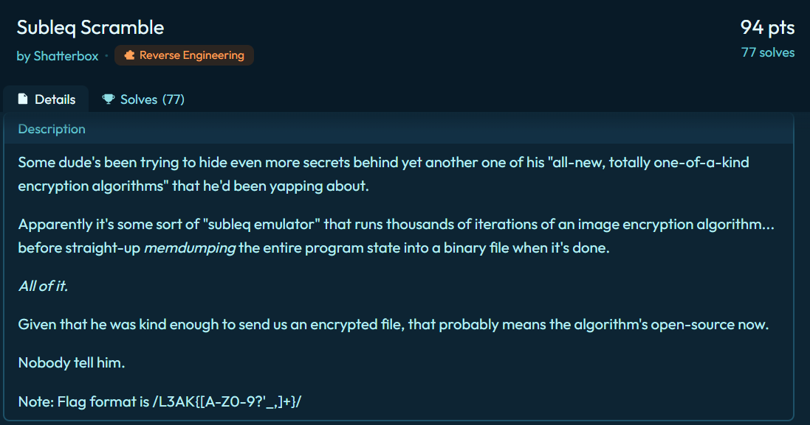
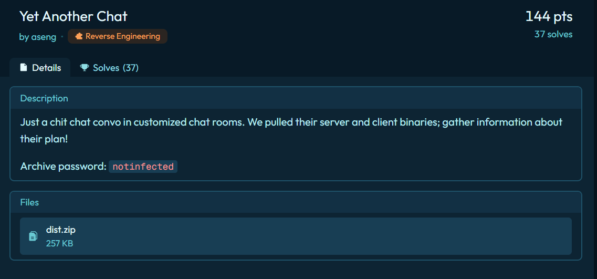
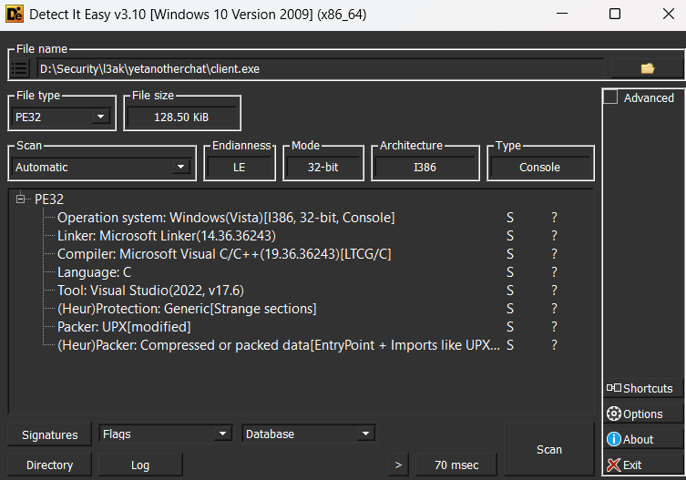
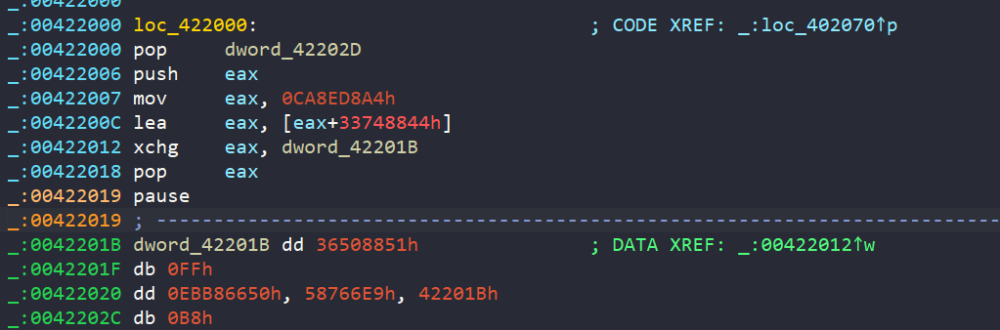
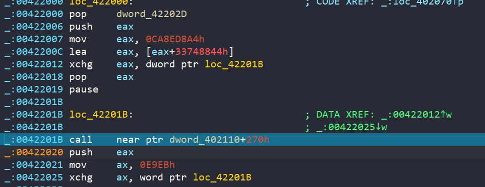
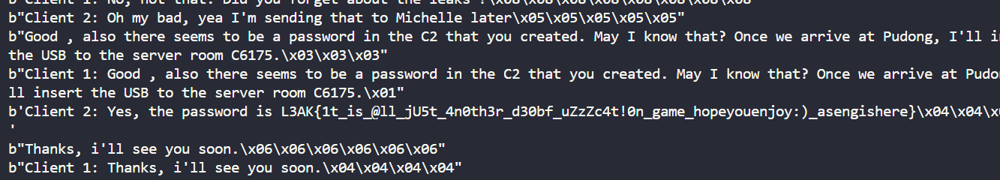

### Subleq Scramble (77 solves)

This was an interesting challenge although it was not that hard, we could still learn something from analyzing this challenge



The downloaded file is a raw binary file with no recognizable format. From the challenge's description, we know that this is a dump of memory state of a SUBLEQ emulator after encrypting an image

Just in case you don't know what a "subleq emulator" is. Basically SUBLEQ means "Subtract and Branch if Less than or Equal to Zero". SUBLEQ is considered a finite-state machine because of the boundary in memory range (for example 8-bit, 16-bit, 32-bit, ...) But abstractly, it could be witnessed as a turing-complete machine

Heading back to the challenge, since the author only gives us the final memory state of the emulator, where data is modified throughout execution, it could be harder to analyze the challenge if the binary does some operation that we could not manually reverse. For example, program could modify its own operands or branch targets. But let's hope they didn't deliberately do this

First of all we need to determine what word size this SUBLEQ implementation uses, we can make an initial guess by looking at several piece of evidence. First of all, it could not be 8-bit, well subjectively speaking, 256 memory cells are too tight to write any program not to mention this is an image-encryption program. A 32-bit or larger word-size program is not good at all because by interpreting the binary, some instructions access indices that exceed the bounded memory range so this implementation is not plausible as well. So 16-bit fits all these conditions. Although this was just a heuristic guess, just trust me here *Proof by AC*
 
Let's write a disassembler real quick
```python 
#!/usr/bin/env python3

import struct

with open('data.subleq', 'rb') as f:
    bin = f.read()

data = list(struct.unpack('<' + 'h' * (len(bin) // 2), bin))

symbol = {
    252: "reg1",
    253: "reg2",
    261: "width",
    262: "height",
    1: "1",
    2: "-1",
    0: "reg0",
    258: "w",
    90: "reg3",
    136: "reg4",
    97: "reg5",
    254: "-2",
    263: "start_image_blob",
    195: "-65",
    259: "h",
    260: "loop_lim_9999"
}
def get_symbol(x):
    if x in symbol:
        return symbol[x]
    return f"data[{x}]"

pc = 0
while pc < 264: 
    first = data[pc]
    second = data[pc + 1]
    third = data[pc + 2]

    diff = data[second]

    asm = f"""{get_symbol(second & 0xffff)} -= {get_symbol(first & 0xffff)}"""
    for reg in range(100):
        if f"reg{reg} -= reg{reg}" in asm:
            asm = f"Reset reg{reg}"
            data[second] = 0

    print(f"{pc:#x} {asm} if <= 0 taken {third & 0xffff:#x}\n")

    pc += 3
```
The symbols are what I retrieved from reversing the log and understanding the binary's context. The log is [here](subleq_log.txt)

Let's inspect the log slowly to reconstruct the logic
```C
0x3 loop_lim_9999 -= data[257] if <= 0 taken 0x6
0xa2 loop_lim_9999 -= 1 if <= 0 taken 0xb7
```
This part initializes loop counter limitation, which is up to 9999, because `data[257]` is fixed at `-9999` (you can examine from the binary)

Alright we figured out the looping block, all instructions located from `0x3` to `0xa2` are the main encrypting logic. There are some operations with a pattern like `data[xx] -= data[xx]` so I named it `Reset data[xx]` 

```C
0x6 Reset reg1 if <= 0 taken 0x9
0x9 Reset reg2 if <= 0 taken 0xc
0xc reg1 -= width if <= 0 taken 0xf
0xf reg2 -= reg1 if <= 0 taken 0x12
0x12 Reset reg1 if <= 0 taken 0x15
0x15 reg1 -= h if <= 0 taken 0x18
0x18 reg2 -= 1 if <= 0 taken 0x1e
0x1b Reset reg0 if <= 0 taken 0x15
0x1e reg1 -= w if <= 0 taken 0x21
```
I named `width` because I saw that its value (which is 84) is a constant. Well basically eventhough, it could be the width or the height, the distinction does not affect the analysis, Incidentally, there is a height variable equal to 38. So the image is `84x38` 
Look closely, there is a repeating block from `0x15 -> 0x1b` which computes the value `-h * width - w`

The encrypted image blob starts at index `264` so I named a memory cell with the fixed value `264` as `start_image_blob`
```C
0x21 reg1 -= start_image_blob if <= 0 taken 0x24
0x24 Reset reg3 if <= 0 taken 0x27
0x27 reg3 -= reg1 if <= 0 taken 0x2a
0x2a Reset reg4 if <= 0 taken 0x2d
0x2d reg4 -= reg1 if <= 0 taken 0x30
0x30 Reset reg5 if <= 0 taken 0x33
0x33 reg5 -= reg1 if <= 0 taken 0x36
```
This part is pretty tricky and it sent me down the wrong direction, we can recognize that reg1 stores  `-h * width - w - start_image_blob` 
`reg3 = reg4 = reg5 = -reg1 = start_image_blob + h * width + w` means `reg3`, `reg4`, and `reg5` contain the memory address of the image cell at coordinates (w, h) rather than the pixel value

At first glance, I thought they were just temporary variables used to prepare something related to encryption but I was wrong. Look again at the log, the positions of those variables were `90`, `136` and `97` respectively, which are located directly in the code region of the program, so this means the program is modifying operands related to index in later SUBLEQ instructions to point to the memory address of the image cell to process that cell during later encryption

>[!NOTE]
>Just in case this is confusing, SUBLEQ is designed to operate on memory cells. Each cell, specified by an address, occupies exactly 16 bits in this challenge (or could differ in other challenges, depends on the architecture). The instructions and data share the same memory, and a memory cell can be accessed through an index in each instruction

There is a pattern for checking the boundaries of `w` and `h`
```C
0x36 Reset reg1 if <= 0 taken 0x39
0x39 reg1 -= w if <= 0 taken 0x3f
0x3c Reset reg0 if <= 0 taken 0xa8
0x3f reg2 -= width if <= 0 taken 0x42
0x42 reg1 -= reg2 if <= 0 taken 0xa8

0x45 Reset reg1 if <= 0 taken 0x48
0x48 Reset reg2 if <= 0 taken 0x4b
0x4b reg1 -= h if <= 0 taken 0x51
0x4e Reset reg0 if <= 0 taken 0xa8
0x51 reg2 -= height if <= 0 taken 0x54
0x54 reg1 -= reg2 if <= 0 taken 0xa8
```
At `0x39` and `0x42`, the log illustrates that, to continue the encryption loop, the condition must be `w >= 0 and w <= width`. `h` also needs a similar condition.

```C
0x57 Reset reg2 if <= 0 taken 0x5a
0x5a reg2 -= reg0 if <= 0 taken 0x5d
0x5d reg2 -= -1 if <= 0 taken 0x87
0x60 reg0 -= -2 if <= 0 taken 0x63

0x63 Reset reg2 if <= 0 taken 0x66
0x66 Reset reg1 if <= 0 taken 0x69
0x69 reg1 -= data[255] if <= 0 taken 0x6c
0x6c reg2 -= reg1 if <= 0 taken 0x6f
0x6f data[255] -= data[255] if <= 0 taken 0x72
0x72 data[255] -= reg2 if <= 0 taken 0x75

0x75 Reset reg2 if <= 0 taken 0x78
0x78 Reset reg1 if <= 0 taken 0x7b
0x7b reg1 -= data[256] if <= 0 taken 0x7e
0x7e reg2 -= reg1 if <= 0 taken 0x81
0x81 data[256] -= data[256] if <= 0 taken 0x84
0x84 data[256] -= reg2 if <= 0 taken 0x87

0x87 reg0 -= 1 if <= 0 taken 0x8a
0x8a Reset reg1 if <= 0 taken 0x8d
0x8d reg1 -= data[256] if <= 0 taken 0x90
0x90 data[256] -= data[256] if <= 0 taken 0x93
0x93 data[256] -= data[255] if <= 0 taken 0x96
0x96 data[255] -= data[255] if <= 0 taken 0x99
0x99 data[255] -= reg1 if <= 0 taken 0x9c
0x9c w -= data[255] if <= 0 taken 0x9f
0x9f h -= data[256] if <= 0 taken 0xa2
```
I have separated this main encryption blob into 4 different blocks. As a reminder, `reg0` at `0x60`, `0x80`, and `0x5a` has been replaced by the index of the current pixel. Returning to the logic of this log is equivalent to the following C-like pseudocode

```C
int pixel = current_image_pixel
if (pixel == 0) {
    pixel = 1
    dx, dy = -dy, dx
}
else {
    pixel = 0
    dx, dy = dy, -dx
}
```

As you can see, `data[255]` and `data[256]` are `dx` and `dy` respectively. In conclusion, the encryption is relatively simple, it performs a bit-flipping operation and moves to the next cell depending on the current pixel value. This process is repeated 9999 times. In my opinion, The log would not be that hard to analyze because the terminology is pretty clear. The remaining lines of the log are actually weird. However I believed that those things were merely junk data or decoys, so I ignored them.

So our mission here is pretty intuitive, extracting the encrypted image from index `264` to the end of the binary file, and then reversing the operation exactly 9999 times.

One more thing I need to mention is that each pixel represents a color of one point in the image, either black/white or red/blue. The contrast between two color creates visible text on the image that we could see (at first, I thought it was a bitstream of the image)

Solve script
```python
#!/usr/bin/env python3
import struct

with open("data.subleq", 'rb') as f:
    bin = f.read()

start = 264
encrypted_image = list(struct.unpack('<' + 'h' * 84 * 38, bin[start * 2:]))[:84 * 38]
print(encrypted_image)

data = list(struct.unpack('<' + 'h' * (len(bin) // 2), bin))

width = 84
height = 38

def decrypt(data, w, h, dx, dy):
    iteration = 9999
    for i in range(iteration):
        w += dx
        h += dy
        pixel = h * width + w
        try: 
            if data[pixel] == 0:
                data[pixel] = 1
                dx, dy = -dy, dx
            else:
                data[pixel] = 0
                dx, dy = dy, -dx
        except:
            print(pixel, w, h)
            exit(0)
    return data
res = decrypt(bytearray(encrypted_image), data[258], data[259], data[255], data[256])

from PIL import Image

img = Image.new('L', (width, height), color=255)
for i in range(38):
    for j in range(84):
        if res[i * width + j]:
            img.putpixel((j, i), 0)

img.save('output.png')
```


### Yet Another Chat (37 solves)


Before getting into my solution, I think there might be other clever directions because my approach seems to be tough

#### Description
The challenge gives us three files which are `server.exe`, `client.exe` and `challenge.pcap`. My experience tells me that this challenge will be about the interaction between `server.exe` and `client.exe`, whereas the `challenge.pcap` is the captured packet during the communication process

Let's triage these binaries first, I will use `Detect It Easy`


These binaries are packed using `UPX`, however the UPX decompressor was unable to unpack the binary. So I think it is highly modified and hijacked, so we have to manually unpack it. The packed binary often execute its shellcode to reconstruct the original binary, then run it. In order to unpack, we have to find `OEP` (Original Entry Point), the actual entry point of our binary, not the shellcode one.

There are several ways to find this value, we could place a breakpoint on the section that packer stores unpacked executable to detect whether it is executing or finding the last `jump` instruction in the shellcode

Whatever method you use, the ultimate goal is to find the `OEP`. Unfortunately, the binary is heavily obfuscated, so we could not analyze the binary statically. I can't determine whether deobfuscating this binary is feasible



It is trying to compute the bytecode at runtime and patch the next instruction directly using the `xchg` instruction
Then after executing the decoded instruction, it returns to the unreadable opcode


Although the pattern is clear, there is a high risk in encountering unexpected behaviour. So I decided to debug the challenge dynamically (the cost that I have to pay is 10 hours of suffering)

Before edging through a thousand assembly lines, I decided to monitor how many API calls were made throughout execution. By using API Monitor, we were able to collect a lot of useful information, we can monitor all the APIs related to `Networking`, `Visual C++ Runtime Library`, and `Security and Identity` (select these options in API Monitor)

First of all we can see that the `server.exe` is initializing some basic networking setup. For example, `setsockopt` for configuring `TCP` socket or `inet_addr` and `bind` for establishing a loopback network connection, then start listening to the incoming packets.

When I first ran the `client.exe`, some really interesting API calls appeared. They were `CryptAcquireContextA`, `CryptGenRandom`, and `CryptReleaseContext`. One of the arguments passed through `CryptAcquireContextA` is `PROV_RSA_FULL`, so I thought the intended encryption algorithm was RSA but unfortunately I could not even detect any other APIs that were used to encrypt a message with RSA.  

Right after that, the server sends three different payloads. Under my observation, the first one is a number, the second one is an array with 16 random bytes generated from `CryptGenRandom`, and the final one is an encrypted hexstream. The first value is the total length of the last two payloads. Let's call this a request, so the structure of one request is
```C
struct Request {
    int len;
    uint8_t random_16[16], payload[....];
};
```

To retrieve packets from the server, client must use `recv` to receive packets. So I just need to place a breakpoint at client's `recv` API, then continue to execute the program

Just a few instructions later, we will fall into this blob
```asm
00401C55  | 0F84 0D010000      | je client.401D68                        |
00401C5B  | 53                 | push ebx                                |
00401C5C  | 56                 | push esi                                |
00401C5D  | 0F1F00             | nop dword ptr ds:[eax],eax              |
00401C60  | 0FB61C2F           | movzx ebx,byte ptr ds:[edi+ebp]         |
00401C64  | 0FB6442F 01        | movzx eax,byte ptr ds:[edi+ebp+1]       |
00401C69  | 0FB64C2F 02        | movzx ecx,byte ptr ds:[edi+ebp+2]       |
00401C6E  | 0FB6542F 03        | movzx edx,byte ptr ds:[edi+ebp+3]       |
00401C73  | 0FB6742F 07        | movzx esi,byte ptr ds:[edi+ebp+7]       |
00401C78  | C1E3 08            | shl ebx,8                               |
00401C7B  | 0BD8               | or ebx,eax                              |
00401C7D  | C74424 18 7520DAEB | mov dword ptr ss:[esp+18],EBDA2075      |
00401C85  | 0FB6442F 04        | movzx eax,byte ptr ds:[edi+ebp+4]       |
00401C8A  | C1E3 08            | shl ebx,8                               |
00401C8D  | 0BD9               | or ebx,ecx                              |
00401C8F  | C1E0 08            | shl eax,8                               |
00401C92  | 0FB64C2F 05        | movzx ecx,byte ptr ds:[edi+ebp+5]       |
00401C97  | 0BC1               | or eax,ecx                              |
00401C99  | C1E3 08            | shl ebx,8                               |
00401C9C  | 0BDA               | or ebx,edx                              |
00401C9E  | C1E0 08            | shl eax,8                               |
00401CA1  | 0FB6542F 06        | movzx edx,byte ptr ds:[edi+ebp+6]       |
00401CA6  | BF 20000000        | mov edi,20                              | 20:' '
00401CAB  | 0BC2               | or eax,edx                              |
00401CAD  | C74424 1C 10E370DE | mov dword ptr ss:[esp+1C],DE70E310      |
00401CB5  | C1E0 08            | shl eax,8                               |
00401CB8  | 0BC6               | or eax,esi                              |
00401CBA  | C74424 20 7B464BE0 | mov dword ptr ss:[esp+20],E04B467B      |
00401CC2  | BE 2037EFC6        | mov esi,C6EF3720                        |
00401CC7  | C74424 24 046D8C75 | mov dword ptr ss:[esp+24],758C6D04      |
00401CCF  | 90                 | nop                                     |
00401CD0  | 8BD3               | mov edx,ebx                             |
00401CD2  | 8BCB               | mov ecx,ebx                             |
00401CD4  | C1E1 04            | shl ecx,4                               |
00401CD7  | C1EA 05            | shr edx,5                               |
00401CDA  | 33D1               | xor edx,ecx                             |
00401CDC  | 8BCE               | mov ecx,esi                             |
00401CDE  | C1E9 0B            | shr ecx,B                               |
00401CE1  | 03D3               | add edx,ebx                             |
00401CE3  | 83E1 03            | and ecx,3                               |
00401CE6  | 8B4C8C 18          | mov ecx,dword ptr ss:[esp+ecx*4+18]     |
00401CEA  | 03CE               | add ecx,esi                             |
00401CEC  | 81C6 4786C861      | add esi,61C88647                        |
00401CF2  | 33D1               | xor edx,ecx                             |
00401CF4  | 2BC2               | sub eax,edx                             |
00401CF6  | 8BD0               | mov edx,eax                             |
00401CF8  | 8BC8               | mov ecx,eax                             |
00401CFA  | C1E1 04            | shl ecx,4                               |
00401CFD  | C1EA 05            | shr edx,5                               |
00401D00  | 33D1               | xor edx,ecx                             |
00401D02  | 8BCE               | mov ecx,esi                             |
00401D04  | 83E1 03            | and ecx,3                               |
00401D07  | 03D0               | add edx,eax                             |
00401D09  | 8B4C8C 18          | mov ecx,dword ptr ss:[esp+ecx*4+18]     |
00401D0D  | 03CE               | add ecx,esi                             |
00401D0F  | 33D1               | xor edx,ecx                             |
00401D11  | 2BDA               | sub ebx,edx                             |
00401D13  | 83EF 01            | sub edi,1                               |
00401D16  | 75 B8              | jne client.401CD0                       |
00401D18  | 8B7C24 10          | mov edi,dword ptr ss:[esp+10]           |
00401D1C  | 8BCB               | mov ecx,ebx                             |
00401D1E  | C1E9 18            | shr ecx,18                              |
00401D21  | 880C2F             | mov byte ptr ds:[edi+ebp],cl            |
00401D24  | 8BCB               | mov ecx,ebx                             |
00401D26  | C1E9 10            | shr ecx,10                              |
00401D29  | 884C2F 01          | mov byte ptr ds:[edi+ebp+1],cl          |
00401D2D  | 8BCB               | mov ecx,ebx                             |
00401D2F  | C1E9 08            | shr ecx,8                               |
00401D32  | 884C2F 02          | mov byte ptr ds:[edi+ebp+2],cl          |
00401D36  | 8BC8               | mov ecx,eax                             |
00401D38  | C1E9 18            | shr ecx,18                              |
00401D3B  | 884C2F 04          | mov byte ptr ds:[edi+ebp+4],cl          |
00401D3F  | 8BC8               | mov ecx,eax                             |
00401D41  | C1E9 10            | shr ecx,10                              |
00401D44  | 884C2F 05          | mov byte ptr ds:[edi+ebp+5],cl          |
00401D48  | 8BC8               | mov ecx,eax                             |
00401D4A  | C1E9 08            | shr ecx,8                               |
00401D4D  | 885C2F 03          | mov byte ptr ds:[edi+ebp+3],bl          |
00401D51  | 884C2F 06          | mov byte ptr ds:[edi+ebp+6],cl          |
00401D55  | 88442F 07          | mov byte ptr ds:[edi+ebp+7],al          |
00401D59  | 83C5 08            | add ebp,8                               |
00401D5C  | 3B6C24 14          | cmp ebp,dword ptr ss:[esp+14]           |
00401D60  | 0F82 FAFEFFFF      | jb client.401C60                        |
00401D66  | 5E                 | pop esi                                 |
00401D67  | 5B                 | pop ebx                                 |
00401D68  | 5F                 | pop edi                                 |
00401D69  | 5D                 | pop ebp                                 |
00401D6A  | 83C4 18            | add esp,18                              |
00401D6D  | C3                 | ret                                     |
```

My attention is drawn to the instruction `add esi,61C88647` which is commonly used in TEA/XTEA decryption. After putting in some effort to examine how data is transformed, I confirm that this is 100% XTEA decryption. This blob decrypts the payload that the server sent, using these 4 keys
```asm
mov dword ptr ss:[esp+18],EBDA2075
mov dword ptr ss:[esp+1C],DE70E310
mov dword ptr ss:[esp+20],E04B467B
mov dword ptr ss:[esp+24],758C6D04
```

After that, I found this instruction
```asm
0043F4B7  | C707 6351E1B7      | mov dword ptr ds:[edi],B7E15163         |
```
Basically if you have encountered enough rev challenges, you will know this is a constant in the RC5 encryption/decryption (or you can search gg). After looking around how data is transferred and processed with that constant, there is a fixed array with a length of 26 is generated
```asm
00D3F6F8  B7E15163  
00D3F6FC  5618CB1C  
00D3F700  F45044D5  
00D3F704  9287BE8E  
00D3F708  30BF3847  
00D3F70C  CEF6B200  
00D3F710  6D2E2BB9  
00D3F714  0B65A572  
00D3F718  A99D1F2B  
00D3F71C  47D498E4  
00D3F720  E60C129D  
00D3F724  84438C56  
00D3F728  227B060F  
00D3F72C  C0B27FC8  
00D3F730  5EE9F981  
00D3F734  FD21733A  
00D3F738  9B58ECF3  
00D3F73C  399066AC  
00D3F740  D7C7E065  
00D3F744  75FF5A1E  
00D3F748  1436D3D7  
00D3F74C  B26E4D90  
00D3F750  50A5C749  
00D3F754  EEDD4102  
00D3F758  8D14BABB  
00D3F75C  2B4C3474  
00D3F760  00D3F898  
```

This matches perfectly with what RC5 produces. So this is most likely the RC5 key expansion function, we need to determine whether this is used for encryption or decryption

```asm
00401171  | 0F84 C9000000      | je client.401240                        |
00401177  | 66:0F1F8400 000000 | nop word ptr ds:[eax+eax],ax            |
00401180  | 8B7424 18          | mov esi,dword ptr ss:[esp+18]           |
00401184  | 0FB6541E 13        | movzx edx,byte ptr ds:[esi+ebx+13]      |
00401189  | 0FB6441E 12        | movzx eax,byte ptr ds:[esi+ebx+12]      |
0040118E  | 0FB64C1E 16        | movzx ecx,byte ptr ds:[esi+ebx+16]      |
00401193  | C1E2 08            | shl edx,8                               |
00401196  | 0BD0               | or edx,eax                              |
00401198  | 0FB6441E 11        | movzx eax,byte ptr ds:[esi+ebx+11]      |
0040119D  | C1E2 08            | shl edx,8                               |
004011A0  | 0BD0               | or edx,eax                              |
004011A2  | 0FB6441E 10        | movzx eax,byte ptr ds:[esi+ebx+10]      |
004011A7  | C1E2 08            | shl edx,8                               |
004011AA  | 0BD0               | or edx,eax                              |
004011AC  | 0FB6441E 17        | movzx eax,byte ptr ds:[esi+ebx+17]      |
004011B1  | C1E0 08            | shl eax,8                               |
004011B4  | 0BC1               | or eax,ecx                              |
004011B6  | 0FB64C1E 15        | movzx ecx,byte ptr ds:[esi+ebx+15]      |
004011BB  | C1E0 08            | shl eax,8                               |
004011BE  | 0BC1               | or eax,ecx                              |
004011C0  | 0FB64C1E 14        | movzx ecx,byte ptr ds:[esi+ebx+14]      |
004011C5  | C1E0 08            | shl eax,8                               |
004011C8  | BE 0C000000        | mov esi,C                               | 0C:'\f'
004011CD  | 0BC1               | or eax,ecx                              |
004011CF  | 90                 | nop                                     |
004011D0  | 2B44F4 2C          | sub eax,dword ptr ss:[esp+esi*8+2C]     |
004011D4  | 8ACA               | mov cl,dl                               |
004011D6  | 80E1 1F            | and cl,1F                               |
004011D9  | D3C8               | ror eax,cl                              |
004011DB  | 33C2               | xor eax,edx                             |
004011DD  | 2B54F4 28          | sub edx,dword ptr ss:[esp+esi*8+28]     |
004011E1  | 8AC8               | mov cl,al                               |
004011E3  | 4E                 | dec esi                                 |
004011E4  | 80E1 1F            | and cl,1F                               |
004011E7  | D3CA               | ror edx,cl                              |
004011E9  | 33D0               | xor edx,eax                             |
004011EB  | 83FE 01            | cmp esi,1                               |
004011EE  | 7D E0              | jge client.4011D0                       |
004011F0  | 8B7424 10          | mov esi,dword ptr ss:[esp+10]           | [esp+10]:L"AddressFamily"
004011F4  | 2B5424 28          | sub edx,dword ptr ss:[esp+28]           |
004011F8  | 2B4424 2C          | sub eax,dword ptr ss:[esp+2C]           |
004011FC  | 8BCA               | mov ecx,edx                             |
004011FE  | C1E9 08            | shr ecx,8                               |
00401201  | 884C33 01          | mov byte ptr ds:[ebx+esi+1],cl          |
00401205  | 8BCA               | mov ecx,edx                             |
00401207  | C1E9 10            | shr ecx,10                              |
0040120A  | 884C33 02          | mov byte ptr ds:[ebx+esi+2],cl          |
0040120E  | 8BC8               | mov ecx,eax                             |
00401210  | C1E9 08            | shr ecx,8                               |
00401213  | 884C33 05          | mov byte ptr ds:[ebx+esi+5],cl          |
00401217  | 8BC8               | mov ecx,eax                             |
00401219  | 881433             | mov byte ptr ds:[ebx+esi],dl            |
0040121C  | 884433 04          | mov byte ptr ds:[ebx+esi+4],al          |
00401220  | C1EA 18            | shr edx,18                              |
00401223  | C1E9 10            | shr ecx,10                              |
00401226  | C1E8 18            | shr eax,18                              |
00401229  | 885433 03          | mov byte ptr ds:[ebx+esi+3],dl          |
0040122D  | 884C33 06          | mov byte ptr ds:[ebx+esi+6],cl          |
00401231  | 884433 07          | mov byte ptr ds:[ebx+esi+7],al          |
00401235  | 83C3 08            | add ebx,8                               |
00401238  | 3BDF               | cmp ebx,edi                             |
0040123A  | 0F82 40FFFFFF      | jb client.401180                        |
00401240  | 8B4424 14          | mov eax,dword ptr ss:[esp+14]           |
00401244  | 8A5C30 EF          | mov bl,byte ptr ds:[eax+esi-11]         |
00401248  | 84DB               | test bl,bl                              |
```
This part gives us enough information to conclude this is used to decrypt. After 0x4011D0, the value, stored in EAX and EDX, is respectively the first 2 DWORD of the decrypted payload with XTEA. The RC5 S table is stored at `[ESP + 0x28]`. It is then subtracting with S[2 * i + 1] (`ESI` is the current loop index). Then xor-ing and ror-ing with `EDX` (the second value in the decrypting routines) and . These evidences are enough to confirm this is for decryption

After these two decrypting rountines, I could not find any others. So I decided to decrypt the first payload group that server sent to client in the `challenge.pcap` file and it produces a readable string. Wow this is incrediable, all thing is now clear, we just need to do this with all other payload groups with the belief that `client -> server` uses the similar decrypting method :D

And yeah we found the flag



#### POC

challcrypto.py
```python
#!/usr/bin/env python3

import struct
from pwn import *

def xtea_encrypt(v0, v1, key, num_rounds=32):
    delta = 0x9E3779B9
    sum_val = 0
    for _ in range(num_rounds):
        v0 = (v0 + (((v1 << 4 ^ v1 >> 5) + v1) \
                    ^ (sum_val + key[sum_val & 3]))) & 0xFFFFFFFF
        sum_val = (sum_val + delta) & 0xFFFFFFFF
        v1 = (v1 + (((v0 << 4 ^ v0 >> 5) + v0) \
                    ^ (sum_val + key[(sum_val >> 11) & 3]))) & 0xFFFFFFFF
        
    return v0, v1

def xtea_decrypt(v0, v1, key, num_rounds=32):
    delta = 0x9E3779B9
    sum_val = (delta * num_rounds) & 0xFFFFFFFF
    for _ in range(num_rounds):
        v1 = (v1 - (((v0 << 4 ^ v0 >> 5) + v0) \
                    ^ (sum_val + key[(sum_val >> 11) & 3]))) & 0xFFFFFFFF
        sum_val = (sum_val - delta) & 0xFFFFFFFF
        v0 = (v0 - (((v1 << 4 ^ v1 >> 5) + v1) \
                    ^ (sum_val + key[sum_val & 3]))) & 0xFFFFFFFF
    return v0, v1

parsed_key = [
    0xEBDA2075,
    0xDE70E310,
    0xE04B467B,
    0x758C6D04
]
P32 = 0xB7E15163
Q32 = 0x9E3779B9
T = 26
C = 4
MASK32 = 0xffffffff

def rc5_setup(key_bytes):
    key = list(struct.unpack("<4I", key_bytes))
    # print(' ')

    S = [0] * 26
    S[0] = P32
    for i in range(1, 26):
        S[i] = S[i - 1] + Q32

    A = B = 0
    i = j = 0

    for _ in range(3 * max(T, C)):
        A = rol((S[i] + A + B) & MASK32, 3, 32)
        S[i] = A

        B = rol((key[j] + A + B) & MASK32, (A + B) % 32, 32)
        key[j] = B

        i = (i + 1) % T
        j = (j + 1) % C

    return S, key
R = 12
def rc5_decrypt_helper(v0, v1, S, Key):
    A = v0
    B = v1 
    for i in range(R, 0, -1):
        B = ror((B - S[2 * i + 1]) & MASK32, A & 31, 32) ^ A
        A = ror((A - S[2 * i]) & MASK32, B & 31, 32) ^ B
    return (A - S[0]) & MASK32, (B - S[1]) & MASK32
```

solve.py
```python
#!/usr/bin/env python3

from challcrypto import *
import struct

class Packet:
    def __init__(self, len, random_16, payload):
      self.len = len
      self.random_16 = bytes.fromhex(random_16)
      self.payload = bytes.fromhex(payload)

    def xtea_decrypt(self):
        # payload need tobe big endian
        len_pay = self.len - 16
        data = list(struct.unpack('>' + 'I' * (len_pay // 4), self.payload))

        for i in range(0, len(data), 2):
            data[i], data[i + 1] = xtea_decrypt(data[i], data[i + 1], parsed_key)

        self.decrypt_xtea = []
        for i in data:
            self.decrypt_xtea.append(
                int.from_bytes(
                    int.to_bytes(i, 4, 'big'),
                    'little'
                )
            )
        return

    def rc5_decrypt(self):
        self.S, self.K = rc5_setup(self.random_16)

        data = [0] * len(self.decrypt_xtea)
        decrypted = b''
        for i in range(0, len(self.decrypt_xtea), 2):
            data[i], data[i + 1] = rc5_decrypt_helper(
                self.decrypt_xtea[i], self.decrypt_xtea[i + 1], self.S, self.K
            )
            decrypted += int.to_bytes(data[i], 4, 'little') + int.to_bytes(data[i + 1], 4, 'little') 
        print(decrypted)

    def decrypted_str(self):
        self.xtea_decrypt()
        self.rc5_decrypt()

Conversation = """
00000030
c754ca2e961aab4d19651a6feb05b197
a9f78277f60005571e8f72de2e8ea9546f1d585214d9980233d137ea3e56344f
00000020
c0d02bcc0fc6ff2e4f5c453369d8331e
ffda220bcd73e65ed72bb32c2f2fa919
000000a0
ec345ee8276dcf20201bcfdd86518c27
51e52e6608ae4d3d957fccdaa14393421aeef859d632349cbee5535b9eaf2cdeb3a47cedbd7001420a2d5a749000ad2ebb92c4d5195cc4467cd56ddc0402395374321db28def1f25f63b56fb72b160f4faffc24ca42d8c61dc73e28caa54a8e48ae5739715fc610dad4f5360ea11e2d0aaf5bd71270a48b9febfc19f295caeae14fa1ef80fdf8cf6bf43d592b14ce0df
000000a8
ac16ac0e7f8aac3bf51564e6b7729c0f
dbeeb044c321257a3626fbdfa9460a7fb25fcd13f87e3e72b1af38b9e55d42acb1bbd652d30fb5303b005ca47e4623e1e956681cfdff3e5db1110c0c80bce27d4040c2d5e1048b9364a5be73c861254f3b1a03c5aa56bf6208155fba6a57a169fabf5fff8a95e6c891b08b6f9a755f61466af24e786776e144c75294b77097ee5b6e4526bf0a359d1058ab6dafc86ef6e11fa52a62070bd4
00000098
7fac95e31b384d7cb5abd1da8de96d5e
e8847e0d018e172ca92685491048b924ee717025a85073ce1a40b80e47b237066d078f19a8e2829e9c90f2c1a231cfd267ffdc256665e41c36a0990b5fd0eaf6fa3f9a118b4d654b15958b252cbed39589b1066856eb6a10a2b2620c317f0d2d4bdc914d43fa22ea0e91a8eacbba7a77b0986ad3d6d14a2a05123a59ad915a610a80cf2f843064ec
00000058
08b1ca47701757bb3255ebb24ac65ae9
4f0e5357362fa3e51ba067c3720f15c2a1c2986972779ad1abe5a917985d1ebed5ec30e54a858210ec4c26b43c1d41808d7dfd3c8e731aff603ed6d1769ad76b204cb55254a2450e
00000060
5738ba59ef342ecccd9cac3432b8d722
998cb2ae31c85606218fc3671ec225dbfdc5a3ba7b9e033abde392d3e1c2c220c45fb334aeac891462c32b17aa9040734f686285a48552890a79a9bc3275826dcfa66cdefa707085422c6980b5e568d4
00000038
aac823a995087a8001c919a023464e36
67331b2ffe1e4f5764301ccca2acf9baceb640eb02ace49574c86e35e28545d9698daaf672393dcd
00000040
3eb06bc2153cd05a6a869adf4ad4f5f1
1581e60f0182edeac358002631f50ba195b8080e1d0a4f980bb5cbe31ff42db5668d8b8474e59ad0a98e3a719df00a06
00000050
4d0cfbc210ac10486ab00dee478a399f
377e753c27a9caafe5e5f82dc40d8c13092903ff2fac44a3e0138a1ae25b7009263dbc9ee045b178c5ac5311581a7251f153b6c765f285001c456e9caf87614e
00000050
0b727a339ce4e2a3856f54dd8c5c0fa3
f0ec3891dadc4baacd996718aee53b51a053f380be20c39a12c83628bd6d7c7e0d8505a0c9a52b88c833bf0b68c690a62cbd9198215884ee3052aaf3138f7769
000000b0
519e02ef03873c8fb178f5d5495cdee6
0627990e3613d6742d4e44802471a87be9caa6e77a1b92638f9507a89df646bb9ede81fc7add1c5a6ea5cbfcac105b939b7a9b37abf85762067ec879c46c9de012b93736f4dab47413b617004fcc077fe714a1a9c48a2db994794b1c8680179fb59a240a8fdf53419c1901e568f82405dad644671c9e2a093f882ff688c478000b6113bf1d5f0b5b781c08a99160de0071737d724cc74da91b3bad37267cbbe3
000000b8
000cd99900dd7029ca5a3f56c738fb8a
e16fb48e62504bf4bfeed965ced369cb45a7846006ee97895e5434787e8fc532e5f4ae9b5a3ffaa5a4e9077a84db4d04496a51319fccc973537e24f65ad663a43812b912205d22217a8ad48788222c914f722fcfbfed8230cd7e1fa5f34133081e558ed6aef3f2f2191ed2fca9f4dbe6a13a2b1876711d0e25b3eeb5297300a865780a0d9c2c680737f59696513c808cb8d5a6d5ef69df236ea9ddb0b536f6444221238539e7ccc6
00000080
39f5d9ec1ce3dfa97261b37ffc9ba448
2dbd6620608922e28d36d6450112732f07ff912faf03ac492f6b61adf63253a1e3b80b4ded8a23d4dae401d71143f81eff1b4c0fa02d09103f0fc0fa31201f4c26cc0382e3cbe07c779a7f2929ca71aa808d81efb2e6a86b72c6e35ff32e12f35087ec6a43ce0292c3abdf81df81578b
00000030
546b927da2329ac478685457dddf9d0d
66cf94e2094455341df3bbc4d1e8dda9836906656271b3d4dd0c6959f4104c08
00000038
dd0fdce9847d4c66525678a756e43c4f
d6e149a95fd566621dff3d14eebe89b48d3f228cfdc9971c72a54b36706405b90763ba9ab195682e
00000068
94b6e99f9ccac36fac3a1f5647c0130c
82d0c0a2a1d97c355b25b4cb2df9648d650c92862ff1b10140d4e42c76d3f1b93d82e0d1f84a3e6dd1ba5e320f2c9e31c55aceac87be7f72e46bbaae60b8feee5c65e9cc86823bed09974e0beb92797998111e48319a9297
00000018
e55caf27c727d1c8f002494969f956c2
98368fe76f85dced
""".strip().split("\n")

for i in range(0, len(Conversation), 3):
    length = int(Conversation[i], 16)
    ran = Conversation[i + 1]
    payload = Conversation[i + 2]
    Packet(
        length, ran, payload
    ).decrypted_str()
```

>[!NOTE]
>It would have been greater if I solved this challenge by deobfuscating the challenge. But whatever the solution was, I solved it. But I think I would spend some extra attempts to try to deobfuscate this binary and hopefully success :D