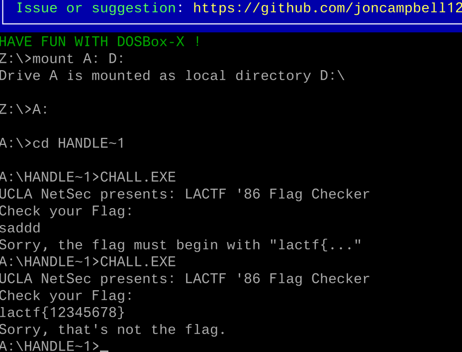

## lactf-1986
>Dug around the archives and found a floppy disk containing a long-forgotten LA CTF challenge. Perhaps you may be the first to solve it in decades.
### Overview
This was a really fun challenge that I solved during LACTF 2026. The binary was programmed in a 16-bit x86 DOS environment, which immediately made the analysis more interesting. One of the main difficulties came from the limited tools available for analyzing this binary and converting it into a readable C-like pseudocode, instead we have to work directly with the raw low-level assembly code.

The tools that I used to solve this challenge are DOSbox-x for debugging and radare2, IDA for disassembling

### Reconnaissance
The challenge gives us only `CHALL.IMG` which is a floppy disk image file type
```bash 
$ file CHALL.IMG
CHALL.IMG: DOS/MBR boot sector, code offset 0x3c+2, OEM-ID "IPRT 6.2", root entries 224, sectors 2880 (volumes <=32 MB), sectors/FAT 9, sectors/track 18, serial number 0x46ba57e0, label: "           ", FAT (12 bit), followed by FAT
```

Using binwalk we can extract all the embedded files in this image. However, in this challenge, I recommend to use 7zip's extraction tool, which is a really nice and fast way to retrieve the `CHALL.EXE` file

Using `strings CHALL.exe` to collect some useful clues, we can see these things
```yml
UCLA NetSec presents: LACTF '86 Flag Checker
Check your Flag:
Sorry, the flag must begin with "lactf{..."
Sorry, that's not the flag.
Indeed, that's the flag!
Not enough memory to allocate file structures
Floating-point support not loaded
0123456789abcdefghijklmnopqrstuvwxyz
```
This is definitely a flag checker challenge

### Analyze

> I would not dive deeply into my really tough analyzing process, I will directly point to the correct path of this challenge.

At first glance, I will use IDA to quickly analyze the challenge, however, the analyzed binary is just a bunch of raw assembly's code. At this moment, I know I have to start dynamic debugging. 
Opening DOSbox-x debugger and setting our classic analysis environment



The program flow should be
```
Read input -> check prefix -> do some changes with the input -> compare 
```

In DOS, reading input should look like this 
```asm
mov ah,3fh
int 21h
```
My next move is starting to dynamic debugging. First of all I will set breakpoint at `int 21h` using `bpint 21` then turn on logging executing instruction in DOSbox-x using `log 10000` then I spam `f5` (this shortcut likely continues the program). Then analyze the LOGCPU.txt from DOSbox-x.

I search for the aforementioned reading input pattern. And I can easily figure out this program's flow 

```
Reading input -> fnc.0000027E (get length) -> 
fcn.000000b0 (prefix's checker) -> fcn.00000010 (maybe encryption)
-> compare with ciphertext
```

fcn.00000010
```asm
┌ 107: fcn.00000010 (int16_t arg1);
│ `- args(ax) vars(3:sp[0xc..0x10])
│           0000:0010      50             push ax                      ; arg1
│           0000:0011      b81200         mov ax, 0x12
│           0000:0014      e8b601         call fcn.000001cd
│           0000:0017      58             pop ax
│           0000:0018      53             push bx
│           ; DATA XREF from fcn.00001a14 @ 0x1a22(r)
│           0000:0019      51             push cx
│           ; DATA XREF from fcn.00000776 @ 0x7be(r)
│           ; DATA XREFS from segment.seg_001 @ +0x2e6(r), +0x2e8(r)
│           0000:001a      56             push si
│           0000:001b      57             push di
│           ; DATA XREF from fcn.00001f7a @ 0x2038(r)
│           0000:001c      55             push bp
│           0000:001d      89e5           mov bp, sp
│           0000:001f      83ec04         sub sp, 4
│           ; DATA XREFS from fcn.000000b0 @ 0xd6(r), 0xd9(w)
│           ; DATA XREF from fcn.00002150 @ 0x2171(r)
│           0000:0022      50             push ax
│           ; DATA XREF from fcn.00000dec @ 0xdfd(r)
│           0000:0023      c746fc0000     mov word [var_4h], 0
│           0000:0028      31f6           xor si, si
│           ; CODE XREF from fcn.00000010 @ 0x6c(x)
│       ┌─> 0000:002a      8b5efa         mov bx, word [var_6h]
│       ╎   ; XREFS: DATA 0x00000df9  DATA 0x00000f59  DATA 0x000011ed  DATA 0x000019f7  DATA 0x00001b69  DATA 0x00001bd9
│       ╎   0000:002d      8a07           mov al, byte [bx]
│       ╎   0000:002f      8846fe         mov byte [var_2h], al
│       ╎   0000:0032      ff46fa         inc word [var_6h]
│       ╎   0000:0035      84c0           test al, al
│      ┌──< 0000:0037      7435           je 0x6e
│      │╎   ; DATA XREFS from fcn.00000ca4 @ 0xcc8(r), 0xd12(r)
│      │╎   0000:0039      8b5efc         mov bx, word [var_4h]
│      │╎   0000:003c      89f7           mov di, si
│      │╎   ; DATA XREF from fcn.00002054 @ 0x205c(r)
│      │╎   ; DATA XREF from fcn.000022e9 @ +0x18(r)
│      │╎   0000:003e      b90600         mov cx, 6
│      │╎   ; CODE XREF from fcn.00000010 @ 0x45(x)
│      │╎   ; DATA XREF from fcn.00001a14 @ 0x1a29(x)
│     ┌───> 0000:0041      d1e3           shl bx, 1
│     ╎│╎   ; DATA XREF from fcn.00001078 @ 0x112d(r)
│     ╎│╎   0000:0043      d1d7           rcl di, 1
│     ││╎   ; DATA XREF from fcn.00001078 @ 0x1129(r)
│     └───< 0000:0045      e2fa           loop 0x41
│      │╎   ; DATA XREF from fcn.00001078 @ 0x147c(r)
│      │╎   0000:0047      8b46fc         mov ax, word [var_4h]
│      │╎   ; DATA XREF from fcn.000000b0 @ 0xed(r)
│      │╎   ; DATA XREF from entry0 @ 0x3c4(r)
│      │╎   ; DATA XREF from fcn.00002328 @ 0x2359(r)
│      │╎   0000:004a      89f2           mov dx, si
│      │╎   ; DATA XREF from fcn.000004e1 @ 0x520(r)
│      │╎   ; DATA XREF from fcn.00000ca4 @ 0xd53(r)
│      │╎   0000:004c      d1e0           shl ax, 1
│      │╎   ; DATA XREF from fcn.00000ca4 @ 0xdc3(r)
│      │╎   0000:004e      d1d2           rcl dx, 1
│      │╎   ; DATA XREFS from fcn.000000b0 @ 0xe0(r), 0xe3(w)
│      │╎   ; DATA XREF from fcn.00001078 @ 0x1125(r)
│      │╎   ; DATA XREF from fcn.00002150 @ 0x2168(r)
│      │╎   0000:0050      01d8           add ax, bx
│      │╎   0000:0052      11d7           adc di, dx
│      │╎   0000:0054      8b56fc         mov dx, word [var_4h]
│      │╎   ; DATA XREF from fcn.00000ca4 @ 0xdbf(r)
│      │╎   0000:0057      01c2           add dx, ax
│      │╎   0000:0059      11f7           adc di, si
│      │╎   0000:005b      8a46fe         mov al, byte [var_2h]
│      │╎   0000:005e      30e4           xor ah, ah
│      │╎   0000:0060      31f6           xor si, si
│      │╎   ; DATA XREFS from fcn.00001078 @ 0x10a5(r), 0x146e(r)
│      │╎   0000:0062      01c2           add dx, ax
│      │╎   ; DATA XREFS from fcn.00001078 @ 0x10dc(r), 0x1121(r)
│      │╎   0000:0064      8956fc         mov word [var_4h], dx
│      │╎   ; DATA XREF from fcn.00001078 @ 0x1417(r)
│      │╎   0000:0067      11fe           adc si, di
│      │╎   ; DATA XREFS from fcn.00001078 @ 0x1179(r), 0x1413(r)
│      │╎   0000:0069      83e60f         and si, 0xf
│      ││   ; DATA XREF from fcn.00000ca4 @ 0xd88(r)
│      │└─< 0000:006c      ebbc           jmp 0x2a
│      │    ; CODE XREF from fcn.00000010 @ 0x37(x)
│      │    ; DATA XREF from entry0 @ 0x448(x)
│      │    ; DATA XREF from fcn.00000a85 @ 0xaee(x)
│      └──> 0000:006e      8b46fc         mov ax, word [var_4h]
│           0000:0071      89f2           mov dx, si
│           ; DATA XREF from fcn.00000a85 @ 0xbe6(r)
│           ; DATA XREF from fcn.00001078 @ 0x1315(r)
│           0000:0073      89ec           mov sp, bp
│           ; DATA XREFS from fcn.00001078 @ 0x10d0(r), 0x1409(r)
│           0000:0075      5d             pop bp
│           ; CODE XREF from fcn.0000007b @ 0xae(x)
│           0000:0076      5f             pop di
│           ; DATA XREF from fcn.00000ca4 @ 0xda2(r)
│           0000:0077      5e             pop si
│           ; DATA XREFS from fcn.00001078 @ 0x10d4(r), 0x13b8(r)
│           0000:0078      59             pop cx
│           0000:0079      5b             pop bx
│           ; DATA XREF from fcn.00000ca4 @ 0xd9e(r)
└           0000:007a      c3             ret
```
After analyzing this, this is just a simple hash the input using multi-precision technique, the 32-bit integer result is stored in `dx:ax`

```python 
def hash(input: str) -> int:
    h = 0
    for c in input:
        h = (67 * h + ord(c)) & 0xFFFFF
    return h
```
Then the program starts its comparision with the hardcoded ciphertext hidden in the binary. Our input will be hashed by the above algorithms, then the program will loop 0x49 times. In each loop, it calls fcn.0000007b to make some encoding or math with the hash value, then it uses the low byte of computed value to compare with the ciphertext if all is matched, the flag is correct

Extracted ciphertext
```c
0A5C:0BBA   B6 8C 95 8F 9B 85 4C 5E EC B6 B8 C0 97 93 0B 58 
0A5C:0BCA   77 50 B0 2C 7E 28 7A F1 B6 04 EF BE 5C 44 78 E8 
0A5C:0BDA   99 81 04 8F 03 40 A7 3F FA B7 08 01 63 52 E3 AD 
0A5C:0BEA   D1 85 9F 94 21 D5 2A 5C 20 D4 31 12 CE AA 16 C7 
0A5C:0BFA   AD DF 29 5D 72 FC 24 90 2C 0A 5B 0C 00 00 70 0C 
0A5C:0C0A   60 0C 20 0C DC 0C 60 0C FF FF 1E 21 B0 0C 00 00 
0A5C:0C1A   5C 0A B2 0C 5C 0A 2E 0C 0C 00 60 0C FF FF 5B 17 
0A5C:0C2A   0E 00 01 
```

fcn.0000007b
```asm
        ╎   ; CALL XREF from fcn.000000b0 @ 0x189(x)
┌ 53: fcn.0000007b (int16_t arg1);
│ `- args(ax)
│       ╎   0000:007b      50             push ax                      ; arg1
│       ╎   0000:007c      b80a00         mov ax, 0xa
│       ╎   0000:007f      e84b01         call fcn.000001cd
│       ╎   0000:0082      58             pop ax
│       ╎   0000:0083      53             push bx
│       ╎   0000:0084      51             push cx
│       ╎   0000:0085      56             push si
│       ╎   ; DATA XREF from fcn.00000a19 @ 0xa2d(w)
│       ╎   0000:0086      57             push di
│       ╎   0000:0087      89c3           mov bx, ax
│       ╎   0000:0089      89d6           mov si, dx
│       ╎   0000:008b      b90300         mov cx, 3
│       ╎   ; CODE XREF from fcn.0000007b @ 0x92(x)
│      ┌──> 0000:008e      d1ea           shr dx, 1
│      ╎╎   ; DATA XREF from segment.seg_001 @ +0x18c(r)
│      ╎╎   0000:0090      d1d8           rcr ax, 1
│      └──< 0000:0092      e2fa           loop 0x8e
│       ╎   0000:0094      89c7           mov di, ax
│       ╎   0000:0096      31df           xor di, bx
│       ╎   0000:0098      83e701         and di, 1
│       ╎   0000:009b      89d8           mov ax, bx
│       ╎   0000:009d      89f2           mov dx, si
│       ╎   ; DATA XREF from fcn.000021e7 @ +0x3d(r)
│       ╎   0000:009f      d1ea           shr dx, 1
│       ╎   0000:00a1      d1d8           rcr ax, 1
│       ╎   0000:00a3      b103           mov cl, 3
│       ╎   0000:00a5      89fe           mov si, di
│       ╎   0000:00a7      d3e6           shl si, cl
│       ╎   0000:00a9      09f2           or dx, si
│       ╎   0000:00ab      83e20f         and dx, 0xf
└       └─< 0000:00ae      ebc6           jmp 0x76                     ; fcn.00000010+0x66
```

Equivalent python code
```python 
def encrypt(hash):
    k = ((hash >> 3) ^ hash) & 1
    hash = (hash >> 1) | (k << 19)
    hash &= 0xFFFFF
    return hash
```

Compare stub
```asm 
│     ┌───> 0000:0178      46             inc si
│     ╎││   0000:0179      89364401       mov word [0x144], si
│     ╎││   0000:017d      83fe49         cmp si, 0x49                 ; 'I'
│     ╎││   ; DATA XREF from fcn.00000ca4 @ 0xdb6(r)
│    ┌────< 0000:0180      7d2e           jge 0x1b0
│    │╎││   ; CODE XREF from fcn.000000b0 @ 0x176(x)
│    │╎│└─> 0000:0182      a14603         mov ax, word [0x346]         ; [0x346:2]=0x6300
│    │╎│    0000:0185      8b164803       mov dx, word [0x348]         ; [0x348:2]=0x6e6f
│    │╎│    0000:0189      e8effe         call fcn.0000007b
│    │╎│    0000:018c      a34603         mov word [0x346], ax
│    │╎│    0000:018f      89164803       mov word [0x348], dx
│    │╎│    0000:0193      8b364401       mov si, word [0x144]         ; [0x144:2]=0xb805
│    │╎│    0000:0197      807aea00       cmp byte [bp + si - 0x16], 0
│    │╎│┌─< 0000:019b      7413           je 0x1b0
│    │╎││   0000:019d      a04603         mov al, byte [0x346]         ; [0x346:1]=0
│    │╎││   ; DATA XREF from fcn.000001ff @ +0x14(r)
│    │╎││   0000:01a0      3242ea         xor al, byte [bp + si - 0x16]
│    │╎││   0000:01a3      88427e         mov byte [bp + si + 0x7e], al
│    │╎││   0000:01a6      3a4234         cmp al, byte [bp + si + 0x34]
│    │└───< 0000:01a9      74cd           je 0x178
│    │ ││   0000:01ab      b89100         mov ax, 0x91
│    │┌───< 0000:01ae      eb03           jmp 0x1b3
```

Full script
```python 
#!/home/ryou/.venvs/rev/bin/python

def hash(input: str) -> int:
    h = 0
    for c in input:
        h = (67 * h + ord(c)) & 0xFFFFF
    return h

def encrypt(hash):
    k = ((hash >> 3) ^ hash) & 1
    hash = (hash >> 1) | (k << 19)
    hash &= 0xFFFFF
    return hash

ciphertext = bytearray.fromhex('''
B6 8C 95 8F 9B 85 4C 5E EC B6 B8 C0 97 93 0B 58 
77 50 B0 2C 7E 28 7A F1 B6 04 EF BE 5C 44 78 E8 
99 81 04 8F 03 40 A7 3F FA B7 08 01 63 52 E3 AD 
D1 85 9F 94 21 D5 2A 5C 20 D4 31 12 CE AA 16 C7 
AD DF 29 5D 72 FC 24 90 2C 0A 5B 0C 00 00 70 0C 
60 0C 20 0C DC 0C 60 0C FF FF 1E 21 B0 0C 00 00 
5C 0A B2 0C 5C 0A 2E 0C 0C 00 60 0C FF FF 5B 17 
0E 00 01
''')

flag = input()
hash = hash(flag)

if not flag.startswith('lactf'):
    print("Sorry!")
    exit(-1)

for i in range(len(flag)):  
    x = ord(flag[i])
    hash = encrypt(hash)
    if (x ^ (hash & 0xFF)) != ciphertext[i]:
        print("Sorry thats not the flag!")
        exit(-1)

print("Correct!")
```

Since seed only belongs to [0, 0xFFFFF] so we can easily perform a brute force technique

Solve script
```python
#!/home/ryou/.venvs/rev/bin/python

def hash(input: str) -> int:
    h = 0
    for c in input:
        h = (67 * h + ord(c)) & 0xFFFFF
    return h

def encrypt(hash):
    k = ((hash >> 3) ^ hash) & 1
    hash = (hash >> 1) | (k << 19)
    hash &= 0xFFFFF
    return hash

ciphertext = bytearray.fromhex('''
B6 8C 95 8F 9B 85 4C 5E EC B6 B8 C0 97 93 0B 58 
77 50 B0 2C 7E 28 7A F1 B6 04 EF BE 5C 44 78 E8 
99 81 04 8F 03 40 A7 3F FA B7 08 01 63 52 E3 AD 
D1 85 9F 94 21 D5 2A 5C 20 D4 31 12 CE AA 16 C7 
AD DF 29 5D 72 FC 24 90 2C 0A 5B 0C 00 00 70 0C 
60 0C 20 0C DC 0C 60 0C FF FF 1E 21 B0 0C 00 00 
5C 0A B2 0C 5C 0A 2E 0C 0C 00 60 0C FF FF 5B 17 
0E 00 01
''')
for seed in range(1 << 20):
    flag = []
    hash = seed
    for i in range(73):
        hash = encrypt(hash)
        flag.append(ciphertext[i] ^ (hash & 0xff))
    try:
        res = bytes(flag).decode()
        if 'lactf' in res:
            print(res)
            exit(0)
    except Exception as e:
        pass

```

### FLAG
> lactf{3asy_3nough_7o_8rute_f0rce_bu7_n0t_ea5y_en0ugh_jus7_t0_brut3_forc3}