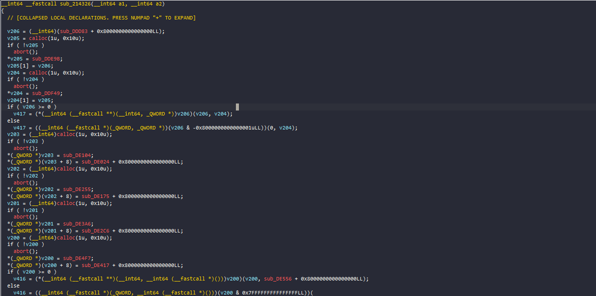
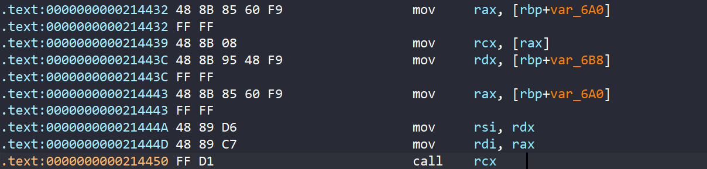
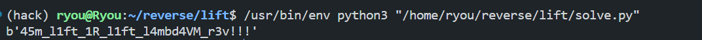

### Lift

#### Summary
This is an obfuscated flag checker that validates our input and return whether it is correct or not. At a higher level, the checking logic is a combination of decision statement (if-statement) for each bit of the flag body.

You can download challenge [here](chall) or https://github.com/r3kapig/r3ctf-2026/tree/master/lift

#### Initial analysis

The binary main function
```C
  s = "R3CTF{";
  n = strlen("R3CTF{");
  printf("Input flag: ");
  fflush(stdout);
  if ( fgets(s1, 0x200, stdin) && (s1[strcspn(s1, "\r\n")] = 0, v8 = strlen(s1), v8 == n + 33) )
  {
    if ( !strncmp(s1, s, n) && s1[v8 - 1] == 0x7D )
    {
      v4 = *(_QWORD *)&s1[n + 8];
      v6[0] = *(_QWORD *)&s1[n];
      v6[1] = v4;
      v5 = *(_QWORD *)&s1[n + 24];
      v6[2] = *(_QWORD *)&s1[n + 16];
      v6[3] = v5;
      sub_214326(0, v6);
      return 2;
    }
    else
    {
      puts("Fail...");
      return 1;
    }
  }
  else
  {
    puts("Fail...");
    return 1;
  }
```
The function checks the "R3CTF{...}" flag format, extracts the 32-byte body inside the curly braces, and passes it into `sub_214326`

So `sub_214326` is the main validation process, however it is insanely obfuscated something like this


By looking at the decompilation, we can figure out that the binary virtualize the initial program by using multiple indirect calls. From that hides the CFG, the execution flow and the main process.

Alright after searching several internal strings, I find two functions used for printing `Correct` and `Fail` which is `sub_21EB44` and `sub_21EB6D` respectively. So the key is these two functions

At this point, there is two possible targets. Firstly we can try to deobfuscate the binary, recover the initial program and write a solve script for that. Secondly, we can directly solve the challenge by witnessing how input is parsing and transfering during the execution phase. I chose the latter method because I don't know whether the former one would produces any undefined behaviour or not, like too many patterns or some kinds..

To begin with, there is a hypothesis that these obfuscation layers hide the main checking logic toward our input, so we need to find the exact pivot where the program access our flag and used it to control something or to calculate something we don't know.

The fact that if our flag is specified, the program execution flow would be absolutely linear which means we could use `angr` to detect the splitting branch. From that we could clarify where is the first code stub uses our input

Script
```python
#!/usr/bin/env python3

import angr
import claripy

proj = angr.Project("./chall", auto_load_libs=False)
base_addr = proj.loader.main_object.mapped_base

print(f"Image base {base_addr:#x}")
state : angr.SimState = proj.factory.blank_state(
    addr=base_addr + 0x214326,
    add_options={
        angr.options.ZERO_FILL_UNCONSTRAINED_MEMORY,
        angr.options.ZERO_FILL_UNCONSTRAINED_REGISTERS,
    }
)

# fake state
state.regs.rbp = 0x7fffffffdc70
state.regs.rsp = 0x7fffffffda28

# argument setup
buffer_addr = 0x7fffffffda30

state.regs.rdi = 0
state.regs.rsi = buffer_addr

buf = [
    claripy.BVS(f"inp{i}", 8, explicit_name=True)
    for i in range(32)
]
for i, b in enumerate(buf):
    state.memory.store(
        buffer_addr + i, b
    )

# flag = "aaaabaaacaaadaaaeaaafaaagaaahaaa"
# for i, b in enumerate(flag):
#     state.solver.add(buf[i] == ord(b))

for i in range(1):
    state.solver.add(claripy.Extract((i % 8), (i % 8), buf[i // 8]) == (i & 1))

# first i need to see something
fail = 0x21EB87
success = 0x21EB54

ins_counter = 0
# while len(s.active) == 1:
#     s.step()
#     ins_counter += 1

s = proj.factory.simgr(state)

counter = 0
def callback(sm):
    global counter
    counter += 1
    if counter % 200 == 0:
        print(f"Ran {counter}")
    return len(sm.active) != 1

s.run(until=callback)

print(f"Ran {ins_counter} instructions, Splitted to ")
for state in s.active:
    print(hex(state.addr - base_addr), end=" ")
print()

one = s.active[0]
for i, frame in enumerate(one.callstack):
    print(f"Frame #{i}: {frame.func_addr - base_addr:#x}, called by: {frame.call_site_addr - base_addr:#x}")

expr = claripy.simplify(one.regs.rax)
print(expr)
```

It produces something like
```
0x21ea85 0x21ea7c 
Frame #0: 0x21ea41, called by: 0xf81b8
Frame #1: 0xf81b8, called by: 0xf860e
Frame #2: 0xf8324, called by: 0xf92d8
Frame #3: 0xf890e, called by: 0x21c74a
Frame #4: -0x400000, called by: -0x400000
<BV64 0x0 .. inp0[1:1]>
```
The first bit of the first input byte is not be transformed (it is still *inp0[1:1]*). So it might be mathematically transformed into an intermediate buffer or it might just be used to compare at this address (and this will strengthen my following analyzing stuff). But we would't care it, the key of this log is a function at `0x21ea41`. 
```c
_QWORD *__fastcall sub_21EA41(__int64 a1, char a2)
{
  __int64 (__fastcall *sub_21E99D_1)(); // rax
  _QWORD *v4; // [rsp+18h] [rbp-8h]

  v4 = calloc(1u, 8u);
  if ( !v4 )
    abort();
  if ( (a2 & 1) != 0 )
    sub_21E99D_1 = sub_21E99D;
  else
    sub_21E99D_1 = sub_21E9FE;
  *v4 = sub_21E99D_1;
  return v4;
}
```

I tried to set a concrete value for the first few bits, and they always stop at this function. Through my script, the second argument is a current input bit, and the first argument is some heap address might be come from `calloc` somewhere else. Let's watch the caller stub

```C
  v4 = ((__int64 (__fastcall *)(_QWORD, _QWORD))((unsigned __int64)sub_21EA41 & 0x7FFFFFFFFFFFFFFFLL))(
         0,
         *(_QWORD *)(a1 + 16));
  v3 = (__int64)calloc(1u, 0x18u);
  if ( !v3 )
    abort();
  *(_QWORD *)v3 = sub_F8149;
  *(_QWORD *)(v3 + 8) = *(_QWORD *)(a1 + 8);
  *(_QWORD *)(v3 + 16) = v4;
  v2 = ((__int64 (__fastcall *)(_QWORD, _QWORD))((unsigned __int64)sub_21EA99 & 0x7FFFFFFFFFFFFFFFLL))(
         0,
         *(_QWORD *)(a1 + 0x10));
  if ( v3 >= 0 )
    return (*(__int64 (__fastcall **)(__int64, __int64))v3)(v3, v2);
  else
    return ((__int64 (__fastcall *)(_QWORD, __int64))(v3 & 0x7FFFFFFFFFFFFFFFLL))(0, v2);
```
The function `sub_21EA99` also receive `*(_QWORD *)(a1 + 0x10)` as an argument so it is doing some thing with the input byte
```c
unsigned __int64 __fastcall sub_21EA99(__int64 a1, unsigned __int64 a2) {
  return a2 >> 1;
}
```
The function shifts the current input byte value by one before consuming the LSB. This strongly suggests that the program is trying to extract each bit of each flag byte. In summary, those aforemention stubs are preparing 256 structs (corresponding with 256 bits). If a current bit is odd `sub_21E99D` is selected, else `sub_21E9FE`. 

These functions generate a callback function. After doing a few research on google and ChatGPT, I have known this is some kind of closure function where local variables are memorized to be used outside the function scope. An example on the internet is javascript, because C does not have this feature
For example
```js
function closure() {
    let count = 0;
    return function() {
        count++;
        return count;
    }
}
let func = closure();
console.log(func()); // output 1;
console.log(func()); // output 2;
```
The function memorizes the `count` variable. In order to simulate this is in C, we can create a struct like this
```C
struct Closure {
    uint64_t callbacks; // our function
    void *env; // used to register local variable
};
```
Then we can use it like this
```C
uint64_t creating_closure() {
    struct Closure *closure = calloc(1, sizeof(struct Closure));
    closure->env = calloc(1, 8); // this is used to store count
    *(uint64_t *)closure->env = 2007; // we act like this is a local variable

    return closure;
}

struct Closure *cls = creating_closure();
printf("%lld\n", *(uint64_t*)cls->env); // it prints 2007
```

So it could be the main obfuscation type of this challenge. Go back to `sub_21E99D` and `sub_21E9FE`. These functions are used to generate a closure function 

```C
_QWORD *__fastcall sub_21E99D(__int64 a1, __int64 a2) {
  _QWORD *v3; // [rsp+18h] [rbp-8h]
  v3 = calloc(1u, 0x10u);
  if ( !v3 )
    abort();
  *v3 = sub_21E987;
  v3[1] = a2;
  return v3;
}

_QWORD *sub_21E9FE() {
  _QWORD *v1; // [rsp+18h] [rbp-8h]
  v1 = calloc(1u, 8u);
  if ( !v1 )
    abort();
  *v1 = sub_21E9EC;
  return v1;
}
```
Note that the second function also receive two arguments (in assembly it does). But it is not used, so IDA truncated them

The two constructors look similar, let's watch their callback function
```C
__int64 __fastcall sub_21E987(__int64 a1) {
  return *(_QWORD *)(a1 + 8);
}

__int64 __fastcall sub_21E9EC(__int64 a1, __int64 a2) {
  return a2;
}
```

So both of them always initialize a closure with pre-setup argument, then trigger that function with another argument. This is a mess while solving because it will take an expensive effort just to find those arguments. 

The former returns the captured argument while the latter returns a new passed argument. Let's call it first argument and second argument generally
So it could be something like this 
```
If bit_i == 1 -> create a func(A, B) -> return A - let's call a True-like function
If bit_i == 0 -> create a func(A, B) -> return B - let's call a False-like function
```
After doing a few research and of course asking `GPT`. I have known that this is equivalent to Boolean-encoding Church (you can read more here https://en.wikipedia.org/wiki/Church_encoding). 

In short, each bit looks like the condition for the selector: true chooses the first argument, and false chooses the second argument.

The program core idea is something like this
```C
if (bit_0 == 1) {
    if (bit_1 == 0) {
        if (bit_2 == 1) {
            ... 
        }
        else {
            return True;
        }
    }
    else return False;
} else return False
```
*It is just a random example it is not the program internal logic.*

So the Boolean expression is used to virtualize this logic and hide the real `if-statement` structure, the order and many other things. In order to solve this challenge, we have to lift these whole virtualization layers into a visualized structure first.

Back to the challenge, after the preparation process, I still don't know what to do with these collect data. So I decided to trace the program instructions using `unicorn` to try to find some crucial hints

Script
```python
#!/usr/bin/env python3

from unicorn import *
from unicorn.x86_const import *
from capstone import *
from capstone.x86_const import *

from struct import *

uc = Uc(UC_ARCH_X86, UC_MODE_64)

with open("./chall", "rb") as f:
    blob = f.read()

# disassembly cache
cache = {}
md = Cs(CS_ARCH_X86, CS_MODE_64)
for ins in md.disasm(blob[0x1100:0x21ED4D], 0x1100):
    cache[ins.address] = f"{ins.mnemonic} {ins.op_str}"

puts_addr = 0x1050
calloc_addr = 0x10a0

text_addr = 0x1100
map_start = 0x1000
map_size  = 0x21f000
uc.mem_map(map_start, map_size)

uc.mem_write(
    text_addr,
    blob[0x1100:0x21ED4D]
)

# Initialize stack
stack_size = 0x100000000
stack_base = 0x7ffff0000000
uc.mem_map(stack_base, stack_size)

uc.reg_write(UC_X86_REG_RSP, 0x7fffffffda28)
uc.reg_write(UC_X86_REG_RBP, 0x7fffffffdc70)

buffer_addr = 0x7fffffffda30
uc.reg_write(UC_X86_REG_RDI, 0)
uc.reg_write(UC_X86_REG_RSI, buffer_addr)

# Fill flag
flag = b'aaaabaaacaaadaaaeaaafaaagaaahaaa'
uc.mem_write(0x7fffffffda30, b'aaaabaaacaaadaaaeaaafaaagaaahaaa')
bit = []
for c in flag:
    x = c
    for _ in range(8):
        bit.append(x & 1)
        x >>= 1

def read_mem(uc: Uc, addr, sz = 8):
    return int.from_bytes(uc.mem_read(addr, sz), 'little')

# Initialize heap
hp_size = 0x5000000
hp_addr = 0x90000000
uc.mem_map(hp_addr, hp_size)

# Simulate Libc's calloc
heap_top = hp_addr
def libc_calloc(uc, addr, size, user_data):
    code = uc.mem_read(addr, size)
    if (size != 5) or (code[0] != 232): return
    call_addr = (addr + unpack("<i", code[1:5])[0] + 5) & 0xffffffff
    if call_addr != 0x10a0: return

    global heap_top, heap_size, hp_addr, hp_size

    arg0 = uc.reg_read(UC_X86_REG_RDI)
    arg1 = uc.reg_read(UC_X86_REG_RSI)

    heap_size = arg0 * arg1
    if heap_size + heap_top > hp_addr + hp_size:
        print("Too much calloc!")
        exit(0)

    uc.mem_write(heap_top, b'\x00' * heap_size)
    uc.reg_write(UC_X86_REG_RAX, heap_top)

    heap_top += heap_size
    uc.reg_write(
        UC_X86_REG_RIP,
        addr + 5
    )
    return
uc.hook_add(UC_HOOK_CODE, callback=libc_calloc)

def puts_libc(uc, addr, size, user_data):
    code = uc.mem_read(addr, size)
    if (size != 5) or (code[0] != 232): return
    call_addr = (addr + unpack("<i", code[1:5])[0] + 5) & 0xffffffff
    if call_addr != 0x1050: return

    print("Calling puts...")
    uc.reg_write(
        UC_X86_REG_RIP,
        addr + 5
    )
    pass
uc.hook_add(UC_HOOK_CODE, callback=puts_libc)

counter = 0
stream = open("trace.log", "a")
def tracer(uc, addr, size, user_data):
    global stream
    stream.write(f"{addr:#x} {cache.get(addr, 'unknown')}\n")
uc.hook_add(UC_HOOK_CODE, callback=tracer)

def invalid_mem(uc, access, address, size, value, user_data):
    rip = uc.reg_read(UC_X86_REG_RIP)
    print(f"Invalid memory access {address:#x} at {rip}")
    return False
uc.hook_add(UC_HOOK_MEM_INVALID, callback=invalid_mem)

uc.emu_start(begin=0x214326, until=0x21E986)
```

However things goes evil after this decision. It ruined my entire workspace because of huge quantity of assembly instructions (over 500M running in about 30 minutes, could be more but I stopped tracing). 

Manually inspecting thousand of millions of instruction is not a clever option, although there might be a pattern and I can use script to extract pattern, clean log and lift to readable structure. It is still too risky because how I am supposed to know that I have covered enough cases? Additionally, it can be inconvenient because I could not examine the whole logs as well as running the script also a waste of time.

#### Deobfuscation
After a triage period, raw tracing is not good enough to solve the challenge. It is time for deobfuscating

Let's unpack the binary slowly. First of all we have known that this is a type of indirect call obfuscation, something like this
```C
if ( v201 >= 0 )
    v415 = (*(__int64 (__fastcall **)(__int64, __int64))v201)(v201, v416);
else
    v415 = ((__int64 (__fastcall *)(_QWORD, __int64))(v201 & 0x7FFFFFFFFFFFFFFFLL))(0, v416);
```
Moreover, there is actually two type. The first type is triggering a callback with a memorized variable and new argument.The second one is running a normal functions. A signal for the normal function is the high bit set. We can see that whenever the program calls a normal function it will unset the high bit and call it. For example `(func & 0x7FFFFFFFFFFFFFFFLL)(0, something)`

That is all the challenge does, by arranging this type of indirect calls into a multiple layers it makes static analysis much harder, at least my skill issue prevented me :sob:

To be honest, in order to deobfuscate this challenge we have to intensively examine the assembly instructions, witness pattern, group instruction, lift them into a readable IR. I rarely do any challenges similar to this. I had done some obfuscation challenges with different vibes like VM, Packer, Shellcode, JIT, etc. I don't mean it is easier or harder, it is just purely different *or just my feelings?*

Enough talkings, let's go back to the challenge. As I mentioned above, I didn't use unicorn in the final solution. But I did try it to deobfuscate the binary a little bit before giving up... So I wanna take a short discussion about that here also

##### Unicorn Attempt

First of all, the script is based on what I send above you can take a look there. So in order to witness how program processes with our Boolean expressions of the input, we need to save the returned heap address from `0x21ea41` and save it. We can do that by simply using `HOOK` in unicorn hehe

```python
bit_map = {}
rev_bit_map = {}
index_counter = cur_value = 0
def bit_function(uc: Uc, addr, size, ud):
    if addr != 0x21EA97: return
    rax = uc.reg_read(UC_X86_REG_RAX)
    rbp = uc.reg_read(UC_X86_REG_RBP)

    global index_counter, cur_value
    char = int.from_bytes(uc.mem_read(rbp - 0x20, 8), 'little') & 1
    index_counter += 1

    cur_value |= (char << ((index_counter - 1) % 8))
    if index_counter % 8 == 0: 
        print(chr(cur_value), end="")
        cur_value = 0

    bit_map[index_counter - 1] = rax
    rev_bit_map[rax] = index_counter - 1
    if index_counter == 256:
        for x, y in bit_map.items():
            print(f"bit_{x} {y:#x}")
    pass
uc.hook_add(UC_HOOK_CODE, callback=bit_function)
```
After the 256 bit objects is created, the program is no longer needs to read our original inputs anymore. Instead, it uses the heap-allocated address from our input. That is the reason why I store the heap address. To continue with, how could we able to watch where our expressions is used? Well by looking at assembly level we always see this pattern of closure function



The program load the closure into stack address then loading the first 8 byte to retrieve the callback function and call them. In unicorn, we can use `UC_HOOK_MEMORY_READ` to detect `mov rcx, [rax]` easily. After that we just need to check whether the loaded memory is one of our saved value in `rev_bit_map` or not

```python
def hook_load(uc: Uc, access, addr, size, value, ud):
    if addr not in rev_bit_map: return
    rip = uc.reg_read(UC_X86_REG_RIP)
    print(f"Loading function at {addr:#x} bit_{rev_bit_map[addr]} = {bit[rev_bit_map[addr]]} at {rip:#x}")
    pass    
uc.hook_add(UC_HOOK_MEM_READ, callback=hook_load)
```
The output will look like this
```c
Loading function at 0x9001c5d8 bit_135 = 0 at 0x36174
Loading function at 0x9001c548 bit_134 = 1 at 0x36174
Loading function at 0x9001c4c8 bit_133 = 1 at 0x36174
Loading function at 0x9001c458 bit_132 = 0 at 0x36174
Loading function at 0x9001c3f8 bit_131 = 0 at 0x36174
Loading function at 0x9001c3a8 bit_130 = 1 at 0x36174
Loading function at 0x9001c368 bit_129 = 0 at 0x36174
Loading function at 0x9001c338 bit_128 = 1 at 0x36174
Loading function at 0x9001de20 bit_143 = 0 at 0x2d5b7
Loading function at 0x9001dd90 bit_142 = 1 at 0x2d5b7
Loading function at 0x9001dd10 bit_141 = 1 at 0x2d5b7
Loading function at 0x9001dca0 bit_140 = 0 at 0x2d5b7
Loading function at 0x9001dc40 bit_139 = 0 at 0x2d5b7
// truncated 99,999999% of the content lol
```
Alright after running for around 5 mins, only two address is recorded which is `0x36174` and `0x2d5b7`. Oh nice sound promising only 2 address hehehe...

So the address `0x36174` is located in this function
```C
__int64 __fastcall sub_3603A(__int64 a1, __int64 a2)
{
  __int64 v4; // [rsp+28h] [rbp-18h]
  __int64 v5; // [rsp+30h] [rbp-10h]
  __int64 v6; // [rsp+38h] [rbp-8h]

  if ( a2 >= 0 )
    v6 = (*a2)(a2, sub_35FB3 + 0x8000000000000000LL);
  else
    v6 = ((a2 & 0x7FFFFFFFFFFFFFFFLL))(0, sub_35FB3 + 0x8000000000000000LL);
  if ( v6 >= 0 )
    v5 = (*v6)(v6, sub_35FEB + 0x8000000000000000LL);
  else
    v5 = ((v6 & 0x7FFFFFFFFFFFFFFFLL))(0, sub_35FEB + 0x8000000000000000LL);
  if ( *(a1 + 8) >= 0 )
    v4 = (**(a1 + 8))(*(a1 + 8), v5); // <<<<<------ THIS IS WHERE 0x36174 SHOW US 
  else
    v4 = ((*(a1 + 8) & 0x7FFFFFFFFFFFFFFFLL))(0, v5);
  if ( v4 >= 0 )
    return (*v4)(v4, a2);
  else
    return ((v4 & 0x7FFFFFFFFFFFFFFFLL))(0, a2);
}
```
So the pattern is pretty clear now, `v4` is used to creating closure and initialize first argument which is `v5`. And then the program triggers the closure immediately with second argument `a2`

So I need a script to automatically trace these two argument, so we can use `UC_HOOK_CODE` to watch the value. It is equivalently for `0x2d5b7` but it is harder a little bit to see but you would able to figure out it, not at that hard

Script
```python
arg0 = arg1 = 0
def hook_create_closure(uc: Uc, addr, size, ud):
    global arg0, arg1
    rbp = uc.reg_read(UC_X86_REG_RBP)
    if (addr == 0x36189) or (addr == 0x2D5D6):
        rdi = uc.reg_read(UC_X86_REG_RDI)
        rsi = uc.reg_read(UC_X86_REG_RSI)
        arg0 = rdi
        arg1 = rsi
        print(f"Creating closure at {addr:#x} arg {rdi:#x} ")
    pass
uc.hook_add(UC_HOOK_CODE, callback=hook_create_closure)

def hook_trigger_closure(uc: Uc, addr, size, ud):
    global arg0, arg1
    rbp = uc.reg_read(UC_X86_REG_RBP)
    if addr == 0x36196:
        func = int.from_bytes(uc.mem_read(rbp - 0x18, 8), 'little')
        arg2 = int.from_bytes(uc.mem_read(rbp - 0x40, 8), 'little')
        print(f"Triggering closure {func:#x} arg {arg1:#x}, {arg2:#x}\n"
        )
    if addr == 0x2DBA7:
        func = int.from_bytes(uc.mem_read(rbp - 0xd0, 8), 'little')
        arg2 = int.from_bytes(uc.mem_read(rbp - 0x108, 8), 'little')
        print(f"Triggering closure {func:#x} arg {arg1:#x}, {arg2:#x}")
    pass
uc.hook_add(UC_HOOK_CODE, callback=hook_trigger_closure)
```

The log will look like this
```C
Loading function at 0x9001c5d8 bit_135 = 0 at 0x36174
Creating closure at 0x36189 arg 0x9001c5d8 
Triggering closure 0x9007da58 arg 0x8000000000035feb, 0x80000000001eb367

Loading function at 0x9001c548 bit_134 = 1 at 0x36174
Creating closure at 0x36189 arg 0x9001c548 
Triggering closure 0x9007da80 arg 0x8000000000035feb, 0x80000000001eb4b8
....
....

Loading function at 0x9001de20 bit_143 = 0 at 0x2d5b7
Creating closure at 0x2d5d6 arg 0x9001de20 
Triggering closure 0x9007ff10 arg 0x9007dd48, 0x90080018 

Loading function at 0x9001dd90 bit_142 = 1 at 0x2d5b7
Creating closure at 0x2d5d6 arg 0x9001dd90 
Triggering closure 0x90080f58 arg 0x9007dd48, 0x90081068 
....
....
```

EVERYTHING... uh sorry for caplocking. Everything seems to be normal JUST UNTIL NOW.

For `0x36174`, the examined logs show that its argument is usually an internal function (like 0x35feb) in the binary related to True/False Boolean expression. However for `0x2DBA7`, the arguments are heap-allocated address/object instead.

This is where unicorn feels impotent. If an argument is not a binary hardcode function/address but heap address, it would take more efforts to understanding the context. We must look at where it is called from, what is the related argument around that. For example it is a closure function? It is statically like everytime the binary runs with different input, it stores the same value etc

Moreover, there is a critical point, unicorn can not handle dynamic object. If we receive an address or a pointer, we don't know whether it is program related object or it is the selected object from one of our input Boolean expression. We can not mask an ID to an object, structure or a heap-allocated address that it is input dependent or program independent object. So tough right? So I gave up using unicorn here

> The only solution I think about is building a handmade unicorn (written in C for speed) to handle those case by myself, this is seemed to be the most intuitive approach but would be painful like finishing minecraft hardcore world with half heart, full of cursed of binding of unbreakable leather armor and infinite blind effect.

##### Hooking Attempt
*Before reading, sorry if my explanation is confused, because I'm trying to describe about what I'm thinking in my brain while solving instead of providing a comprehensive writeup for the challenge*

Alright back from the challenge, this method is inspired by one of malware technique that I have learnt it is DLL injection. So basically the function will call our program function instead of the binary one leading to over control the execution. 

So I decided to create a dummy `Object` that is the alternative for binary Boolean expression. So that we can easily trace how my object travel around the binary, how my object is used and is combined with others stuff. It also easier for me to distinguish from program internal object

Script
```C
#define _GNU_SOURCE
#include <stdio.h>
#include <dlfcn.h>
#include <stdint.h>
#include <stdbool.h>
#include <unistd.h>
#include <link.h>
#include <sys/mman.h>
#include <string.h>

#define logging(fmt, ...) fprintf(stream, fmt, ##__VA_ARGS__)

#define ull uint64_t

#define HIGH 0x8000000000000000ULL
#define MASK 0x7fffffffffffffffULL

unsigned long long counter = 0;

static void *(*real_calloc)(size_t a, size_t b) = NULL;
static void *(*real_exit)(int code) = NULL;

static ull fn_func_symbolic;
static ull fn_partial_symbolic;
static ull fn_choice_object;
static ull fn_run_intermediate;
static ull fn_run_intermediate_yes;
static ull fn_run_intermediate_no;
static ull fn_decoy = 0;
static ull decoy() {printf("Why can it access this?");}

static ull base_address = 0;

FILE* stream = NULL;

void *calloc(size_t x, size_t y) {
    if (real_calloc == NULL) real_calloc = dlsym(RTLD_NEXT, "calloc");
    return real_calloc(x, y);
}

ull expr_cnt = 0;

/*
func is the callback function
type 0 = bit constructor
type 1 = yes argument
type 2 = no argument and decide
*/
typedef struct {
    ull func;

    int bit_id;
    ull expr;

    ull yes, no;
} Object;

static bool isHigh(ull x) {
    return (x & HIGH) != 0;
}
static bool isTarget(ull addr) {
    if (!addr) return false;
    addr &= MASK;
    return ((addr - base_address) == 0x21EB44) || ((addr - base_address) == 0x21EB6D);
}
static bool is_in_text(ull addr) {
    addr &= MASK;
    return base_address <= addr && addr <= base_address + 0x21ED4D;
}
static ull convertAddr(ull addr) {
    addr &= MASK;
    return is_in_text(addr) ? addr - base_address : addr;
}

static bool is_object(ull address) {
    if (isHigh(address) || !address) return 0;
    ull func = *(ull *)address;
    if (func == fn_func_symbolic 
        || func == fn_partial_symbolic 
        || func == fn_choice_object
        || func == fn_run_intermediate
        || func == fn_run_intermediate_yes
        || func == fn_run_intermediate_no
        || func == decoy) {
            return 1;
        }
    return 0;
}

static Object *create_object(ull function) {
    Object *x = calloc(1, sizeof(Object)); 
    x->func = function;
    return x;
}

static int func_type(ull address) {
    address &= MASK;
    uint8_t *array = (uint8_t *) address;
    if (array[0] != 0x55 || array[1] != 0x48 || array[2] != 0x89 || array[3] != 0xE5) {
        return -1;
    }
    int counter = 1;
    for (; ((array[counter - 1] != 0xC3) 
        || (array[counter - 1] == 0xC3 && (array[counter - 2] != 0x5D && array[counter - 2] != 0xC9))) 
            && counter <= 101; counter++);

    if (counter == 79) {
        return 1; // true-like
    }
    if ((counter == 34) || (counter == 67)) {
        return 0; // false-like
    }
    return -1;
}

static int func_type_log(ull address) {
    address &= MASK;
    int counter = 1;
    printf("%#llx\n", address, address - base_address);
    for (; (*(uint8_t *)address != 0xC3) && counter <= 100; address++, counter++) {
        printf("%x ", *(uint8_t *)address);
    }
    printf("%d \n", counter);
    if (counter == 79) {
        return 1; // true-like
    }
    if ((counter == 34) || (counter == 67)) {
        return 0; // false-like
    }
    return -1;
}

static Object* choice_object(Object *self) {
    ull yes = self->yes;
    ull no = self->no;

    {
        bool a = isTarget(yes);
        bool b = isTarget(no);

        if ((a && !b) || (!a && b)) {
            printf("Not good");
            _exit(123);
        }
        if (a && b) {
            // This is Correct/Fail function
            // if (convertAddr(yes) != 0x21EB44)
            logging("expr_%d = Choice(expr_%d, %#llx, %#llx)\n", expr_cnt + 1, self->expr, convertAddr(yes), convertAddr(no));
            _exit(0);
        }
    }

    {
        // Here wee need to treat other functions as a boolean type
        // So it could be either TRUE/FALSE or Symbolic
        // Is it easier to treat True/False as Symbolic ? 
        // To be easier lets assume there is no weird function apart from this type
        // So yes_func and no_func is Boolean
        // if yes_func or no_func is Object it would be different

        bool a = is_object(yes);   
        bool b = is_object(no);
        
        if (a && !b) {
            Object *cur = create_object(fn_func_symbolic);
            int btype = func_type(no);
            // logging("%d\n", btype);
            if (btype == -1) {
                // so here btype = -1 which means it could be non-boolean function we need to handler this case
                // logging("expr_%d %#llx %#llx\n", self->expr, yes, convertAddr(*(ull *)no));
                // we can still recursive until no is some case in this choice_object function
                // logging("%#llx\n", convertAddr(*(ull*)no));
                // cur->func = fn_run_intermediate_no;
                // cur->expr = self->expr;
                // cur->no = self->no;
                // cur->yes = self->yes;

                // return cur;
            }
            else {
                Object *x = (Object *)yes;
                cur->expr = expr_cnt ++;
                // logging("[Object-Like] expr_%lld = Choice(expr_%lld, expr_%lld, %s)\n", 
                //     cur->expr, self->expr, x->expr, (btype ? "true" : "false")
                // );
                logging("expr_%lld = Choice(expr_%lld, expr_%lld, %s)\n", 
                    cur->expr, self->expr, x->expr, (btype ? "true" : "false")
                );
                return cur;
            }
            
        }
        if (!a && b) {
            Object *cur = create_object(fn_func_symbolic);
            int atype = func_type(yes);
            if (atype == -1) {
                // cur->func = fn_run_intermediate_yes;
                // cur->expr = self->expr;
                // cur->yes = self->yes;
                // cur->no = self->no;
                // return cur;
            }
            else {
                Object *y = (Object *)no;
                cur->expr = expr_cnt ++;
                logging("expr_%lld = Choice(expr_%lld, %s, expr_%lld)\n", 
                    cur->expr, self->expr, (atype ? "true" : "false"), y->expr
                );
                return cur;
            }

            
        }
        // if ((a && !b) || (!a && b)) {
        //     printf("Weird here\n");
        //     printf("%#llx %#llx", convertAddr(yes), convertAddr(no));
        //     _exit(0);
        // }
        if (a && b) {
            Object *cur = create_object(fn_func_symbolic);
            // it is Choice(self->expr, yes->expr, no->expr)
            Object *x = (Object *)yes;
            Object *y = (Object *)no;
            
            cur->expr = expr_cnt ++;
            // logging("[Object-Like] expr_%lld = Choice(expr_%lld, expr_%lld, expr_%lld)\n", 
            //     cur->expr, self->expr, x->expr, y->expr
            // );
            logging("expr_%lld = Choice(expr_%lld, expr_%lld, expr_%lld)\n", 
                cur->expr, self->expr, x->expr, y->expr
            );
            
            return cur;
        }   
        
        // now A/B is either TRUE/FALSE (because we assumed there is no non-closure function)
        // 
        {
            Object *cur = create_object(fn_func_symbolic);
            cur->expr = expr_cnt ++;
            int atype = func_type(yes);
            int btype = func_type(no);
            // logging("expr_%d %d %d\n", self->expr, atype, btype);

            // printf("%d %d %#llx %#llx\n", atype, btype, convertAddr(yes), convertAddr(no));

            if ((atype != -1) && (btype != -1)) {
                // logging( 
                //     "[Func-Like] expr_%lld = Choice(expr_%lld, %s, %s)\n", cur->expr, 
                //     self->expr, (atype ? "true" : "false"), (btype ? "true" : "false")
                // );
                logging( 
                    "expr_%lld = Choice(expr_%lld, %s, %s)\n", cur->expr, 
                    self->expr, (atype ? "true" : "false"), (btype ? "true" : "false")
                );

                return cur;
            }
        }

        // time for undefined function for example 0x3706A
        // fprintf(stream, "%#llx %#llx\n", convertAddr(*(ull*)(yes & MASK)), convertAddr(*(ull*)(no & MASK)));
        // the pattern is likely
        /*
            Yes/No here non-boolean function. Lets have "yes" as an example
            It will call a function for example selector(yes, false/true-like)
            Then using true/false-like function to select whether yes[0] or yes[1]
            Then yes[0] or yes[1] is again a selector until there is a boolean-expression appear
            
            The solution is pretty cheap here, because selector(yes, no) receive the same true/false-like argument
            So we just need to identity whether it is true-like or false-like function 

            So run_intermediate is a key here
            it clarify the type of filter function 
            then map new argument for the boolean expression
            for example
            Expression(yes, no, false) -> Expression(yes[1], no[1], filter)...

        */
        {
            // invalid case fallback here includes half object
            /*
                pattern here
                Choice(express, func_a, func_b)
                func_a[0] = selector
                func_a[1] = first
                func_a[2] = second
                filter = choose first or second
                func_a[0](func_a, filter) -> func_a[1]/func_a[2]
                // so we need to keep recursive util func_a/func_b is not a selector anymore
                // How could we do that? Idk either
            */
            // logging("expr_%d yes=%#llx no=%#llx\n", self->expr, convertAddr(self->yes), convertAddr(self->no));
            Object *cur = create_object(fn_run_intermediate);
            cur->expr = self->expr; // we will not creating a new expression for this we will reuse
            cur->yes = self->yes; cur->no = self->no;
            // logging("yes=%#llx no=%#llx yes[1] = %#llx no[1] = %#llx\n", 
            //     cur->yes, cur->no, *(ull*)(cur->yes + 8), *(ull*)(cur->no + 8)
            // );
            /*
                yes = *(ull*)(yes + 16);
                logging("yes[1][0] %#llx, yes[1][1] = %#llx yes[1][2] = %#llx, object %d %d\n", convertAddr(*(ull*)yes), *(ull*)(yes+8), *(ull*)(yes + 16), is_object(*(ull*)(yes+8)), is_object(*(ull*)(yes + 16)));
                yes = *(ull*)(yes + 8);
                logging("yes[1][0] %#llx, yes[1][1] = %#llx yes[1][2] = %#llx, object %d %d\n", convertAddr(*(ull*)yes), *(ull*)(yes+8), *(ull*)(yes + 16), is_object(*(ull*)(yes+8)), is_object(*(ull*)(yes + 16)));            
                no = *(ull*)(no + 8);
                logging("no[1][0] %#llx, no[1][1] = %#llx no[1][2] = %#llx, object %d %d\n", convertAddr(*(ull*)no), *(ull*)(no+8), *(ull*)(no + 16), is_object(*(ull*)(no+8)), is_object(*(ull*)(no + 16)));
                no = *(ull*)(no + 8);
                logging("no[1][0] %#llx, no[1][1] = %#llx no[1][2] = %#llx, object %d %d\n", convertAddr(*(ull*)no), *(ull*)(no+8), *(ull*)(no + 16), is_object(*(ull*)(no+8)), is_object(*(ull*)(no + 16)));
            */
            // printf("mercy"); exit(0);
            return cur;
        }
        
    }

    printf("An error occurred: %#llx %#llx\n", convertAddr(yes), convertAddr(no));
    _exit(-1);
}

static Object *run_intermediate(Object* self, ull filter) {
    // can we just run this?
    if (!isHigh(filter)) {
        logging("Latter expr_%d", self->expr);
        _exit(0);
    }
    bool valid_a = is_object(self->yes) || (func_type(self->yes) != -1);
    bool valid_b = is_object(self->no) || (func_type(self->no) != -1);
    if ((valid_a && !valid_b) || (!valid_a && valid_b)) {
        logging("We will see about this");
        _exit(0);
    }
    if (valid_a && valid_b) {
        Object *cur = create_object(fn_decoy);
        cur->yes = self->yes;
        cur->no = self->no;
        cur->expr = self->expr;
        return choice_object(cur);
    }

    bool type = func_type(filter);
    if (type == 0) // false-like 
    {
        Object *cur = create_object(fn_decoy);
        cur->yes = *(ull *)(self->yes + 16);
        cur->no = *(ull *)(self->no + 16);
        cur->expr = self->expr;
        return choice_object(cur);
    }
    else // true-like
    {
        Object *cur = create_object(fn_decoy);
        cur->yes = *(ull *)(self->yes + 8);
        cur->no = *(ull *)(self->no + 8);
        cur->expr = self->expr;
        return choice_object(cur);
    }

    logging("Uh oh\n");
    _exit(0);
}

static Object* func_partial_symbolic(Object *self, ull no) {
    // fprintf(stream, "[Bit] bit_%d expr_%lld Second argument %#llx\n", self->bit_id, self->expr, convertAddr(no));
    self->no = no;
    return choice_object(self);
}

int bit_counter = 0;
static Object* func_symbolic(Object *self, ull yes) {
    Object *cur = create_object(fn_partial_symbolic);

    cur->yes = yes;
    
    cur->expr = self->expr;
    cur->bit_id = self->bit_id;

    // fprintf(stream, "[Bit] bit_%d expr_%lld First argument %#llx\n", cur->bit_id, cur->expr, convertAddr(yes));
    return cur;
}

ull generate_bit(ull x, ull arg) {
    Object *cur = create_object(fn_func_symbolic);
    
    cur->expr = expr_cnt++;
    cur->bit_id = bit_counter++;
    logging("expr_%d = bit_%d\n", counter++, cur->expr);
    // fprintf(stream,"[Bit] bit_%d concrete=%d\n", cur->bit_id, (int)(arg & 1));
    return (ull) cur;
}

int find_base_address(struct dl_phdr_info *info, size_t sz, void *base) {
    if (info->dlpi_name == NULL || info->dlpi_name[0] == '\0') {
        ull base_addr = (ull) info->dlpi_addr;
        *(ull*)base = base_addr;
        return 1;
    }
    return 0;
}

void map_memory(ull start, ull end) {
    int page_size = sysconf(_SC_PAGESIZE);
    ull mask = ~(page_size - 1);
    start = start & mask;
    end = (end + page_size - 1) & mask;
    size_t length = end - start;
    if (mprotect((void*)start, length, PROT_EXEC | PROT_READ | PROT_WRITE) != 0){
        perror("mprotect");
        _exit(123);
    }
    return;
}

bool hook_function(ull address) {
    /*
        the hook idea is pretty simple
        mov rax, address
        jmp rax
    */
    ull addr = address & ~0xfffULL;
    char shellcode[12] = {0x48, 0xb8};
    *(ull *) &shellcode[2] = (ull) generate_bit;
    shellcode[10] = 0xff;
    shellcode[11] = 0xe0;

    if (mprotect((void*)addr, 0x1000, PROT_EXEC | PROT_READ | PROT_WRITE) != 0) {
        perror("mprotect");
        _exit(123);
    }

    memcpy((void*)address, (void*)shellcode, sizeof(shellcode));
    __builtin___clear_cache((char *) address, (char *)address + sizeof(shellcode));

    return true;
}

__attribute__((constructor))
static void init_array(void) {
    if (real_calloc == NULL) real_calloc = dlsym(RTLD_NEXT, "calloc");

    dl_iterate_phdr(
        find_base_address,
        &base_address
    );
    remove("formula.txt");
    stream = fopen("formula.txt", "a");
    if (stream == NULL) {
        perror("stream null");
    }
    setvbuf(stream, NULL, _IONBF, 0);
    setvbuf(stdout, NULL, _IONBF, 0);

    fn_func_symbolic = (ull) func_symbolic;
    fn_partial_symbolic = (ull) func_partial_symbolic;
    fn_choice_object = (ull) choice_object;
    fn_run_intermediate = (ull) run_intermediate;

    fn_decoy = (ull) decoy;

    printf("Main address = %#llx\n", base_address);
    if (hook_function(base_address + 0x21EA41)) {
        printf("Hooked successfully\n");
    }

    map_memory(base_address + 0x1100, base_address + 0x21ED4D);
    return;
}

__attribute__((destructor))
static void finish_array(void) {
    printf("\nBye\n");
    return;
}
```
> [!NOTE]
> This script took me around 2 days >:D because I keep fixing errors as well as when I meet a new pattern I need to fix a few or sometime a whole script because I can't not statically list out all pattern first. By the way, I remain the same script without cleaning up because I'm too lazy >:3

*Misunderstanding is my best friend while writing this script but unfortunately he left me when I solved this challenge. Why he so means T_T*

Because It is so long I will explain it slowly latter.

First of all I used the `LD_PRELOAD` trick here to force the `ld` load my shared object first. Then I interrupt the program `calloc` to my own `calloc` instead of libc. It is seemed to be useless, so true because it not one of a part in my script I was just use it to test some stuff and forgot to remove...

Alright enough for joking, this is what I used for hooking the `0x21ea41` function
```C
bool hook_function(ull address) {
    /*
        the hook idea is pretty simple
        mov rax, address
        jmp rax
    */
    ull addr = address & ~0xfffULL;
    char shellcode[12] = {0x48, 0xb8};
    *(ull *) &shellcode[2] = (ull) generate_bit; // <-- this function is mentioned below
    shellcode[10] = 0xff;
    shellcode[11] = 0xe0;

    if (mprotect((void*)addr, 0x1000, PROT_EXEC | PROT_READ | PROT_WRITE) != 0) {
        perror("mprotect");
        _exit(123);
    }

    memcpy((void*)address, (void*)shellcode, sizeof(shellcode));
    __builtin___clear_cache((char *) address, (char *)address + sizeof(shellcode));

    return true;
}
```
I change a very first few bytes of a function to jump instruction. If you often work with malware binary, this could be familar. Remember to use `__builtin___clear_cache` because in modern CPU, there is a D-Cache for data caching and I-Cache for Instruction caching. The instruction will be cached in ram for faster dispatching. If we don't clear the cache, the old instruction still be executed.

The replacement for binary's boolean expression:
```C
typedef struct { 
    ull func; // function used for callback

    int bit_id; // as it is named
    ull expr; // the current expression of the boolean expression

    ull yes, no; // the first and second argument 
} Object;

static Object *create_object(ull function) {
    Object *x = calloc(1, sizeof(Object)); 
    x->func = function;
    return x;
}
```
Talk more about `expr`, it is used to identify the current object and identify the nested decision. For example if the binary use bit_0 to select A and B, then use bit_1 to select the result with C it could be something like this.
```C
expr_1 = bit_0
expr_2 = bit_1
expr_3 = Choice(expr_1, A, B)
expr_4 = Choice(expr_2, expr_3, C)
```
See? if we can lift the whole program into this format. Z3 can easily solve the constraint hehehe.

The trick here is instead of running program function for example `0x36174` or `0x2d5b7` as I mentioned above, we could redirect it to our own function. From that we could collect data, parsing expression and understand many things 

The alternative for `0x21ae41`, we used to logging initialization for each bit
```C
ull generate_bit(ull x, ull arg) {
    Object *cur = create_object(fn_func_symbolic);
    
    cur->expr = expr_cnt++;
    cur->bit_id = bit_counter++;
    logging("expr_%d = bit_%d\n", counter++, cur->expr);
    // fprintf(stream,"[Bit] bit_%d concrete=%d\n", cur->bit_id, (int)(arg & 1));
    return (ull) cur;
}
```
Then we redirect it into `fn_func_symbolic` which is used for creating closure and registering first argument
```C
static Object* func_symbolic(Object *self, ull yes) {
    Object *cur = create_object(fn_partial_symbolic);
    cur->yes = yes;
    cur->expr = self->expr;
    cur->bit_id = self->bit_id;
    return cur;
}
```
Record our argument and setting up some middle steps then redirect it for `fn_partial_symbolic` which takes our second argument and performing handling data to deobfuscate

```C
static Object* func_partial_symbolic(Object *self, ull no) {
    self->no = no;
    return choice_object(self);
}
```
Alright that is all what I have. Now the fun part is beginning, the most annoying logic of my obfuscator come from `choice_object()`

I will remove all the comment in the code if you want to read my comment, you can scroll up and watch the full script
```C
static Object* choice_object(Object *self) {
    ull yes = self->yes;
    ull no = self->no;

    {
        bool a = isTarget(yes);
        bool b = isTarget(no);

        if ((a && !b) || (!a && b)) {
            printf("Not good");
            _exit(123);
        }
        if (a && b) {
            logging("expr_%d = Choice(expr_%d, %#llx, %#llx)\n", expr_cnt + 1, self->expr, convertAddr(yes), convertAddr(no));
            _exit(0);
        }
    }

    {

        bool a = is_object(yes);   
        bool b = is_object(no);
        
        if (a && !b) {
            Object *cur = create_object(fn_func_symbolic);
            int btype = func_type(no);
            if (btype == -1) {
                // fall back to fn_run_intermediate at the end of the function
            }
            else {
                Object *x = (Object *)yes;
                cur->expr = expr_cnt ++;
                logging("expr_%lld = Choice(expr_%lld, expr_%lld, %s)\n", 
                    cur->expr, self->expr, x->expr, (btype ? "true" : "false")
                );
                return cur;
            }
            
        }
        if (!a && b) {
            Object *cur = create_object(fn_func_symbolic);
            int atype = func_type(yes);
            if (atype == -1) {
                // fall back to fn_run_intermediate at the end of the function
            }
            else {
                Object *y = (Object *)no;
                cur->expr = expr_cnt ++;
                logging("expr_%lld = Choice(expr_%lld, %s, expr_%lld)\n", 
                    cur->expr, self->expr, (atype ? "true" : "false"), y->expr
                );
                return cur;
            }

            
        }
        if (a && b) {
            Object *cur = create_object(fn_func_symbolic);
            Object *x = (Object *)yes;
            Object *y = (Object *)no;
            
            cur->expr = expr_cnt ++;
            logging("expr_%lld = Choice(expr_%lld, expr_%lld, expr_%lld)\n", 
                cur->expr, self->expr, x->expr, y->expr
            );
            
            return cur;
        }   
        
        {
            Object *cur = create_object(fn_func_symbolic);
            cur->expr = expr_cnt ++;
            int atype = func_type(yes);
            int btype = func_type(no);

            if ((atype != -1) && (btype != -1)) {
                logging( 
                    "expr_%lld = Choice(expr_%lld, %s, %s)\n", cur->expr, 
                    self->expr, (atype ? "true" : "false"), (btype ? "true" : "false")
                );

                return cur;
            }
        }
        {  

            Object *cur = create_object(fn_run_intermediate);
            cur->expr = self->expr; // we will not creating a new expression for this we will reuse
            cur->yes = self->yes; cur->no = self->no;
            return cur;
        }
        
    }

    printf("An error occurred: %#llx %#llx\n", convertAddr(yes), convertAddr(no));
    _exit(-1);
}
```
> [!NOTE]
> Some of `_exit` function used in this script is for me to check all possible patterns in the script, whenever the exit function is executed, I know that it is one of the part of the program and I need to handle else I will feel happy :D lightwork but high volt

I will explain some helper function
* `isTarget`: checking if the address is Correct or Fail function

* `convertAddr`: get the rva of the address or its value if it is a heap-allocated address
* `is_in_text`, `isHigh`, `logging`: like what it is named
* `is_object`: checking if it is our created object or not (simply comparing obj->func)
* `func_type`: checking if it is True-like or False-Like function by using really stupid-but-work method

Talk more about `func_type`, I used many heuristic pattern to recognize the function, eventhough it could be incorrect in general but it worked in this binary, that is all what we need

>[!NOTE]
>Make your script works base on your target, do not generalize the goal, it would be more difficult.

*Sorry I would not put those helper functions here but the blog will be too repeative, you can see in the full script*

I separated each case into 4 different block. The first block is checking if we reach Correct/Fail or not. 

```C
Object *cur = create_object(fn_func_symbolic);
cur->expr = expr_cnt ++;
int atype = func_type(yes);
int btype = func_type(no);
if ((atype != -1) && (btype != -1)) {
    logging( 
        "expr_%lld = Choice(expr_%lld, %s, %s)\n", cur->expr, 
        self->expr, (atype ? "true" : "false"), (btype ? "true" : "false")
    );
    return cur;
}
```
This third block is checking if our input is both `True` or `False`. Something like `expr_15 = Choice(expr_12, true, false)`. True/False here is a concrete Boolean expression. I mentioned in the [Initial Analysis](#initial-analysis). After selecting `True` or `False`, the object will be pushed into queue for generating closure so `fn_func_symbolic` is the best option here.

Next, come to the second block
```C
bool a = is_object(yes);   
bool b = is_object(no);

if (a && !b) {
    Object *cur = create_object(fn_func_symbolic);
    int btype = func_type(no);
    if (btype == -1) {
        // fall back to fn_run_intermediate at the end of the function
    }
    else {
        Object *x = (Object *)yes;
        cur->expr = expr_cnt ++;
        logging("expr_%lld = Choice(expr_%lld, expr_%lld, %s)\n", 
            cur->expr, self->expr, x->expr, (btype ? "true" : "false")
        );
        return cur;
    }
}
if (!a && b) {
    Object *cur = create_object(fn_func_symbolic);
    int atype = func_type(yes);
    if (atype == -1) {
        // fall back to fn_run_intermediate at the end of the function
    }
    else {
        Object *y = (Object *)no;
        cur->expr = expr_cnt ++;
        logging("expr_%lld = Choice(expr_%lld, %s, expr_%lld)\n", 
            cur->expr, self->expr, (atype ? "true" : "false"), y->expr
        );
        return cur;
    }
}
if (a && b) {
    Object *cur = create_object(fn_func_symbolic);
    Object *x = (Object *)yes;
    Object *y = (Object *)no;
    
    cur->expr = expr_cnt ++;
    logging("expr_%lld = Choice(expr_%lld, expr_%lld, expr_%lld)\n", 
        cur->expr, self->expr, x->expr, y->expr
    );
    
    return cur;
}   
```
This handler only processes cases when at least one of the two arguments is our object, the other could be either object or True/False-like function. The logic is pretty simple and could be understand easily through this example
```C
1. expr_1 = Choice(expr_2, expr_3, true/false)
2. expr_1 = Choice(expr_2, true/false, expr_3)
3. expr_1 = Choice(expr_2, expr_3, expr_4)
// only these three cases
```

Then the last stub handle a leftover case
```C
Object *cur = create_object(fn_run_intermediate);
cur->expr = self->expr; // we will not creating a new expression for this we will reuse
cur->yes = self->yes; cur->no = self->no;
```

Let's analyze this. Genuinelly, This case is the first argument is a closure, and the second argument is a selector which is either True-like or False-like function. But it hide that pattern using multiple intermediate internal object then using unpacker to unpack respectively. The unpacker is
```C
__int64 __fastcall sub_3706A(__int64 a1, __int64 a2)
{
  __int64 v4; // [rsp+18h] [rbp-8h]

  if ( a2 >= 0 )
    v4 = (*(__int64 (__fastcall **)(__int64, _QWORD))a2)(a2, *(_QWORD *)(a1 + 8));
  else
    v4 = ((__int64 (__fastcall *)(_QWORD, _QWORD))(a2 & 0x7FFFFFFFFFFFFFFFLL))(0, *(_QWORD *)(a1 + 8));
  if ( v4 >= 0 )
    return (*(__int64 (__fastcall **)(__int64, _QWORD))v4)(v4, *(_QWORD *)(a1 + 16));
  else
    return ((__int64 (__fastcall *)(_QWORD, _QWORD))(v4 & 0x7FFFFFFFFFFFFFFFLL))(0, *(_QWORD *)(a1 + 16));
}
```
The first argument is program internal object, and the second one is fixed selector which is either true-like or false-like function
Let's look what called `sub_3706A`
```C
_QWORD *__fastcall sub_37128(__int64 a1, __int64 a2) {
  _QWORD *v3; // [rsp+18h] [rbp-8h]

  v3 = calloc(1u, 0x18u);
  if ( !v3 )
    abort();
  *v3 = sub_3706A;
  v3[1] = *(_QWORD *)(a1 + 8);
  v3[2] = a2;
  return v3;
}
```
It generates a closure with two registered variables. The behavior of this could be describe like this

First it will initialize two real Boolean expression, then it will wrap those expressions into an intermediate closure and using unpacker with fixed selector function to release initial expression

For example
```C
Object one = {x, y};
uint64_t selector = true_function;
unpacker(one, selector) -> return x;
```
In order to make things harder to analyze, the author deliberately nested multiple unpacker

For example
```C
Object one = {expr_1, expr_2};
Object two = {expr_2, expr_1};
uint64_t layer1_selector = false_function;

Object three = {one, two};
uint64_t layer2_selector = true_function;

Object temp = unpack(three, layer2_selector);
temp = unpack(temp, layer1_selector);
```
In the end, temp is our valid object, so we can manually write a recursive unpacker to retrieve the core expression. If the current state is not one of the case that `choice_object` can describe an expression, it will be this case and transfer control for `run_intermediate`

Script:
```C
static Object *run_intermediate(Object* self, ull filter) {
    // can we just run this?
    if (!isHigh(filter)) {
        logging("Latter expr_%d", self->expr);
        _exit(0);
    }
    bool valid_a = is_object(self->yes) || (func_type(self->yes) != -1);
    bool valid_b = is_object(self->no) || (func_type(self->no) != -1);
    if ((valid_a && !valid_b) || (!valid_a && valid_b)) {
        logging("We will see about this");
        _exit(0);
    }
    if (valid_a && valid_b) { // valid object
        Object *cur = create_object(fn_decoy);
        cur->yes = self->yes;
        cur->no = self->no;
        cur->expr = self->expr;
        return choice_object(cur);
    }

    bool type = func_type(filter);
    if (type == 0) // false-like 
    {
        Object *cur = create_object(fn_decoy);
        cur->yes = *(ull *)(self->yes + 16);
        cur->no = *(ull *)(self->no + 16);
        cur->expr = self->expr;
        return choice_object(cur);
    }
    else // true-like
    {
        Object *cur = create_object(fn_decoy);
        cur->yes = *(ull *)(self->yes + 8);
        cur->no = *(ull *)(self->no + 8);
        cur->expr = self->expr;
        return choice_object(cur);
    }

    logging("Uh oh\n");
    _exit(0);
}
```
The filter is a selector function which is a true-like or false-like function, because it high bit is never set (I tested in the script).

That is all about my script and by running it we could have these expressions in [Here](formula.txt). In the end of the script is this line
```C
expr_103888 = Choice(expr_103886, 0x21eb44, 0x21eb6d)
```
It is exactly what I have expected, `0x21eb44` is the Correct function and `0x21eb6d` is the Fail function. So after this we could use Z3 to solve the constant that leading to the Correct option. We can have the flag

Z3 solve script:
```python
#!/usr/bin/env python3

from z3 import *

import re

s = Solver()

bit = [BitVec(f"bit_{i}", 1) for i in range(256)]

with open("formula.txt", "r") as f:
    data = f.read().split("\n")

save_expr = {}

save_expr["true"] = BitVecVal(1, 1)
save_expr["false"] = BitVecVal(0, 1)

last_expression = ""
for i in data:
    line = i.strip()
    if "bit_" in line:
        bit_index = int(re.search(r"bit_[0-9]*", line)[0][4:], 10)
        expr = re.search(r"expr_[0-9]*", line)[0]

        save_expr[expr] = bit[bit_index]
    else:
        ex = re.findall(r"\bexpr_[0-9]*", line)
        arg = re.search(r"Choice\(.*?, (.*?), (.*?)\)", line)
        save_expr[ex[0]] = If(
            save_expr[ex[1]] == 1, 
            save_expr[arg.group(1).strip()],
            save_expr[arg.group(2).strip()]
        )
        last_expression = ex[0]
s.add(save_expr[last_expression] == save_expr["true"])

if s.check() != sat:
    print("not good")
    exit(0)

model = s.model()
value = [model.eval(b, model_completion=True).as_long() for b in bit]

flag_bytes = []
for byte_idx in range(32):
    cur_byte = 0
    for bit_offset in range(8):
        bit_idx = byte_idx * 8 + bit_offset
        cur_byte |= (value[bit_idx] << bit_offset)
    flag_bytes.append(cur_byte)

flag = bytes(flag_bytes)
print(flag)
```




#### Ending
If you have any questions, you could DM me. I'm not a good teacher to be honest so some part of the writeup would be confused. Final words, happy reversing >:D