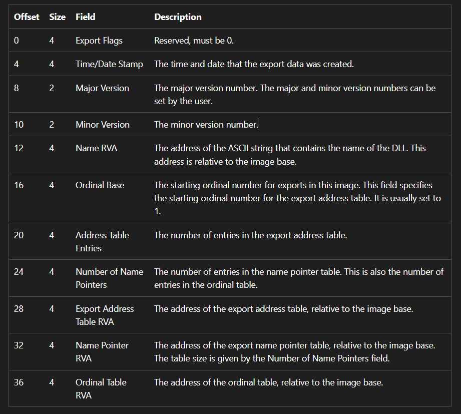
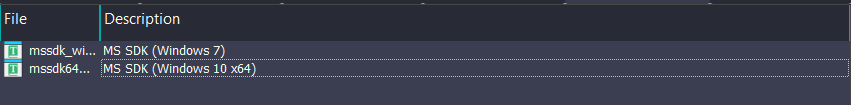

__Prolouge__: The purpose of this page is in order to figure out what is export table in PE file and how the OS find the export function used for others program

This post is related to PE HEADER knowledges!

## Introduction
First of all we need to understand what is data directory. Basically, Data directory is just an attribute in the `IMAGE_OPTIONAL_HEADER` which belongs to `IMAGE_NT_HEADER` which also be coordinated by `IMAGE_DOS_HEADER` `e_lfanew` attribute.

Deep into data directory element, the data directory itself, is an array or a table contains lots of thing used to manage many stuff by operating system. And the first one is export table which hold two value. The RVA lead to the `IMAGE_EXPORT_DIRECTORY` and the size of `Export Table`.

Geninuelly, the `IMAGE_EXPORT_DIRECTORY` is a struct that remain those values

Source: https://learn.microsoft.com/en-us/windows/win32/debug/pe-format#export-directory-table

The value that we must take a look here is from `Ordinal Base` to `Ordinal Table RVA`

Now the `IMAGE_EXPORT_DIRECTORY` contains 3 table.
1. Export Address Table *EAT* contains an array of DWORD that each lead to the specific function in the program or a string if that is a forwarded export function. This table has `Addres Table Entries` size
2. Name Pointer RVA, which is an array of DWORD (4 bytes) stores the RVA directly to the name of the function with null terminated char.
3. The Ordinal Table RVA which is an array of WORD (2 bytes) stores the index (0-based index) which is used for locating the function in EAT 
    *Both 2 and 3 has `Number of Name Pointers` size*

Now what is actually Ordinal Base. Well bascially, by concept there are two different ordinal base. The one used as importer to search suitable function (importer request) called Ordinal Number, others is used for locating the function in the program (export table lookup value) called Ordinal index. However, The formular and relationship of those is.
> `Ordinal Number` = `Ordinal Base` + `Ordinal Index`
> `Ordinal Index` = `Ordinal Number` - `Ordinal Base`

The process of tracing function in the exporter program.
1. For example you require a function HelloWorld(). Now first of all the OS will find the function name in the AddressOfName (Name Pointer RVA) and filter out the index in that table called X.
2. After that extracting the ordinal index from Ordinal Table RVA using the value X, call this value is Y
3. The value Y will be used in order to access the function in the EAT

>[!Note]
Edge Case: For example you don't have the function name like `HelloWorld` but you just have an ordinal number. The OS will do some calculation with Ordinal Base. More specifically, your ordinal number will be minus to ordinal base then that value will be used as the X value *(skip the step 1)*

## Script
All thing is clear now, lets try to extract those attribute clearly. We will write a small script using Ipyida or Idapython i don't really know the name lol. 

Now first of all we have to  add type library MSSDK in ida like this. This is just for using struct like `IMAGE_DOS_HEADER`, ... etc

*The second one*

```python 
import idaapi as api

dos_tp = api.Appcall.typedobj('IMAGE_DOS_HEADER;')
idd_tp = api.Appcall.typedobj('IMAGE_DATA_DIRECTORY;')
inh_tp = api.Appcall.typedobj('IMAGE_NT_HEADERS32;')
ied_tp = api.Appcall.typedobj('IMAGE_EXPORT_DIRECTORY;')

def main(base):
    ok, dos = dos_tp.retrieve(base)
    if not ok:
        return
    
    inh_ea = dos.e_lfanew + base
    ok, inh = inh_tp.retrieve(inh_ea)
    if not ok:
        return
    
    eid = inh.OptionalHeader.DataDirectory['0']
    ied_start = eid.VirtualAddress + base
    ied_end = ied_start + eid.Size
    
    print(f'INH: {inh_ea:x} Start {ied_start:x} End: {ied_end:x} EID SZ: {eid.Size:x}')
    
    ok, ied = ied_tp.retrieve(ied_start)
    if not ok:
        return
    eat = ied.AddressOfFunctions + base
    namesAddress = ied.AddressOfNames + base
    ordinalsName = ied.AddressOfNameOrdinals + base
    ordinalBase = ied.Base
    numNames = ied.NumberOfNames
    
    print(f'EAT {eat:x} NameAddress {namesAddress:x} OrdinalsName {ordinalsName:x} numNames {numNames}')
    
    ntable = {}
    otable = {}
    
    #Print all current function in the EAT with their address
    if numNames != 0:
        for i in range(numNames):
            name_ea = base + api.get_wide_dword(namesAddress + 4 * i)
            name_str = idc.get_strlit_contents(name_ea).decode()
            print(f'Address {name_ea:x} has function {name_str}')
            ntable[i] = name_str
            otable[api.get_wide_word(ordinalsName + i * 2)] = i
            
    # Loop through functions
    for i in range(ied.NumberOfFunctions):
        func_addr = base + api.get_wide_dword(eat + 4 * i)
        if func_addr == base:
            continue
        ordinalNumber = ordinalBase + i
            
        lookup = otable.get(i, -1)
        if ied_start <= func_addr <= ied_end:
            # This is forward function
            fw_name = idc.get_strlit_contents(func_addr).decode()
            print(f'Ord: {ordinalNumber} Address: {func_addr} Name {ntable[lookup]} forward to {fw_name}') 
            continue
        
        # This is function that belongs to this program
        if lookup == -1:
            print(f'Ord: {ordinalNumber} Address: {func_addr:x}')
        else:
            print(f'Ord: {ordinalNumber} Address: {func_addr:x} Name: {ntable[lookup]}')
        
        
api.msg_clear()
main(api.get_imagebase())

```

You can open abitrary DLL file on your window computer or download on the internet and load it into IDA and use this script for testing.

>If you found any misleading knowledge or something about my understanding, please comment I will fix it!

This post references: https://www.youtube.com/watch?v=VjxPWbUJI9A